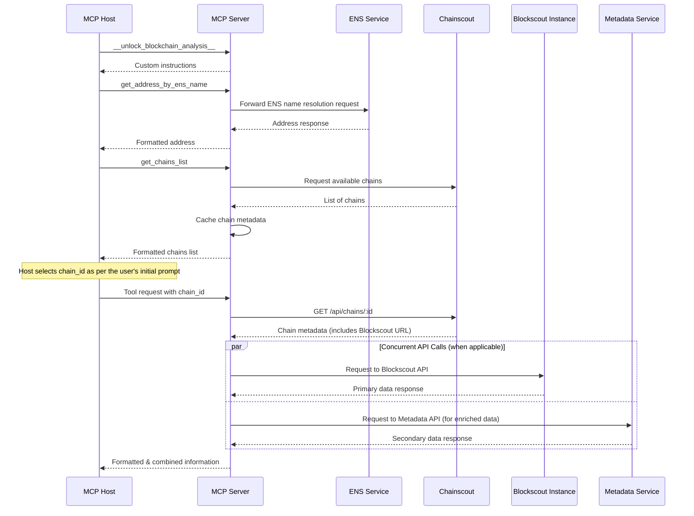
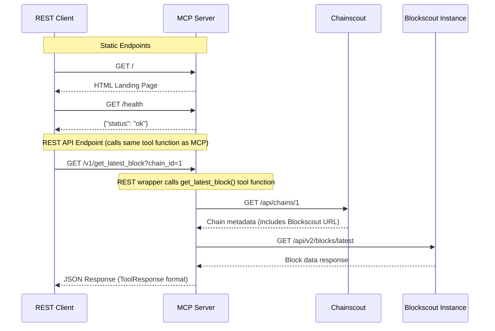
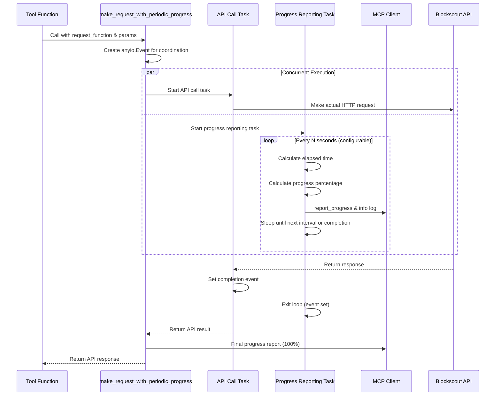

# Blockscout MCP Server

[](https://smithery.ai/server/@blockscout/mcp-server)

<a href="https://glama.ai/mcp/servers/@blockscout/mcp-server">
  
</a>

The Model Context Protocol (MCP) is an open protocol designed to allow AI agents, IDEs, and automation tools to consume, query, and analyze structured data through context-aware APIs.

This server wraps Blockscout APIs and exposes blockchain data—balances, tokens, NFTs, contract metadata—via MCP so that AI agents and tools (like Claude, Cursor, or IDEs) can access and analyze it contextually.

**Key Features:**

- Contextual blockchain data access for AI tools
- Multi-chain support via getting Blockscout instance URLs from Chainscout
- **Versioned REST API**: Provides a standard, web-friendly interface to all MCP tools. See [API.md](API.md) for full documentation.
- Custom instructions for MCP host to use the server
- Intelligent context optimization to conserve LLM tokens while preserving data accessibility
- Smart response slicing with configurable page sizes to prevent context overflow
- Opaque cursor pagination using Base64URL-encoded strings instead of complex parameters
- Automatic truncation of large data fields with clear indicators and access guidance
- Standardized ToolResponse model with structured JSON responses and follow-up instructions
- Enhanced observability with MCP progress notifications and periodic updates for long-running operations

## Configuring MCP Clients

### Using the Claude Desktop Extension (.dxt) - Recommended

The easiest way to use the Blockscout MCP server with Claude Desktop is through the official Desktop Extension. This provides a seamless, one-click installation experience.

**Installation:**

1. Download the latest `blockscout-mcp.dxt` file from the [releases page](https://github.com/blockscout/mcp-server/releases).
2. Open Claude Desktop.
3. Double click to open the `.dxt` file to automatically install the extension.
4. Check Settings -> Extensions if you experience any issues. You can also drag and drop .DXT files into the extensions window to view and install.

### Using the Official Blockscout MCP Server

The official cloud-hosted instance at `https://mcp.blockscout.com/mcp` provides a reliable, always-updated service.

**Claude Desktop Setup:**

> _Note: Docker is required for this setup_

1. Open Claude Desktop and click on Settings
2. Navigate to the "Developer" section
3. Click "Edit Config"
4. Open the file `claude_desktop_config.json` and configure the server:

    ```json
    {
      "mcpServers": {
        "blockscout": {
          "command": "docker",
          "args": [
            "run",
            "--rm",
            "-i",
            "sparfenyuk/mcp-proxy:latest",
            "--transport",
            "streamablehttp",
            "https://mcp.blockscout.com/mcp"
          ]
        }
      }
    }
    ```

5. Save the file and restart Claude Desktop
6. When chatting with Claude, you can now enable the Blockscout MCP Server to allow Claude to access blockchain data

**Cursor Setup:**

Use [this deeplink](https://cursor.com/en/install-mcp?name=blockscout&config=eyJ1cmwiOiJodHRwczovL21jcC5ibG9ja3Njb3V0LmNvbS9tY3AiLCJ0aW1lb3V0IjoxODAwMDB9) to install the Blockscout MCP server in Cursor.

**Gemini CLI Setup:**

1. Add the following configuration to your `~/.gemini/settings.json` file:

    ```json
    {
      "mcpServers": {
        "blockscout": {
          "httpUrl": "https://mcp.blockscout.com/mcp",
          "timeout": 180000
        }
      }
    }
    ```

2. For detailed Gemini CLI MCP server configuration instructions, see the [official documentation](https://github.com/google-gemini/gemini-cli/blob/main/docs/tools/mcp-server.md).

## Try Blockscout X-Ray GPT

Experience the power of the Blockscout MCP server through our showcase GPT: **[Blockscout X-Ray](https://chatgpt.com/g/g-68a7f315edf481918641bd0ed1e60f8b-blockscout-x-ray)**

This GPT demonstrates the full capabilities of the MCP server, providing intelligent blockchain analysis and insights. It's a great way to explore what's possible when AI agents have contextual access to blockchain data.

### Local Development Setup (For Developers)

If you want to run the server locally for development purposes:

```json
{
  "mcpServers": {
    "blockscout": {
      "command": "docker",
      "args": [
        "run", "--rm", "-i",
        "ghcr.io/blockscout/mcp-server:latest"
      ]
    }
  }
}
```

## Technical details

Refer to [SPEC.md](SPEC.md) for the technical details.

## Repository Structure

Refer to [AGENTS.md](AGENTS.md) for the repository structure.

## Testing

Refer to [TESTING.md](TESTING.md) for comprehensive instructions on running both **unit and integration tests**.

## Tool Descriptions

1. `__unlock_blockchain_analysis__()` - Provides custom instructions for the MCP host to use the server. This is a mandatory first step before using other tools.
2. `get_chains_list()` - Returns a list of all known chains.
3. `get_address_by_ens_name(name)` - Converts an ENS domain name to its corresponding Ethereum address.
4. `lookup_token_by_symbol(chain_id, symbol)` - Searches for token addresses by symbol or name, returning multiple potential matches.
5. `get_contract_abi(chain_id, address)` - Retrieves the ABI (Application Binary Interface) for a smart contract.
6. `inspect_contract_code(chain_id, address, file_name=None)` - Allows getting the source files of verified contracts.
7. `get_address_info(chain_id, address)` - Gets comprehensive information about an address including balance, ENS association, contract status, token details, and public tags.
8. `get_tokens_by_address(chain_id, address, cursor=None)` - Returns detailed ERC20 token holdings for an address with enriched metadata and market data.
9. `get_latest_block(chain_id)` - Returns the latest indexed block number and timestamp.
10. `get_transactions_by_address(chain_id, address, age_from, age_to, methods, cursor=None)` - Gets transactions for an address within a specific time range with optional method filtering.
11. `get_token_transfers_by_address(chain_id, address, age_from, age_to, token, cursor=None)` - Returns ERC-20 token transfers for an address within a specific time range.
12. `transaction_summary(chain_id, hash)` - Provides human-readable transaction summaries using Blockscout Transaction Interpreter.
13. `nft_tokens_by_address(chain_id, address, cursor=None)` - Retrieves NFT tokens owned by an address, grouped by collection.
14. `get_block_info(chain_id, number_or_hash, include_transactions=False)` - Returns block information including timestamp, gas used, burnt fees, and transaction count. Can optionally include a list of transaction hashes.
15. `get_transaction_info(chain_id, hash, include_raw_input=False)` - Gets comprehensive transaction information with decoded input parameters and detailed token transfers.
16. `get_transaction_logs(chain_id, hash, cursor=None)` - Returns transaction logs with decoded event data.
17. `read_contract(chain_id, address, abi, function_name, args='[]', block='latest')` - Executes a read-only smart contract function and returns its result. The `abi` argument is a JSON object describing the specific function's signature.
18. `direct_api_call(chain_id, endpoint_path, query_params=None, cursor=None)` - Calls a curated raw Blockscout API endpoint for specialized or chain-specific data.

## Example Prompts for AI Agents

```plaintext
Is any approval set for OP token on Optimism chain by `zeaver.eth`?
```

```plaintext
Calculate the total gas fees paid on Ethereum by address `0xcafe...cafe` in May 2025.
```

```plaintext
Which 10 most recent logs were emitted by `0xFe89cc7aBB2C4183683ab71653C4cdc9B02D44b7`
before `Nov 08 2024 04:21:35 AM (-06:00 UTC)`?
```

```plaintext
Tell me more about the transaction `0xf8a55721f7e2dcf85690aaf81519f7bc820bc58a878fa5f81b12aef5ccda0efb`
on Redstone rollup.
```

```plaintext
Is there any blacklisting functionality of USDT token on Arbitrum One?
```

```plaintext
What is the latest block on Gnosis Chain and who is the block minter?
Were any funds moved from this minter recently?
```

```plaintext
When the most recent reward distribution of Kinto token was made to the wallet
`0x7D467D99028199D99B1c91850C4dea0c82aDDF52` in Kinto chain?
```

```plaintext
Which methods of `0x1c479675ad559DC151F6Ec7ed3FbF8ceE79582B6` on the Ethereum 
mainnet could emit `SequencerBatchDelivered`?
```

```plaintext
What is the most recent executed cross-chain message sent from the Arbitrum Sepolia
rollup to the base layer?
```

## Development & Deployment

### Local Installation

Clone the repository and install dependencies:

```bash
git clone https://github.com/blockscout/mcp-server.git
cd mcp-server
uv pip install -e . # or `pip install -e .`
```

To customize the leading part of the `User-Agent` header used for RPC requests,
set the `BLOCKSCOUT_MCP_USER_AGENT` environment variable (defaults to
"Blockscout MCP"). The server version is appended automatically.

### Running the Server

The server runs in `stdio` mode by default:

```bash
python -m blockscout_mcp_server
```

**HTTP Mode (MCP only):**

To run the server in HTTP Streamable mode (stateless, JSON responses):

```bash
python -m blockscout_mcp_server --http
```

You can also specify the host and port for the HTTP server:

```bash
python -m blockscout_mcp_server --http --http-host 0.0.0.0 --http-port 8080
```

**HTTP Mode with REST API:**

To enable the versioned REST API alongside the MCP endpoint, use the `--rest` flag (which requires `--http`).

```bash
python -m blockscout_mcp_server --http --rest
```

With custom host and port:

```bash
python -m blockscout_mcp_server --http --rest --http-host 0.0.0.0 --http-port 8080
```

**CLI Options:**

- `--http`: Enables HTTP Streamable mode.
- `--http-host TEXT`: Host to bind the HTTP server to (default: `127.0.0.1`).
- `--http-port INTEGER`: Port for the HTTP server (default: `8000`).
- `--rest`: Enables the REST API (requires `--http`).

### Building Docker Image Locally

Build the Docker image with the official tag:

```bash
docker build -t ghcr.io/blockscout/mcp-server:latest .
```

### Pulling from GitHub Container Registry

Pull the pre-built image:

```bash
docker pull ghcr.io/blockscout/mcp-server:latest
```

### Running with Docker

**HTTP Mode (MCP only):**

To run the Docker container in HTTP mode with port mapping:

```bash
docker run --rm -p 8000:8000 ghcr.io/blockscout/mcp-server:latest python -m blockscout_mcp_server --http --http-host 0.0.0.0
```

With custom port:

```bash
docker run --rm -p 8080:8080 ghcr.io/blockscout/mcp-server:latest python -m blockscout_mcp_server --http --http-host 0.0.0.0 --http-port 8080
```

**HTTP Mode with REST API:**

To run with the REST API enabled:

```bash
docker run --rm -p 8000:8000 ghcr.io/blockscout/mcp-server:latest python -m blockscout_mcp_server --http --rest --http-host 0.0.0.0
```

**Note:** When running in HTTP mode with Docker, use `--http-host 0.0.0.0` to bind to all interfaces so the server is accessible from outside the container.

**Stdio Mode:** The default stdio mode is designed for use with MCP hosts/clients (like Claude Desktop, Cursor) and doesn't make sense to run directly with Docker without an MCP client managing the communication.

## Privacy and Anonymous Telemetry

To help us improve the Blockscout MCP Server, community-run instances of the server collect anonymous usage data by default. This helps us understand which tools are most popular and guides our development efforts.

**What we collect:**
- The name of the tool being called (e.g., `get_latest_block`).
- The parameters provided to the tool.
- The version of the Blockscout MCP Server being used.

**What we DO NOT collect:**
- We do not collect any personal data, IP addresses (the central server uses the sender's IP for geolocation via Mixpanel and then discards it), secrets, or private keys.

#### How to Opt-Out

You can disable this feature at any time by setting the following environment variable:

```bash
export BLOCKSCOUT_DISABLE_COMMUNITY_TELEMETRY=true
```

## License

This project is primarily distributed under the terms of the MIT license. See [LICENSE](LICENSE) for details.


================================================
FILE: AGENTS.md
================================================
# Blockscout MCP Server

## Project Structure

```text
mcp-server/
├── blockscout_mcp_server/      # Main Python package for the server
│   ├── __init__.py             # Makes the directory a Python package
│   ├── llms.txt                # Machine-readable guidance file for AI crawlers
│   ├── api/                    # REST API implementation
│   │   ├── __init__.py         # Initializes the api sub-package
│   │   ├── dependencies.py     # Dependency providers for the REST API
│   │   ├── helpers.py          # Shared utilities for REST API handlers
│   │   └── routes.py           # REST API route definitions
│   ├── __main__.py             # Entry point for `python -m blockscout_mcp_server`
│   ├── server.py               # Core server logic: FastMCP instance, tool registration, CLI
│   ├── templates/              # Static HTML templates for the web interface
│   │   └── index.html          # Landing page for the REST API
│   ├── config.py               # Configuration management (e.g., API keys, timeouts, cache settings)
│   ├── constants.py            # Centralized constants used throughout the application, including data truncation limits
│   ├── logging_utils.py        # Logging utilities for production-ready log formatting
│   ├── analytics.py            # Centralized Mixpanel analytics for tool invocations (HTTP mode only)
│   ├── telemetry.py            # Fire-and-forget community telemetry reporting
│   ├── client_meta.py          # Shared client metadata extraction helpers and defaults
│   ├── cache.py                # Simple in-memory cache for chain data
│   ├── web3_pool.py            # Async Web3 connection pool manager
│   ├── models.py               # Defines standardized Pydantic models for all tool responses
│   └── tools/                  # Sub-package for tool implementations
│       ├── __init__.py         # Initializes the tools sub-package
│       ├── common.py           # Shared utilities and common functionality for all tools
│       ├── decorators.py       # Logging decorators like @log_tool_invocation
│       ├── address/            # Address-related tools grouped by functionality
│       │   ├── __init__.py
│       │   ├── get_address_info.py
│       │   ├── get_tokens_by_address.py
│       │   └── nft_tokens_by_address.py
│       ├── block/
│       │   ├── __init__.py
│       │   ├── get_block_info.py
│       │   └── get_latest_block.py
│       ├── chains/
│       │   ├── __init__.py
│       │   └── get_chains_list.py
│       ├── contract/
│       │   ├── __init__.py
│       │   ├── _shared.py              # Shared helpers for contract tools
│       │   ├── get_contract_abi.py
│       │   ├── inspect_contract_code.py
│       │   └── read_contract.py
│       ├── direct_api/
│       │   ├── __init__.py
│       │   ├── direct_api_call.py
│       │   ├── dispatcher.py
│       │   └── handlers/
│       │       ├── __init__.py
│       │       └── address_logs_handler.py
│       ├── ens/
│       │   ├── __init__.py
│       │   └── get_address_by_ens_name.py
│       ├── initialization/
│       │   ├── __init__.py
│       │   └── unlock_blockchain_analysis.py
│       ├── search/
│       │   ├── __init__.py
│       │   └── lookup_token_by_symbol.py
│       └── transaction/
│           ├── __init__.py
│           ├── _shared.py             # Shared helpers for transaction tools
│           ├── get_token_transfers_by_address.py
│           ├── get_transaction_info.py
│           ├── get_transaction_logs.py
│           ├── get_transactions_by_address.py
│           └── transaction_summary.py
├── tests/                      # Test suite for all MCP tools
│   ├── integration/            # Integration tests that make real network calls
│   │   ├── __init__.py         # Marks integration as a sub-package
│   │   ├── helpers.py          # Shared utilities for integration assertions
│   │   ├── test_common_helpers.py  # Helper-level integration tests for API helpers
│   │   ├── address/            # Address tool integration tests (one file per tool)
│   │   │   ├── test_get_address_info_real.py
│   │   │   ├── test_get_tokens_by_address_real.py
│   │   │   └── test_nft_tokens_by_address_real.py
│   │   ├── block/
│   │   │   ├── test_get_block_info_real.py
│   │   │   └── test_get_latest_block_real.py
│   │   ├── chains/
│   │   │   └── test_get_chains_list_real.py
│   │   ├── contract/
│   │   │   ├── Web3PyTestContract.sol          # Fixture contract for live calls
│   │   │   ├── test_get_contract_abi_real.py
│   │   │   ├── test_inspect_contract_code_real.py
│   │   │   ├── test_read_contract_real.py
│   │   │   └── web3py_test_contract_abi.json   # ABI fixture for Web3Py tests
│   │   ├── direct_api/
│   │   │   ├── test_address_logs_handler_real.py
│   │   │   └── test_direct_api_call_real.py
│   │   ├── ens/
│   │   │   └── test_get_address_by_ens_name_real.py
│   │   ├── search/
│   │   │   └── test_lookup_token_by_symbol_real.py
│   │   └── transaction/
│   │       ├── test_get_token_transfers_by_address_real.py
│   │       ├── test_get_transaction_info_real.py
│   │       ├── test_get_transaction_logs_real.py
│   │       ├── test_get_transactions_by_address_real.py
│   │       └── test_transaction_summary_real.py
│   ├── api/                      # Unit tests for the REST API
│   │   └── test_routes.py        # Tests for static API route definitions
│   ├── test_server.py            # Tests for server CLI and startup logic
│   ├── test_models.py            # Tests for Pydantic response models
│   └── tools/                  # Unit test modules for each tool implementation
│       ├── address/            # Tests for address-related MCP tools
│       │   ├── test_get_address_info.py        # Tests for get_address_info
│       │   ├── test_get_tokens_by_address.py         # Tests for get_tokens_by_address
│       │   ├── test_nft_tokens_by_address.py         # Tests for nft_tokens_by_address
│       │   └── test_nft_tokens_by_address_pagination.py  # Pagination scenarios for nft_tokens_by_address
│       ├── block/              # Tests for block-related MCP tools
│       │   ├── test_get_block_info.py          # Tests for get_block_info
│       │   └── test_get_latest_block.py        # Tests for get_latest_block
│       ├── chains/             # Tests for chain-related MCP tools
│       │   └── test_get_chains_list.py         # Tests for get_chains_list
│       ├── contract/           # Tests for contract-related MCP tools
│       │   ├── test_fetch_and_process_contract.py  # Tests for fetch_and_process_contract
│       │   ├── test_get_contract_abi.py        # Tests for get_contract_abi
│       │   ├── test_inspect_contract_code.py   # Tests for inspect_contract_code
│       │   └── test_read_contract.py           # Tests for read_contract
│       ├── transaction/        # Tests for transaction-related MCP tools
│       │   ├── test_get_token_transfers_by_address.py      # Tests for get_token_transfers_by_address
│       │   ├── test_get_transaction_info.py        # Tests for get_transaction_info
│       │   ├── test_get_transaction_logs.py        # Tests for get_transaction_logs
│       │   ├── test_get_transaction_logs_pagination.py  # Pagination-focused logs tests
│       │   ├── test_get_transactions_by_address.py      # Tests for get_transactions_by_address
│       │   ├── test_get_transactions_by_address_pagination.py  # Pagination-focused transaction tests
│       │   ├── test_helpers.py                     # Tests for transaction helper utilities
│       │   └── test_transaction_summary.py         # Tests for transaction_summary
│       ├── direct_api/         # Tests for the direct API MCP tool
│       │   ├── handlers/
│       │   │   └── test_address_logs_handler.py
│       │   ├── test_dispatcher.py
│       │   └── test_direct_api_call.py  # Tests for direct_api_call
│       ├── ens/                # Tests for ENS-related MCP tools
│       │   └── test_get_address_by_ens_name.py  # Tests for get_address_by_ens_name
│       ├── initialization/     # Tests for initialization MCP tools
│       │   └── test___unlock_blockchain_analysis__.py  # Tests for __unlock_blockchain_analysis__
│       ├── search/             # Tests for search-related MCP tools
│       │   └── test_lookup_token_by_symbol.py  # Tests for lookup_token_by_symbol
│       ├── test_common.py            # Tests for shared utility functions
│       ├── test_common_truncate.py   # Tests for truncation helpers
│       └── test_decorators.py        # Tests for logging decorators
├── dxt/                        # Desktop Extension (.dxt) package for Claude Desktop
│   ├── README.md               # DXT-specific documentation and packaging instructions
│   ├── manifest.json           # Extension manifest with metadata and tool definitions
│   └── blockscout.png          # Extension icon file
├── gpt/                        # ChatGPT GPT integration package for "Blockscout X-Ray"
│   ├── README.md               # GPT-specific documentation and configuration instructions
│   ├── instructions.md         # Core GPT instructions incorporating `__unlock_blockchain_analysis__` content
│   ├── action_tool_descriptions.md # Detailed descriptions of all MCP tools (due to GPT 8k char limit)
│   └── openapi.yaml            # OpenAPI 3.1.0 specification for REST API endpoints used by GPT actions
├── Dockerfile                  # For building the Docker image
├── pytest.ini                  # Pytest configuration (excludes integration tests by default)
├── API.md                      # Detailed documentation for the REST API
├── README.md                   # Project overview, setup, and usage instructions
├── SPEC.md                     # Technical specification and architecture documentation
├── TESTING.md                  # Testing instructions for HTTP mode with curl commands
├── pyproject.toml              # Project metadata and dependencies (PEP 517/518)
└── .env.example                # Example environment variables
```

## Overview of Components

1. **`mcp-server/` (Root Directory)**
    * **`README.md`**:
        * Provides a comprehensive overview of the project.
        * Includes detailed instructions for local setup (installing dependencies, setting environment variables) and running the server.
        * Contains instructions for building and running the server using Docker.
        * Lists all available tools and their functionalities.
    * **`API.md`**:
        * Provides detailed documentation for all REST API endpoints.
        * Includes usage examples, parameter descriptions, and information on the standard response structure.
    * **`SPEC.md`**:
        * Contains technical specifications and detailed architecture documentation.
        * Outlines the system design, components interaction, and data flow.
        * Describes key architectural decisions and their rationales.
    * **`TESTING.md`**:
        * Provides comprehensive instructions for testing the MCP server locally using HTTP mode.
        * Contains curl command examples for testing all major tools and functionality.
        * Serves as a practical guide for developers to understand and test the server's capabilities.
    * **`pyproject.toml`**:
        * Manages project metadata (name, version, authors, etc.).
        * Lists project dependencies, which will include:
            * `mcp[cli]`: The Model Context Protocol SDK for Python with CLI support.
            * `httpx`: For making asynchronous HTTP requests to Blockscout APIs.
            * `pydantic`: For data validation and settings management (used by `mcp` and `config.py`).
            * `pydantic-settings`: For loading configuration from environment variables.
            * `anyio`: For async task management and progress reporting.
            * `uvicorn`: For HTTP Streamable mode ASGI server.
            * `typer`: For CLI argument parsing (included in `mcp[cli]`).
        * Lists optional test dependencies:
            * `pytest`: Main testing framework for unit tests.
            * `pytest-asyncio`: Support for async test functions.
            * `pytest-cov`: For code coverage reporting.
        * Configures the build system (e.g., Hatchling).
    * **`Dockerfile`**:
        * Defines the steps to create a Docker image for the MCP server.
        * Specifies the base Python image.
        * Copies the application code into the image.
        * Installs Python dependencies listed in `pyproject.toml`.
        * Sets up necessary environment variables (can be overridden at runtime).
        * Defines the `CMD` to run the MCP server in stdio mode by default (`python -m blockscout_mcp_server`).
    * **`.env.example`**:
        * Provides a template for users to create their own `.env` file for local development.
        * Lists all required environment variables, such as:
            * `BLOCKSCOUT_BS_API_KEY`: API key for Blockscout API access (if required).
            * `BLOCKSCOUT_BS_TIMEOUT`: Timeout for Blockscout API requests.
            * `BLOCKSCOUT_BENS_URL`: Base URL for the BENS (Blockscout ENS) API.
            * `BLOCKSCOUT_BENS_TIMEOUT`: Timeout for BENS API requests.
            * `BLOCKSCOUT_METADATA_URL`: Base URL for the Blockscout Metadata API.
            * `BLOCKSCOUT_METADATA_TIMEOUT`: Timeout for Metadata API requests.
            * `BLOCKSCOUT_CHAINSCOUT_URL`: URL for the Chainscout API (for chain resolution).
            * `BLOCKSCOUT_CHAINSCOUT_TIMEOUT`: Timeout for Chainscout API requests.
            * `BLOCKSCOUT_CHAIN_CACHE_TTL_SECONDS`: Time-to-live for chain resolution cache.
            * `BLOCKSCOUT_CHAINS_LIST_TTL_SECONDS`: Time-to-live for the Chains List cache.
            * `BLOCKSCOUT_PROGRESS_INTERVAL_SECONDS`: Interval for periodic progress updates in long-running operations.
            * `BLOCKSCOUT_NFT_PAGE_SIZE`: Page size for NFT token queries (default: 10).
            * `BLOCKSCOUT_LOGS_PAGE_SIZE`: Page size for address logs queries (default: 10).
            * `BLOCKSCOUT_ADVANCED_FILTERS_PAGE_SIZE`: Page size for advanced filter queries (default: 10).

2. **`dxt/` (Desktop Extension Package)**
    * This directory contains the Desktop Extension (.dxt) package for Claude Desktop integration.
    * **`README.md`**:
        * Provides comprehensive documentation for the DXT specification and architecture.
        * Contains detailed packaging instructions for building the extension.
    * **`manifest.json`**:
        * Defines the extension manifest with metadata including name, version, description, and author information.
        * Specifies the server configuration using Node.js with mcp-remote proxy.
        * Lists all available tools with their names and descriptions for Claude Desktop integration.
        * Includes keywords, license, and repository information.

3. **`gpt/` (ChatGPT GPT Integration Package)**
    * This directory contains files required to create the "Blockscout X-Ray" GPT in ChatGPT that integrates with the Blockscout MCP server via REST API.
    * **`README.md`**:
        * Provides comprehensive documentation for GPT creation and configuration.
        * Includes maintenance instructions and known issues with GPT behavior.
        * Specifies recommended GPT configuration (GPT-5 model, web search, code interpreter).
    * **`instructions.md`**:
        * Contains the core instructions for the GPT built following OpenAI GPT-5 prompting guide recommendations.
        * Incorporates content from the `__unlock_blockchain_analysis__` tool for enhanced reasoning.
        * Must be updated if the `__unlock_blockchain_analysis__` tool output changes.
    * **`action_tool_descriptions.md`**:
        * Contains detailed descriptions of all MCP tools available to the GPT.
        * Required due to GPT's 8,000 character limit for instructions.
        * Must be maintained and updated whenever MCP tools are modified or new ones are created.
    * **`openapi.yaml`**:
        * OpenAPI 3.1.0 specification for REST API endpoints used by GPT actions.
        * Contains modified tool descriptions to comply with OpenAPI standards (under 300 characters).
        * Excludes the `__unlock_blockchain_analysis__` endpoint since its data is embedded in GPT instructions.
        * Includes parameter modifications for OpenAPI compliance, particularly for `read_contract` tool.

4. **`tests/` (Test Suite)**
    * This directory contains the complete test suite for the project, divided into two categories:
    * **`tests/tools/`**: Contains the comprehensive **unit test** suite. All external API calls are mocked, allowing these tests to run quickly and offline. Tool-specific tests live in dedicated modules under category folders (for example, `tests/tools/address/test_get_address_info.py`), and shared utilities are covered by modules like `test_common.py`.
        * Each test file corresponds to a single MCP tool and provides comprehensive test coverage:
            * **Success scenarios**: Testing normal operation with valid inputs and API responses.
            * **Error handling**: Testing API errors, chain lookup failures, timeout errors, and invalid responses.
            * **Edge cases**: Testing empty responses, missing fields, malformed data, and boundary conditions.
            * **Progress tracking**: Verifying correct MCP progress reporting behavior for all tools.
            * **Parameter validation**: Testing optional parameters, pagination, and parameter combinations.
        * Uses `pytest` and `pytest-asyncio` for async testing with comprehensive mocking strategies.
        * All tests maintain full isolation using `unittest.mock.patch` to mock external API calls.
    * **`tests/integration/`**: Contains the **integration test** suite. These tests make real network calls and are divided into two categories:
        * **Helper-level tests** in `test_common_helpers.py` verify basic connectivity and API availability.
        * **Tool-level tests** live in domain-specific folders (for example, `tests/integration/address/`). Each `test_*_real.py`
          module exercises exactly one MCP tool to keep test contexts focused for coding agents.
      All integration tests are marked with `@pytest.mark.integration` and are excluded from the default test run.

5. **`blockscout_mcp_server/` (Main Python Package)**
    * **`__init__.py`**: Standard file to mark the directory as a Python package.
    * **`llms.txt`**: Machine-readable guidance file for AI crawlers.
    * **`__main__.py`**:
        * Serves as the entry point when the package is run as a script (`python -m blockscout_mcp_server`).
        * Imports the main execution function (e.g., `run_server()`) from `server.py` and calls it.
    * **`models.py`**:
        * Defines a standardized, structured `ToolResponse` model using Pydantic.
        * Ensures all tools return data in a consistent, machine-readable format, separating the data payload from metadata like pagination and notes.
        * Includes specific data models for complex payloads, like the response from `__unlock_blockchain_analysis__`.
    * **`server.py`**:
        * The heart of the MCP server.
        * Initializes a `FastMCP` instance using constants from `constants.py`.
        * Imports all tool functions from the modules in the `tools/` sub-package.
        * Registers each tool with the `FastMCP` instance using the `@mcp.tool()` decorator. This includes:
            * Tool name (if different from the function name).
            * Tool description (from the function's docstring or explicitly provided).
            * Argument type hints and descriptions (using `typing.Annotated` and `pydantic.Field` for descriptions), which `FastMCP` uses to generate the input schema.
        * Implements CLI argument parsing using `typer` with support for:
            * `--http`: Enable HTTP Streamable mode
            * `--http-host`: Host for HTTP server (default: 127.0.0.1)
            * `--http-port`: Port for HTTP server (default: 8000)
        * Defines `run_server_cli()` function that:
            * Parses CLI arguments and determines the mode (stdio or HTTP)
            * For stdio mode: calls `mcp.run()` for stdin/stdout communication
            * For HTTP mode: configures stateless HTTP with JSON responses and runs uvicorn server
    * **`templates/`**:
        * **`index.html`**: Landing page for the REST API.
    * **`config.py`**:
        * Defines a Pydantic `BaseSettings` class to manage server configuration.
        * Loads configuration values (e.g., API keys, timeouts, cache settings) from environment variables.
        * Provides a singleton configuration object that can be imported and used by other modules, especially by `tools/common.py` for API calls.
    * **`constants.py`**:
        * Defines centralized constants used throughout the application, including data truncation limits.
        * Contains server instructions and other configuration strings.
        * Ensures consistency between different parts of the application.
        * Used by both server.py and tools like `tools/initialization/unlock_blockchain_analysis.py` to maintain a single source of truth.
    * **`logging_utils.py`**:
        * Provides utilities for configuring production-ready logging.
        * Contains the `replace_rich_handlers_with_standard()` function that eliminates multi-line Rich formatting from MCP SDK logs.
    * **`analytics.py`**:
        * Centralized Mixpanel analytics for MCP tool invocations.
        * Enabled only in HTTP mode when `BLOCKSCOUT_MIXPANEL_TOKEN` is set.
        * Generates deterministic `distinct_id` based on client IP, name, and version fingerprint.
        * Tracks tool invocations with client metadata, protocol version, and call source (MCP vs REST).
        * Includes IP geolocation metadata for Mixpanel and graceful error handling to avoid breaking tool execution.
    * **`telemetry.py`**:
        * Sends anonymous usage reports from self-hosted servers when direct analytics are disabled.
        * Designed as fire-and-forget and never disrupts tool execution.
    * **`client_meta.py`**:
        * Shared utilities for extracting client metadata (name, version, protocol, user_agent) from MCP Context.
        * Provides `ClientMeta` dataclass and `extract_client_meta_from_ctx()` function.
        * Falls back to User-Agent header when MCP client name is unavailable.
        * Ensures consistent sentinel defaults ("N/A", "Unknown") across logging and analytics modules.
    * **`cache.py`**:
        * Encapsulates in-memory caching of chain data with TTL management.
    * **`web3_pool.py`**:
        * Manages pooled `AsyncWeb3` instances with shared `aiohttp` sessions.
        * Provides a custom provider to ensure Blockscout RPC compatibility and connection reuse.
    * **`api/` (API layer)**:
        * **`helpers.py`**: Shared utilities for REST API handlers, including parameter extraction and error handling.
        * **`routes.py`**: Defines all REST API endpoints that wrap MCP tools.
        * **`dependencies.py`**: Dependency providers for the REST API, such as a mock context for stateless calls.
    * **`tools/` (Sub-package for Tool Implementations)**
        * **`__init__.py`**: Marks `tools` as a sub-package. May re-export tool functions for easier import into `server.py`.
        * **`common.py`**:
            * Provides shared utilities and common functionality for all MCP tools.
            * Handles API communication, chain resolution, pagination, data processing, and error handling.
            * Implements standardized patterns used across the tool ecosystem.
            * Includes logging helpers such as the `@log_tool_invocation` decorator.
        * **`decorators.py`**:
            * Contains the `log_tool_invocation` decorator and other logging helpers.
        * **Individual Tool Modules** (e.g., `address/get_address_info.py`, `transaction/get_transaction_info.py`):
            * Each MCP tool lives in its own module named after the tool function.
            * Modules are organized by domain (`address/`, `block/`, `contract/`, `transaction/`, etc.) to keep related tools together while preserving a 1:1 mapping.
            * Shared helpers used by multiple tools in the same domain live in `_shared.py` modules alongside the individual tool files.
            * Tool functions remain `async`, accept a `Context` argument for progress reporting, and use `typing.Annotated`/`pydantic.Field` for argument descriptions.
            * The function docstring provides the description surfaced to FastMCP clients.
            * Example modules:
                * `initialization/unlock_blockchain_analysis.py`: Implements `__unlock_blockchain_analysis__`, returning special server instructions and recommended chains.
                * `chains/get_chains_list.py`: Implements `get_chains_list`, returning a formatted list of blockchain chains with their IDs.
                * `ens/get_address_by_ens_name.py`: Implements `get_address_by_ens_name` via the BENS API.
                * `search/lookup_token_by_symbol.py`: Implements `lookup_token_by_symbol(chain_id, symbol)` with a strict result cap.
                * `contract/inspect_contract_code.py`: Uses helpers from `contract/_shared.py` to return metadata or source files for verified contracts.
                * `address/get_tokens_by_address.py`: Implements paginated ERC-20 holdings responses with `NextCallInfo` for follow-up requests.
                * `transaction/get_transactions_by_address.py`: Uses `_shared.py` helpers for smart pagination and filtering of advanced transactions.


================================================
FILE: API.md
================================================
# Blockscout MCP Server REST API

This document provides detailed documentation for the versioned REST API of the Blockscout MCP Server. This API offers a web-friendly, stateless interface to the same powerful blockchain tools available through the Model Context Protocol (MCP).

The base URL for all Version 1 endpoints is: `http://<host>:<port>/v1`

## Static Endpoints

These endpoints provide general information and are not part of the versioned API.

| Method | Path         | Description                                         |
| ------ | ------------ | --------------------------------------------------- |
| `GET`  | `/`          | Serves a static HTML landing page.                  |
| `GET`  | `/health`    | A simple health check endpoint. Returns `{"status": "ok"}`. |
| `GET`  | `/llms.txt`  | A machine-readable guidance file for AI crawlers.   |

## Authentication

The REST API is currently in an alpha stage and does not require authentication. This may be subject to change in future releases.

## General Concepts

### Standard Response Structure

All endpoints under `/v1/` return a consistent JSON object that wraps the tool's output. This structure, known as a `ToolResponse`, separates the primary data from important metadata.

```json
{
  "data": { ... },
  "data_description": [ ... ],
  "notes": [ ... ],
  "instructions": [ ... ],
  "pagination": { ... }
}
```

- `data`: The main data payload of the response. Its structure is specific to each endpoint.
- `data_description`: (Optional) A list of strings explaining the structure or fields of the `data` payload.
- `notes`: (Optional) A list of important warnings or contextual notes, such as data truncation alerts.
- `instructions`: (Optional) A list of suggested follow-up actions for an AI agent.
- `pagination`: (Optional) An object containing information to retrieve the next page of results.

### Error Handling

All error responses, regardless of the HTTP status code, return a JSON object with a consistent structure.

#### Error Response Structure

```json
{
  "error": "A descriptive error message"
}
```

#### Error Categories

- **Client-Side Errors (`4xx` status codes)**: These errors indicate a problem with the request itself. Common examples include:
  - **Validation Errors (`400 Bad Request`)**: Occur when a required parameter is missing or a parameter value is invalid.
  - **Deprecated Endpoints (`410 Gone`)**: Occur when a requested endpoint is no longer supported.

- **Server-Side Errors (`5xx` status codes)**: These errors indicate a problem on the server or with a downstream service. Common examples include:
  - **Internal Errors (`500 Internal Server Error`)**: Occur when the server encounters an unexpected condition.
  - **Downstream Timeouts (`504 Gateway Timeout`)**: Occur when a request to an external service (like a Blockscout API) times out.
  - **Other Downstream Errors**: The server may also pass through other `4xx` or `5xx` status codes from downstream services.

### Pagination

For endpoints that return large datasets, the response will include a `pagination` object. To fetch the next page, you **must** use the `tool_name` and `params` from the `next_call` object to construct your next request. The `cursor` is an opaque string that contains all necessary information for the server.

**Example Pagination Object:**

```json
{
  "pagination": {
    "next_call": {
      "tool_name": "get_tokens_by_address",
      "params": {
        "chain_id": "1",
        "address": "0x...",
        "cursor": "eyJibG9ja19udW1iZXIiOjE4OTk5OTk5LCJpbmRleCI6NDJ9"
      }
    }
  }
}
```

---

## API Endpoints

### Tool Discovery

#### List All Tools (`list_tools`)

Retrieves a list of all available tools and their MCP schemas.

`GET /v1/tools`

**Parameters**

*None*

**Example Request**

```bash
curl "http://127.0.0.1:8000/v1/tools"
```

### General Tools

#### Unlock Blockchain Analysis (`__unlock_blockchain_analysis__`)

Provides custom instructions and operational guidance for using the server. This is a mandatory first step.

`GET /v1/unlock_blockchain_analysis`
`GET /v1/get_instructions` (legacy)

**Parameters**

*None*

**Example Request**

```bash
curl "http://127.0.0.1:8000/v1/unlock_blockchain_analysis"
```

#### Get Chains List (`get_chains_list`)

Returns a list of all known blockchain chains, including whether each is a testnet, its native currency, ecosystem, and the settlement layer chain ID when applicable.

`GET /v1/get_chains_list`

**Parameters**

*None*

**Example Request**

```bash
curl "http://127.0.0.1:8000/v1/get_chains_list"
```

### Block Tools

#### Get Latest Block (`get_latest_block`)

Returns the latest indexed block number and timestamp for a chain.

`GET /v1/get_latest_block`

**Parameters**

| Name       | Type     | Required | Description               |
| ---------- | -------- | -------- | ------------------------- |
| `chain_id` | `string` | Yes      | The ID of the blockchain. |

**Example Request**

```bash
curl "http://127.0.0.1:8000/v1/get_latest_block?chain_id=1"
```

#### Get Block Info (`get_block_info`)

Returns detailed information for a specific block.

`GET /v1/get_block_info`

**Parameters**

| Name                   | Type      | Required | Description                                          |
| ---------------------- | --------- | -------- | ---------------------------------------------------- |
| `chain_id`             | `string`  | Yes      | The ID of the blockchain.                            |
| `number_or_hash`       | `string`  | Yes      | The block number or its hash.                        |
| `include_transactions` | `boolean` | No       | If true, includes a list of transaction hashes.      |

**Example Request**

```bash
curl "http://127.0.0.1:8000/v1/get_block_info?chain_id=1&number_or_hash=19000000&include_transactions=true"
```

### Transaction Tools

#### Get Transaction Info (`get_transaction_info`)

Gets comprehensive information for a single transaction.

`GET /v1/get_transaction_info`

**Parameters**

| Name                | Type      | Required | Description                                      |
| ------------------- | --------- | -------- | ------------------------------------------------ |
| `chain_id`          | `string`  | Yes      | The ID of the blockchain.                        |
| `transaction_hash`  | `string`  | Yes      | The hash of the transaction.                     |
| `include_raw_input` | `boolean` | No       | If true, includes the raw transaction input data.|

**Example Request**

```bash
curl "http://127.0.0.1:8000/v1/get_transaction_info?chain_id=1&transaction_hash=0x...&include_raw_input=true"
```

#### Get Transaction Logs (`get_transaction_logs`)

Returns the event logs for a specific transaction, with decoded data if available.

`GET /v1/get_transaction_logs`

**Parameters**

| Name               | Type     | Required | Description                                        |
| ------------------ | -------- | -------- | -------------------------------------------------- |
| `chain_id`         | `string` | Yes      | The ID of the blockchain.                          |
| `transaction_hash` | `string` | Yes      | The hash of the transaction.                       |
| `cursor`           | `string` | No       | The cursor for pagination from a previous response.|

**Example Request**

```bash
curl "http://127.0.0.1:8000/v1/get_transaction_logs?chain_id=1&transaction_hash=0x..."
```

#### Get Transaction Summary (`transaction_summary`)

Provides a human-readable summary of a transaction's purpose.

`GET /v1/transaction_summary`

**Parameters**

| Name               | Type     | Required | Description                  |
| ------------------ | -------- | -------- | ---------------------------- |
| `chain_id`         | `string` | Yes      | The ID of the blockchain.    |
| `transaction_hash` | `string` | Yes      | The hash of the transaction. |

**Example Request**

```bash
curl "http://127.0.0.1:8000/v1/transaction_summary?chain_id=1&transaction_hash=0x..."
```

#### Get Transactions by Address (`get_transactions_by_address`)

Gets native currency transfers and contract interactions for an address.

`GET /v1/get_transactions_by_address`

**Parameters**

| Name       | Type     | Required | Description                                        |
| ---------- | -------- | -------- | -------------------------------------------------- |
| `chain_id` | `string` | Yes      | The ID of the blockchain.                          |
| `address`  | `string` | Yes      | The address to query.                              |
| `age_from` | `string` | No       | Start date and time (ISO 8601 format).             |
| `age_to`   | `string` | No       | End date and time (ISO 8601 format).               |
| `methods`  | `string` | No       | A method signature to filter by (e.g., `0x304e6ade`).|
| `cursor`   | `string` | No       | The cursor for pagination from a previous response.|

**Example Request**

```bash
curl "http://127.0.0.1:8000/v1/get_transactions_by_address?chain_id=1&address=0x...&age_from=2024-01-01T00:00:00Z"
```

#### Get Token Transfers by Address (`get_token_transfers_by_address`)

Returns ERC-20 token transfers for an address.

`GET /v1/get_token_transfers_by_address`

**Parameters**

| Name       | Type     | Required | Description                                        |
| ---------- | -------- | -------- | -------------------------------------------------- |
| `chain_id` | `string` | Yes      | The ID of the blockchain.                          |
| `address`  | `string` | Yes      | The address to query.                              |
| `age_from` | `string` | No       | Start date and time (ISO 8601 format).             |
| `age_to`   | `string` | No       | End date and time (ISO 8601 format).               |
| `token`    | `string` | No       | An ERC-20 token contract address to filter by.     |
| `cursor`   | `string` | No       | The cursor for pagination from a previous response.|

**Example Request**

```bash
curl "http://127.0.0.1:8000/v1/get_token_transfers_by_address?chain_id=1&address=0x...&token=0x..."
```

### Address Tools

#### Get Address Info (`get_address_info`)

Gets comprehensive information about an address, including balance and contract details.

`GET /v1/get_address_info`

**Parameters**

| Name       | Type     | Required | Description                  |
| ---------- | -------- | -------- | ---------------------------- |
| `chain_id` | `string` | Yes      | The ID of the blockchain.    |
| `address`  | `string` | Yes      | The address to get info for. |

**Example Request**

```bash
curl "http://127.0.0.1:8000/v1/get_address_info?chain_id=1&address=0xd8dA6BF26964aF9D7eEd9e03E53415D37aA96045"
```

#### Get Address Logs (Deprecated) (`get_address_logs`)

This endpoint is deprecated and always returns a static notice.

`GET /v1/get_address_logs`

**Parameters**

| Name       | Type     | Required | Description                                        |
| ---------- | -------- | -------- | -------------------------------------------------- |
| `chain_id` | `string` | Yes      | The ID of the blockchain.                          |
| `address`  | `string` | Yes      | The address that emitted the logs.                 |
| `cursor`   | `string` | No       | The cursor for pagination from a previous response.|

**Example Request**

```bash
curl "http://127.0.0.1:8000/v1/get_address_logs?chain_id=1&address=0xabc"
```

**Example Response**

```json
{
  "data": {"status": "deprecated"},
  "notes": [
    "This endpoint is deprecated and will be removed in a future version.",
    "Please use the recommended workflow: first, call `get_transactions_by_address` (which supports time filtering), and then use `get_transaction_logs` for each relevant transaction hash."
  ],
  "pagination": null,
  "instructions": null
}
```

### Token & NFT Tools

#### Get Tokens by Address (`get_tokens_by_address`)

Returns ERC-20 token holdings for an address.

`GET /v1/get_tokens_by_address`

**Parameters**

| Name       | Type     | Required | Description                                        |
| ---------- | -------- | -------- | -------------------------------------------------- |
| `chain_id` | `string` | Yes      | The ID of the blockchain.                          |
| `address`  | `string` | Yes      | The wallet address to query.                       |
| `cursor`   | `string` | No       | The cursor for pagination from a previous response.|

**Example Request**

```bash
curl "http://127.0.0.1:8000/v1/get_tokens_by_address?chain_id=1&address=0x..."
```

#### Get NFT Tokens by Address (`nft_tokens_by_address`)

Retrieves NFT tokens (ERC-721, etc.) owned by an address.

`GET /v1/nft_tokens_by_address`

**Parameters**

| Name       | Type     | Required | Description                                        |
| ---------- | -------- | -------- | -------------------------------------------------- |
| `chain_id` | `string` | Yes      | The ID of the blockchain.                          |
| `address`  | `string` | Yes      | The NFT owner's address.                           |
| `cursor`   | `string` | No       | The cursor for pagination from a previous response.|

**Example Request**

```bash
curl "http://127.0.0.1:8000/v1/nft_tokens_by_address?chain_id=1&address=0x..."
```

### Search Tools

#### Lookup Token by Symbol (`lookup_token_by_symbol`)

Searches for tokens by their symbol or name.

`GET /v1/lookup_token_by_symbol`

**Parameters**

| Name       | Type     | Required | Description                       |
| ---------- | -------- | -------- | --------------------------------- |
| `chain_id` | `string` | Yes      | The ID of the blockchain.         |
| `symbol`   | `string` | Yes      | The token symbol to search for.   |

**Example Request**

```bash
curl "http://127.0.0.1:8000/v1/lookup_token_by_symbol?chain_id=1&symbol=WETH"
```

### Contract & Name Service Tools

#### Get Contract ABI (`get_contract_abi`)

Retrieves the Application Binary Interface (ABI) for a smart contract.

`GET /v1/get_contract_abi`

**Parameters**

| Name       | Type     | Required | Description                  |
| ---------- | -------- | -------- | ---------------------------- |
| `chain_id` | `string` | Yes      | The ID of the blockchain.    |
| `address`  | `string` | Yes      | The smart contract address.  |

**Example Request**

```bash
curl "http://127.0.0.1:8000/v1/get_contract_abi?chain_id=1&address=0x..."
```

#### Inspect Contract Code (`inspect_contract_code`)

Returns contract metadata or the content of a specific source file for a verified smart contract.

`GET /v1/inspect_contract_code`

**Parameters**

| Name       | Type     | Required | Description                                                                 |
| ---------- | -------- | -------- | --------------------------------------------------------------------------- |
| `chain_id` | `string` | Yes      | The ID of the blockchain.                                                   |
| `address`  | `string` | Yes      | The smart contract address.                                                 |
| `file_name`| `string` | No       | The name of the source file to fetch. Omit to retrieve metadata and file list. |

**Example Request**

```bash
curl "http://127.0.0.1:8000/v1/inspect_contract_code?chain_id=1&address=0x..."
```

#### Get Address by ENS Name (`get_address_by_ens_name`)

Converts an ENS (Ethereum Name Service) name to its corresponding Ethereum address.

`GET /v1/get_address_by_ens_name`

**Parameters**

| Name   | Type     | Required | Description                |
| ------ | -------- | -------- | -------------------------- |
| `name` | `string` | Yes      | The ENS name to resolve.   |

**Example Request**

```bash
curl "http://127.0.0.1:8000/v1/get_address_by_ens_name?name=vitalik.eth"
```

### Read Contract (`read_contract`)

Executes a read-only smart contract function and returns its result.

`GET /v1/read_contract`

**Parameters**

| Name           | Type     | Required | Description                                     |
| -------------- | -------- | -------- | ----------------------------------------------- |
| `chain_id`     | `string` | Yes      | The ID of the blockchain.                       |
| `address`      | `string` | Yes      | Smart contract address.                         |
| `abi`          | `string` | Yes      | JSON-encoded function ABI dictionary.           |
| `function_name`| `string` | Yes      | Name of the function to call.                   |
| `args`         | `string` | No       | JSON-encoded array of function arguments.       |
| `block`        | `string` | No       | Block identifier or number (`latest` by default). |

**Example Request**

```bash
curl "http://127.0.0.1:8000/v1/read_contract?chain_id=1&address=0xdAC17F958D2ee523a2206206994597C13D831ec7&function_name=balanceOf&abi=%7B%22constant%22%3Atrue%2C%22inputs%22%3A%5B%7B%22name%22%3A%22_owner%22%2C%22type%22%3A%22address%22%7D%5D%2C%22name%22%3A%22balanceOf%22%2C%22outputs%22%3A%5B%7B%22name%22%3A%22balance%22%2C%22type%22%3A%22uint256%22%7D%5D%2C%22payable%22%3Afalse%2C%22stateMutability%22%3A%22view%22%2C%22type%22%3A%22function%22%7D&args=%5B%220xF977814e90dA44bFA03b6295A0616a897441aceC%22%5D"
```

### Direct API Call (`direct_api_call`)

Allows calling a curated raw Blockscout API endpoint for advanced or chain-specific data.

`GET /v1/direct_api_call`

**Parameters**

| Name | Type | Required | Description |
| ---- | ---- | -------- | ----------- |
| `chain_id` | `string` | Yes | The ID of the blockchain. |
| `endpoint_path` | `string` | Yes | The Blockscout API path to call (e.g., `/api/v2/stats`). |
| `query_params` | `object` | No | Additional query parameters forwarded to the Blockscout API. Use bracket syntax in the query string, e.g., `query_params[page]=1`. |
| `cursor` | `string` | No | The cursor for pagination from a previous response. |

**Example Request**

```bash
curl "http://127.0.0.1:8000/v1/direct_api_call?chain_id=1&endpoint_path=/api/v2/proxy/account-abstraction/operations&query_params[sender]=0x91f51371D33e4E50e838057E8045265372f8d448"
```

### Report Tool Usage (`report_tool_usage`)

Receive an anonymous tool usage report from a community-run server.

`POST /v1/report_tool_usage`

**Headers**

| Name | Required | Description |
| ---- | -------- | ----------- |
| `User-Agent` | Yes | Identifies the reporting server version. |
| `Content-Type` | Yes | Must be `application/json`. |

**Parameters**

| Name | Type | Required | Description |
| ---- | ---- | -------- | ----------- |
| `tool_name` | `string` | Yes | Name of the tool being reported. |
| `tool_args` | `object` | Yes | Arguments provided to the tool. |
| `client_name` | `string` | Yes | Name of the MCP client invoking the tool. |
| `client_version` | `string` | Yes | Version of the MCP client. |
| `protocol_version` | `string` | Yes | Model Context Protocol version used. |

**Example Request**

```bash
curl -X POST "http://127.0.0.1:8000/v1/report_tool_usage" \\
  -H "User-Agent: BlockscoutMCP/0.11.0" \\
  -H "Content-Type: application/json" \\
  -d '{"tool_name": "get_latest_block", "tool_args": {"chain_id": "1"}, "client_name": "test-client", "client_version": "1.2.3", "protocol_version": "2024-11-05"}'
```


================================================
FILE: Dockerfile
================================================
# Generated by https://smithery.ai. See: https://smithery.ai/docs/build/project-config
FROM python:3.12-slim

WORKDIR /app

COPY pyproject.toml pyproject.toml
# Install uv for dependency management
RUN pip install uv
RUN uv pip install --system . # Install dependencies from pyproject.toml

COPY blockscout_mcp_server /app/blockscout_mcp_server

ENV PYTHONUNBUFFERED=1

# Expose environment variables that can be set at runtime
# Set defaults here to document expected environment variables
# ENV BLOCKSCOUT_BS_API_KEY="" # It is commented out because docker build warns about sensitive data in ENV instructions
ENV BLOCKSCOUT_BS_TIMEOUT="120.0"
ENV BLOCKSCOUT_BS_REQUEST_MAX_RETRIES="3"
ENV BLOCKSCOUT_BENS_URL="https://bens.services.blockscout.com"
ENV BLOCKSCOUT_BENS_TIMEOUT="30.0"
ENV BLOCKSCOUT_METADATA_URL="https://metadata.services.blockscout.com"
ENV BLOCKSCOUT_METADATA_TIMEOUT="30.0"
ENV BLOCKSCOUT_CHAINSCOUT_URL="https://chains.blockscout.com"
ENV BLOCKSCOUT_CHAINSCOUT_TIMEOUT="15.0"
ENV BLOCKSCOUT_CHAIN_CACHE_TTL_SECONDS="1800"
ENV BLOCKSCOUT_CHAINS_LIST_TTL_SECONDS="300"
ENV BLOCKSCOUT_PROGRESS_INTERVAL_SECONDS="15.0"
ENV BLOCKSCOUT_CONTRACTS_CACHE_MAX_NUMBER="10"
ENV BLOCKSCOUT_CONTRACTS_CACHE_TTL_SECONDS="3600"
ENV BLOCKSCOUT_NFT_PAGE_SIZE="10"
ENV BLOCKSCOUT_LOGS_PAGE_SIZE="10"
ENV BLOCKSCOUT_ADVANCED_FILTERS_PAGE_SIZE="10"
ENV BLOCKSCOUT_RPC_REQUEST_TIMEOUT="60.0"
ENV BLOCKSCOUT_RPC_POOL_PER_HOST="50"
ENV BLOCKSCOUT_MCP_USER_AGENT="Blockscout MCP"
# ENV BLOCKSCOUT_MIXPANEL_TOKEN="" # Intentionally commented out: pass at runtime to avoid embedding secrets in image
ENV BLOCKSCOUT_MIXPANEL_API_HOST=""
ENV BLOCKSCOUT_DISABLE_COMMUNITY_TELEMETRY="false"
ENV BLOCKSCOUT_INTERMEDIARY_HEADER="Blockscout-MCP-Intermediary"
ENV BLOCKSCOUT_INTERMEDIARY_ALLOWLIST="ClaudeDesktop,HigressPlugin"

# Set the default transport mode. Can be overridden at runtime with -e.
# Options: "stdio" (default), "http"
ENV BLOCKSCOUT_MCP_TRANSPORT="stdio"
ENV PORT="8000"

# Expose the default port. This can be overridden at runtime by the PORT environment variable.
EXPOSE 8000

CMD ["python", "-m", "blockscout_mcp_server"]


================================================
FILE: glama.json
================================================
{
    "$schema": "https://glama.ai/mcp/schemas/server.json",
    "maintainers": [
      "akolotov", "vbaranov", "ulyanas", "NikitaSavik", "0xdeval"
    ]
  }


================================================
FILE: LICENSE
================================================
MIT License

Copyright (c) 2025 Blockscout

Permission is hereby granted, free of charge, to any person obtaining a copy
of this software and associated documentation files (the "Software"), to deal
in the Software without restriction, including without limitation the rights
to use, copy, modify, merge, publish, distribute, sublicense, and/or sell
copies of the Software, and to permit persons to whom the Software is
furnished to do so, subject to the following conditions:

The above copyright notice and this permission notice shall be included in all
copies or substantial portions of the Software.

THE SOFTWARE IS PROVIDED "AS IS", WITHOUT WARRANTY OF ANY KIND, EXPRESS OR
IMPLIED, INCLUDING BUT NOT LIMITED TO THE WARRANTIES OF MERCHANTABILITY,
FITNESS FOR A PARTICULAR PURPOSE AND NONINFRINGEMENT. IN NO EVENT SHALL THE
AUTHORS OR COPYRIGHT HOLDERS BE LIABLE FOR ANY CLAIM, DAMAGES OR OTHER
LIABILITY, WHETHER IN AN ACTION OF CONTRACT, TORT OR OTHERWISE, ARISING FROM,
OUT OF OR IN CONNECTION WITH THE SOFTWARE OR THE USE OR OTHER DEALINGS IN THE
SOFTWARE. 


================================================
FILE: MCP-REGISTRY-README.md
================================================
# MCP Registry for Blockscout MCP Server

This document explains the purpose of the MCP Registry, the role of `server.json`, and provides instructions for publishing the Blockscout MCP Server to the registry.

## Why is the MCP Registry Needed?

The Model Context Protocol (MCP) Registry serves as a crucial component for the discoverability and management of MCP servers. It provides:

* **Centralized Metadata Repository:** A single, official source for server creators to publish metadata about their publicly-accessible MCP servers.
* **Server Discovery:** A REST API that allows MCP clients and aggregators to programmatically discover available servers.
* **Standardization:** Standardized installation and configuration information for MCP servers, ensuring consistency across different deployments.
* **Namespace Management:** A mechanism for managing server namespaces through DNS verification, which helps ensure ownership and authenticity.

## What is `server.json`?

The `server.json` file is the core configuration file for publishing your MCP server to the registry. It contains essential metadata about your server, including:

* **Schema reference:** A link to the JSON schema for validation.
* **Name:** A unique identifier for your server, typically in reverse-DNS format (e.g., `com.blockscout/mcp-server`).
* **Description:** A brief explanation of what your server does.

* **Version:** The current version of your server, aligning with your project's version.
    *Note: Ensure this version matches the `version` specified in `pyproject.toml` and `blockscout_mcp_server/__init__.py` to maintain consistency across the project and the registry.*
* **Status:** The operational status of your server (e.g., `active`).
* **Website URL:** The official website for your project.
* **Repository:** Information about your project's source code repository.
* **Remotes:** Details about how to connect to your server, including the transport type and URL.

For the Blockscout MCP Server, the `server.json` is configured to point to the official remote Blockscout server (`https://mcp.blockscout.com/mcp`) using `streamable-http` transport, and does not support local deployments from the registry.

## Original Publishing Instructions

For the most up-to-date and comprehensive instructions on publishing an MCP server, please refer to the official MCP Registry documentation:

[Publishing an MCP Server](https://github.com/modelcontextprotocol/registry/blob/main/docs/guides/publishing/publish-server.md)

## Manual Publishing Steps

While the primary method for publishing new server versions is through GitHub Actions (as described below), you can manually publish the Blockscout MCP Server to the registry using the `mcp-publisher` CLI tool. These steps assume that your `key.pem` file for DNS authorization is located in the project root directory.

1. **Install `mcp-publisher` CLI:**

    ```bash
    curl -L "https://github.com/modelcontextprotocol/registry/releases/download/v1.0.0/mcp-publisher_1.0.0_$(uname -s | tr '[:upper:]' '[:lower:]')_$(uname -m | sed 's/x86_64/amd64/;s/aarch64/arm64/').tar.gz" | tar xz mcp-publisher && sudo mv mcp-publisher /usr/local/bin/
    ```

2. **Login to the Registry with DNS Ownership Proof:**
    This command uses the `key.pem` file to authenticate your domain ownership (`blockscout.com`).

    ```bash
    mcp-publisher login dns --domain blockscout.com --private-key "$(openssl pkey -in key.pem -noout -text | grep -A3 "priv:" | tail -n +2 | tr -d ' :\n')"
    ```

    *Note: The `openssl` command extracts the private key content from `key.pem` and passes it to `mcp-publisher`.*

3. **Publish the Server:**
    Once logged in, navigate to the directory containing your `server.json` file (the project root) and run the publish command:

    ```bash
    mcp-publisher publish
    ```

## Publishing New Server Versions via GitHub Actions

The primary method for publishing new server versions for the Blockscout MCP Server is through **GitHub Actions**. This automates the publishing process, ensuring consistency and reducing manual effort.

For details on the automated publishing workflow, please refer to the GitHub Actions workflow file: `.github/workflows/mcp-registry.yml`.


================================================
FILE: pyproject.toml
================================================
[project]
name = "blockscout-mcp-server"
version = "0.11.0"
description = "MCP server for Blockscout"
requires-python = ">=3.11"
dependencies = [
    # Pinned to 1.11.0 – newer (≥1.12.0) versions break HTTP Streamable mode (see PR #174)
    "mcp[cli]==1.13.1",
    "httpx>=0.27.0",
    "pydantic>=2.0",
    "pydantic-settings>=2.0",
    "anyio>=4.0.0",  # For async task management and progress reporting,
    "uvicorn>=0.23.1",  # For HTTP Streamable mode
    "web3==7.13.0",
    "mixpanel==4.10.1",
]

[project.scripts]
blockscout-mcp-server = "blockscout_mcp_server.server:run_server_cli" # For CLI entry

[project.optional-dependencies]
test = [
    "pytest>=8.0.0",
    "pytest-asyncio>=0.23.0",
    "pytest-cov>=4.0.0"
]
dev = [
    "ruff>=0.12.0"
]

[build-system]
requires = ["hatchling"]
build-backend = "hatchling.build"

[tool.hatch.build.targets.wheel]
packages = ["blockscout_mcp_server"]

[tool.ruff.lint]
select = ["C4", "E", "F", "I", "PERF", "UP"]
ignore = ["PERF203"]

[tool.ruff]
line-length = 120
target-version = "py311"


================================================
FILE: pytest.ini
================================================
# pytest.ini
[pytest]
addopts = -m "not integration" --ignore=temp
asyncio_default_fixture_loop_scope = function
markers =
    integration: marks tests as integration tests (makes real network calls) 
filterwarnings =
    # Silence deprecation notice from websockets 14.x about websockets.legacy used by transitive deps
    ignore::DeprecationWarning:websockets\.legacy


================================================
FILE: server.json
================================================
{
  "$schema": "https://static.modelcontextprotocol.io/schemas/2025-09-16/server.schema.json",
  "name": "com.blockscout/mcp-server",
  "description": "MCP server for Blockscout",
  "version": "0.11.0",
  "status": "active",
  "websiteUrl": "https://blockscout.com",
  "repository": {
    "url": "https://github.com/blockscout/mcp-server",
    "source": "github"
  },
  "remotes": [
    {
      "type": "streamable-http",
      "url": "https://mcp.blockscout.com/mcp"
    }
  ]
}


================================================
FILE: smithery.yaml
================================================
# Smithery configuration file: https://smithery.ai/docs/build/project-config

runtime: "container"

build:
  dockerfile: "Dockerfile"
  dockerBuildPath: "."

startCommand:
  type: "http"
  configSchema:
    # No user-configurable options are needed for this server at the moment.
    type: "object"
    properties: {}
  exampleConfig: {}

# Use environment variables to configure the container at runtime.
# We set the transport to "http" for the Smithery.ai environment.
env:
  BLOCKSCOUT_MCP_TRANSPORT: "http"
  # The PORT variable is set by the Smithery.ai platform at runtime.
  # It is included here for awareness. The value '8081' is arbitrary.
  # PORT: 8081


================================================
FILE: SPEC.md
================================================
# Blockscout MCP Server

This server wraps Blockscout APIs and exposes blockchain data—balances, tokens, NFTs, contract metadata—via MCP so that AI agents and tools (like Claude, Cursor, or IDEs) can access and analyze it contextually.

## Technical details

- The server is built using [MCP Python SDK](https://github.com/modelcontextprotocol/python-sdk) and Httpx.

### Operational Modes

The Blockscout MCP Server supports two primary operational modes:

1. **Stdio Mode (Default)**:
   - Designed for integration with MCP hosts/clients (Claude Desktop, Cursor, MCP Inspector, etc.)
   - Uses stdin/stdout communication following the MCP JSON-RPC 2.0 protocol
   - Automatically spawned and managed by MCP clients
   - Provides session-based interaction with progress tracking and context management

2. **HTTP Mode**:
   - Enabled with the `--http` flag.
   - By default, this mode provides a pure MCP-over-HTTP endpoint at `/mcp`, using the same JSON-RPC 2.0 protocol as stdio mode.
   - While it is stateless and streams Server‑Sent Events (SSE, text/event-stream) rather than prettified JSON, it is still convenient for testing and integration (e.g., using `curl` or `Insomnia`).

   The HTTP mode can be optionally extended to serve additional web and REST API endpoints. This is disabled by default and can be enabled by providing the `--rest` flag at startup.

3. **Extended HTTP Mode (with REST API and Web Pages)**:
   - Enabled by using the `--rest` flag in conjunction with `--http`.
   - This mode extends the standard HTTP server to include additional, non-MCP endpoints:
     - A simple landing page at `/` with human-readable instructions.
     - A health check endpoint at `/health`.
     - A machine-readable policy file at `/llms.txt` for AI crawlers.
     - A versioned REST API under `/v1/` that exposes the same functionality as the MCP tools.
   - This unified server approach allows both MCP clients and traditional REST clients to interact with the same application instance, ensuring consistency and avoiding code duplication.

The core tool functionality is identical across all modes; only the transport mechanism and available endpoints differ.

### Architecture and Data Flow



### REST API Data Flow (Extended HTTP Mode)

When the server runs in extended HTTP mode (`--http --rest`), it provides additional REST endpoints alongside the core MCP functionality. The REST endpoints are thin wrappers that call the same underlying tool functions used by the MCP server.



### Unified Server Architecture

The `FastMCP` server from the MCP Python SDK is built on top of FastAPI, which allows for the registration of custom routes. When running in the extended HTTP mode (`--http --rest`), the server leverages this capability to add non-MCP endpoints directly to the `FastMCP` instance.

- **Single Application Instance**: The `FastMCP` server itself serves all traffic, whether it's from an MCP client to `/mcp` or a REST client to `/v1/...`. There is no need to mount a separate application.
- **Shared Business Logic**: The REST API endpoints are thin wrappers that directly call the same underlying tool functions used by the MCP server. This ensures that any bug fix or feature enhancement to a tool is immediately reflected in both interfaces.
- **Centralized Routing**: All routes, both for MCP and the REST API, are handled by the single `FastMCP` application instance.

This architecture provides the flexibility of a multi-protocol server without the complexity of running multiple processes or duplicating code, all while using the built-in features of the MCP Python SDK.

### Workflow Description

1. **Instructions Retrieval**:
   - MCP Host requests custom instructions via `__unlock_blockchain_analysis__`
   - MCP Server provides context-specific guidance

2. **ENS Resolution**:
   - MCP Host requests address resolution via `get_address_by_ens_name`
   - MCP Server forwards the request to Blockscout ENS Service
   - Response is processed and formatted before returning to the agent

3. **Chain Selection**:
   - MCP Host requests available chains via `get_chains_list`
   - MCP Server retrieves chain data from Chainscout.
   - The snapshot is cached in-process with a TTL (configurable via `BLOCKSCOUT_CHAINS_LIST_TTL_SECONDS`).
   - The per-chain `ChainCache` is warmed via `bulk_set` on each refresh.
   - Concurrent refreshes are deduplicated with an async lock.
   - MCP Host selects appropriate chain based on user needs

4. **Optimized Data Retrieval with Concurrent API Calls**:
   - The MCP Server employs concurrent API calls as a performance optimization whenever tools need data from multiple sources. Examples include:
     - `get_address_info`: Concurrent requests to Blockscout API (for on-chain data) and Metadata API (for public tags)
     - `get_block_info` with transactions: Concurrent requests for block data and transaction list from the same Blockscout instance
   - This approach significantly reduces response times by parallelizing independent API calls rather than making sequential requests. The server combines all responses into a single, comprehensive response for the agent.

5. **Blockchain Data Retrieval**:
   - MCP Host requests blockchain data (e.g., `get_latest_block`) with specific chain_id, optionally requesting progress updates
   - MCP Server, if progress is requested, reports starting the operation
   - MCP Server queries Chainscout for chain metadata including Blockscout instance URL
   - MCP Server reports progress after resolving the Blockscout URL
   - MCP Server forwards the request to the appropriate Blockscout instance
   - For potentially long-running API calls (e.g., advanced transaction filters), MCP Server provides periodic progress updates every 15 seconds (configurable via `BLOCKSCOUT_PROGRESS_INTERVAL_SECONDS`) showing elapsed time and estimated duration
   - MCP Server reports progress after fetching data from Blockscout
   - Response is processed and formatted before returning to the agent

### Key Architectural Decisions

1. **Unified Server via MCP SDK Extensibility**:
   - To support both MCP and a traditional REST API without duplicating logic, the server leverages the extensibility of the `FastMCP` class from the MCP Python SDK. This is motivated by several integration scenarios:
     - **Gateway Integration**: To enable easier integration with API gateways and marketplaces like Higress.
     - **AI-Friendly Stop-Gap**: To provide an AI-friendly alternative to the raw Blockscout API.
     - **Non-MCP Agent Support**: To allow agents without native MCP support to use the server's functionality.
   - The core MCP tool functions (e.g., `get_latest_block`) serve as the single source of truth for business logic.
   - The REST API endpoints under `/v1/` are simple wrappers that call these tool functions. They are registered directly with the `FastMCP` instance using its `custom_route` method.
   - This approach ensures consistency between the two protocols, simplifies maintenance, and allows for a single deployment process.
   - This extended functionality is opt-in via a `--rest` command-line flag to maintain the server's primary focus as an MCP-first application.

2. **Tool Selection and Context Optimization**:
   - Not all Blockscout API endpoints are exposed as MCP tools
   - The number of tools is deliberately kept minimal to prevent diluting the LLM context
   - Too many tools make it difficult for the LLM to select the most appropriate one for a given user prompt
   - Some MCP Hosts (e.g., Cursor) have hard limits on the number of tools (capped at 50)
   - Multiple MCP servers might be configured in a client application, with each server providing its own tool descriptions
   - Tool descriptions are limited to 1024 characters to minimize context consumption

3. **The Standardized `ToolResponse` Model**

   To provide unambiguous, machine-readable responses, the server enforces a standardized, structured response format for all tools. This moves away from less reliable string-based outputs and aligns with modern API best practices.

   Every tool in the server returns a `ToolResponse` object. This Pydantic model serializes to a clean JSON structure, which clearly separates the primary data payload from associated metadata.

   The core structure is as follows:

   - `data`: The main data payload of the tool's response. The schema of this field can be specific to each tool.
   - `data_description`: An optional list of strings that explain the structure, fields, or conventions of the `data` payload (e.g., "The `method_call` field is actually the event signature...").
   - `notes`: An optional list of important contextual notes, such as warnings about data truncation or data quality issues. This field includes guidance on how to retrieve full data if it has been truncated.
   - `instructions`: An optional list of suggested follow-up actions for the LLM to plan its next steps. When pagination is available, the server automatically appends pagination instructions to motivate LLMs to fetch additional pages.
   - `pagination`: An optional object that provides structured information for retrieving the next page of results.

   This approach provides immense benefits, including clarity for the AI, improved testability, and a consistent, predictable API contract.

   **Example: Comprehensive ToolResponse Structure**

   This synthetic example demonstrates all features of the standardized `ToolResponse` format that tools use to communicate with the AI agent. It shows how the server structures responses with the primary data payload, contextual metadata, pagination, and guidance for follow-up actions.

    ```json
    {
      "data": [
        {
          "block_number": 19000000,
          "transaction_hash": "0x1a2b3c4d5e6f...",
          "token_symbol": "USDC",
          "amount": "1000000000",
          "from_address": "0xa1b2c3d4e5f6...",
          "to_address": "0xf6e5d4c3b2a1...",
          "raw_data": "0x1234...",
          "raw_data_truncated": true,
          "decoded_data": {
            "method": "transfer",
            "parameters": [
              {"name": "to", "value": "0xf6e5d4c3b2a1...", "type": "address"},
              {"name": "amount", "value": "1000000000", "type": "uint256"}
            ]
          }
        }
      ],
      "data_description": [
        "Response Structure:",
        "- `block_number`: Block height where the transaction was included",
        "- `token_symbol`: Token ticker (e.g., USDC, ETH, WBTC)",
        "- `amount`: Transfer amount in smallest token units (wei for ETH)",
        "- `raw_data`: Transaction input data (hex encoded). **May be truncated.**",
        "- `raw_data_truncated`: Present when `raw_data` field has been shortened",
        "- `decoded_data`: Human-readable interpretation of the raw transaction data"
      ],
      "notes": [
        "Large data fields have been truncated to conserve context (indicated by `*_truncated: true`).",
        "For complete untruncated data, retrieve it directly:",
        "`curl \"https://eth.blockscout.com/api/v2/transactions/0x1a2b3c4d5e6f.../raw-trace\"`"
      ],
      "instructions": [
        "Use `get_address_info` to get detailed information about any address in the results",
        "Use `get_transaction_info` to get full transaction details including gas usage and status",
        "⚠️ MORE DATA AVAILABLE: Use pagination.next_call to get the next page.",
        "Continue calling subsequent pages if you need comprehensive results."
      ],
      "pagination": {
        "next_call": {
          "tool_name": "get_address_transactions", 
          "params": {
            "chain_id": "1",
            "address": "0xa1b2c3d4e5f6...",
            "cursor": "eyJibG9ja19udW1iZXIiOjE4OTk5OTk5LCJpbmRleCI6NDJ9"
          }
        }
      }
    }
    ```

4. **Async Web3 Connection Pool**:
   - The server uses a custom `AsyncHTTPProviderBlockscout` and `Web3Pool` to interact with Blockscout's JSON-RPC interface.
   - Connection pooling reuses TCP connections, reducing latency and resource usage.
   - The provider ensures request IDs never start at zero and normalizes parameters to lists for Blockscout compatibility.
   - A shared `aiohttp` session enforces global and per-host connection limits to prevent overload.

5. **Blockscout-Hosted Chain Filtering**:

   The `get_chains_list` tool intentionally returns only chains that are hosted
   by the Blockscout team. This ensures a consistent feature set, stable service
   levels, and the ability to authenticate requests from the MCP server. Chains
   without an official Blockscout instance are omitted.

6. **Response Processing and Context Optimization**:

   The server employs a comprehensive strategy to **conserve LLM context** by intelligently processing API responses before forwarding them to the MCP Host. This prevents overwhelming the LLM context window with excessive blockchain data, ensuring efficient tool selection and reasoning.

   **Core Approach:**
   - Raw Blockscout API responses are never forwarded directly to the MCP Host
   - All responses are processed to extract only tool-relevant data
   - Large datasets (e.g., token lists with hundreds of entries) are filtered and formatted to include only essential information
   - Contract source code is not returned by tools to conserve context; when contract metadata is needed, only the ABI may be returned (sources are omitted).

   **Specific Optimizations:**

    **a) Address Object Simplification:**
    Many Blockscout API endpoints return addresses as complex JSON objects containing hash, name, contract flags, public tags, and other metadata. To conserve LLM context, the server systematically simplifies these objects into single address strings (e.g., `"0x123..."`) before returning responses. This approach:

    - **Reduces Context Consumption**: A single address string uses significantly less context than a full address object with multiple fields
    - **Encourages Compositional Tool Use**: When detailed address information is needed, the AI is guided to use dedicated tools like `get_address_info`
    - **Maintains Essential Functionality**: The core address hash is preserved, which is sufficient for most blockchain operations

    **b) Opaque Cursor Strategy for Pagination:**
    For handling large, paginated datasets, the server uses an **opaque cursor** strategy that avoids exposing multiple, complex pagination parameters (e.g., `page`, `offset`, `items_count`) in tool signatures and responses. This approach provides several key benefits:

    - **Context Conservation**: A single cursor string consumes significantly less LLM context than a list of individual parameters.
    - **Improved Robustness**: It treats pagination as an atomic unit, preventing the AI from incorrectly constructing or omitting parameters for the next request.
    - **Simplified Tool Signatures**: Tool functions only need one optional `cursor: str` argument for pagination, keeping their schemas clean.

    **Mechanism:**
    When the Blockscout API returns a `next_page_params` dictionary, the server serializes this dictionary into a compact JSON string, which is then Base64URL-encoded. This creates a single, opaque, and URL-safe string that serves as the cursor for the next page.

    **Example:**

    - **Blockscout API `next_page_params`:**

       ```json
       { "block_number": 18999999, "index": 42, "items_count": 50 }
       ```

    - **Generated Opaque Cursor:**
       `eyJibG9ja19udW1iZXIiOjE4OTk5OTk5LCJpbmRleCI6NDIsIml0ZW1zX2NvdW50Ijo1MH0`

    - **Final Tool Response (JSON):**

      ```json
      {
        "data": [...],
        "pagination": {
          "next_call": {
            "tool_name": "get_transaction_logs",
            "params": {
              "chain_id": "1",
              "hash": "0x...",
              "cursor": "eyJibG9ja19udW1iZXIiOjE4OTk5OTk5LCJpbmRleCI6NDIsIml0ZW1zX2NvdW50Ijo1MH0"
            }
          }
        }
      }
      ```

    **c) Response Slicing and Context-Aware Pagination:**

    To prevent overwhelming the LLM with long lists of items (e.g., token holdings, transaction logs), the server implements a response slicing strategy. This conserves context while ensuring all data remains accessible through robust pagination.

    **Basic Slicing Mechanism:**

    - The server fetches a full page of data from the Blockscout API (typically 50 items) but returns only a smaller, configurable slice to the client (e.g., 10 items). If the original response contained more items than the slice size, pagination is initiated.
    - **Cursor Generation**: Instead of using the `next_page_params` directly from the Blockscout API (which would skip most of the fetched items), the server generates a new pagination cursor based on the **last item of the returned slice**. This ensures the next request starts exactly where the previous one left off, providing seamless continuity.
    - **Configuration**: The size of the slice returned to the client is configurable via environment variables (e.g., `BLOCKSCOUT_*_PAGE_SIZE`), allowing for fine-tuning of context usage.

    **Advanced Multi-Page Fetching with Filtering:**
    For tools that apply significant filtering (e.g., `get_transactions_by_address` which excludes token transfers), the server implements a sophisticated multi-page fetching strategy to handle cases where filtering removes most items from each API page:

    - **Smart Pagination Logic**: The server fetches up to 10 consecutive full-size pages from the Blockscout API, filtering and accumulating items until it has enough for a meaningful client response.
    - **Sparse Data Detection**: If after fetching 10 pages the last page contained no filtered items and the accumulated results are still insufficient for a full client page, the data is considered "too sparse" and pagination is terminated to avoid infinite loops with minimal results.
    - **Pagination Decision**: The server offers pagination to the client only when:
      1. It has accumulated more than the target page size (definitive evidence of more data), OR
      2. It reached the 10-page limit AND the last fetched page contained items AND the API indicates more pages are available (likely more data)
    - **Efficiency Balance**: This approach balances network efficiency (fetching larger chunks) with context efficiency (returning smaller slices) while handling the complex reality of heavily filtered blockchain data.

    This strategy combines the network efficiency of fetching larger data chunks from the backend with the context efficiency of providing smaller, digestible responses to the AI.

    **d) Automatic Pagination Instructions for LLM Guidance:**

    To address the common issue of LLMs ignoring structured pagination data, the server implements a multi-layered approach to ensure LLMs actually use pagination when available:

    - **Enhanced General Rules**: Server instructions include explicit pagination handling rules that LLMs receive upfront
    - **Automatic Instruction Generation**: When a tool response includes pagination, the server automatically appends motivational instructions to the `instructions` field (e.g., "⚠️ MORE DATA AVAILABLE: Use pagination.next_call to get the next page.")
    - **Tool Description Enhancement**: All paginated tools include prominent **"SUPPORTS PAGINATION"** notices in their docstrings

    This balanced approach provides both human-readable motivation and machine-readable execution details, significantly improving the likelihood that LLMs will fetch complete datasets for comprehensive analysis.

    **e) Log Data Field Truncation**

    To prevent LLM context overflow from excessively large `data` fields in transaction logs, the server implements a smart truncation strategy.

    - **Mechanism**: If a log's `data` field (a hex string) exceeds a predefined limit of 514 characters (representing 256 bytes of data plus the '0x' prefix), it is truncated.
    - **Flagging**: A new boolean field, `data_truncated: true`, is added to the log item to explicitly signal that the data has been shortened.
    - **Decoded Truncation**: Oversized string values inside the `decoded` dictionary are recursively replaced with `{"value_sample": "...", "value_truncated": true}`.
    - **Guidance**: When truncation occurs, a note is added to the tool's output. This note explains the flag and provides a `curl` command template, guiding the agent on how to programmatically fetch the complete, untruncated data if required for deeper analysis.

    This approach maintains a small context footprint by default while providing a reliable "escape hatch" for high-fidelity data retrieval when necessary.

    **f) Generic Tool Strategy for Comprehensive API Coverage**

    While the existing specialized MCP tools provide high-level, optimized access to common blockchain data, they cannot cover every possible endpoint or chain-specific functionality offered by Blockscout. The challenge lies in balancing comprehensive data access with LLM context efficiency.

    **The "Tool Sprawl" Problem:**
    Introducing a dedicated tool for every niche endpoint would lead to "tool sprawl," overwhelming the LLM's context window and making effective tool selection difficult. This approach would violate the core principle of keeping the tool count minimal to maintain clear LLM reasoning and tool selection capabilities.

    **Solution - The `direct_api_call` Tool:**
    To address this challenge while maintaining context optimization, the server implements a generic `direct_api_call` tool that provides controlled access to a curated set of Blockscout API endpoints not covered by specialized tools. This approach allows AI agents to access specialized blockchain data without proliferating the core toolset.

    **Architectural Integration and Context Optimization:**

    1. **Functional Uniqueness**: The endpoints exposed via `direct_api_call` are strictly curated to *not* duplicate functionality already provided by existing, specific MCP tools. This eliminates "tool selection confusion" for the AI, ensuring that `direct_api_call` serves a complementary role rather than creating redundancy.

    2. **Context-Aware Endpoint Discovery**:
       - A primary, curated list of general and chain-specific endpoints is provided to the AI through the `__unlock_blockchain_analysis__` tool's response, ensuring immediate awareness of capabilities.
       - Context-relevant endpoints are suggested in the `instructions` field of responses from other specific tools (e.g., `get_address_info`), allowing the AI to "dig deeper" into related data only when contextually relevant.

    3. **Input Simplicity**: Curated endpoints are chosen to have relatively simple input parameters, making it easier for the AI to construct valid calls. The AI substitutes any path parameters (e.g., `{account_address}`) directly into the `endpoint_path` string.

    4. **Output Conciseness**: Endpoints that return excessively large or complex raw data payloads are generally excluded from the curated list, preventing LLM context overflow and maintaining the server's overall context optimization strategy.

    **Implementation**: The tool functions as a thin wrapper around the core `make_blockscout_request` helper. It accepts a `chain_id`, the full `endpoint_path`, optional `query_params`, and an optional `cursor` for pagination. For pagination in the response, it directly encodes the raw `next_page_params` from the Blockscout API into an opaque cursor, as the structure of these parameters can vary across arbitrary endpoints. It leverages the existing `ToolResponse` model for consistent output and integrates with the server's robust HTTP request handling and error propagation mechanisms.

    ##### Specialized Response Handling via Dispatcher

    While the `direct_api_call` tool is designed to be a generic gateway, some endpoints benefit from specialized response processing to make their data more useful and context-friendly for AI agents. To accommodate this without creating new tools, `direct_api_call` implements an internal dispatcher pattern.

    - **Dispatcher (`dispatcher.py`)**: This module contains logic to match an incoming `endpoint_path` to a specific handler function. It uses a self-registering pattern where handlers use a decorator to associate themselves with a URL path regex.
    - **Handlers (`handlers/`)**: Specialized response processors are located in the `blockscout_mcp_server/tools/direct_api/handlers/` directory. Each handler is responsible for transforming a raw JSON API response into a structured `ToolResponse` with a specific data model, applying logic like data truncation, field curation, and custom pagination.

    If a matching handler is found, `direct_api_call` returns the rich, structured response from the handler. If no handler matches, it falls back to its default behavior of returning the raw, unprocessed JSON response wrapped in a generic `DirectApiData` model. This architecture allows for targeted enhancements while keeping the tool surface minimal and the system easily extensible.

    **g) Transaction Input Data Truncation**

    To handle potentially massive transaction input data, the `get_transaction_info` tool employs a multi-faceted truncation strategy.

    - **`raw_input` Truncation**: If the raw hexadecimal input string exceeds `INPUT_DATA_TRUNCATION_LIMIT`, it is shortened. A new flag, `raw_input_truncated: true`, is added to the response to signal this.
    - **`decoded_input` Truncation**: The server recursively traverses the nested `parameters` of the decoded input. Any string value (e.g., a `bytes` or `string` parameter) exceeding the limit is replaced by a structured object: `{"value_sample": "...", "value_truncated": true}`. This preserves the overall structure of the decoded call while saving significant context.
    - **Instructional Note**: If any field is truncated, a note is appended to the tool's output, providing a `curl` command to retrieve the complete, untruncated data, ensuring the agent has a path to the full information if needed.

    **h) Contract Source Code and ABI Separation:**

    To prevent LLM context overflow when exploring smart contracts, the server implements a strategic separation between ABI retrieval and source code inspection through dedicated tools with optimized access patterns.

    - **Separate ABI Tool**: The `get_contract_abi` tool provides only the contract's ABI without source code, as ABI information alone is sufficient for most contract interaction scenarios. This avoids the significant context consumption that would result from combining ABI with potentially large source code in a single response.

    - **Two-Phase Source Code Inspection**: The `inspect_contract_code` tool uses a deliberate two-phase approach for source exploration:
      - **Phase 1 (Metadata Overview)**: When called without a specific `file_name`, the tool returns contract metadata (excluding ABI to avoid duplication) and a structured source file tree. This gives the LLM a complete overview of the contract's file organization without consuming excessive context.
      - **Phase 2 (Selective File Reading)**: The LLM can then make targeted requests for specific files of interest (e.g., main contract logic) while potentially skipping standard interfaces (e.g., ERC20 implementations) that don't require inspection.

    - **Constructor Arguments Truncation**: When constructor arguments in metadata exceed size limits, they are truncated using the same strategy as described in "Transaction Input Data Truncation".

    - **Smart File Naming**: For single-file contracts (including flattened contracts), the server ensures a consistent file tree structure. When metadata doesn't provide a file name (common in Solidity contracts), the server constructs one using the pattern `<contract_name>.sol` for Solidity. For Vyper contracts, the file name is usually specified in the metadata.

    - **Response Caching**: Since contract source exploration often involves multiple sequential requests for the same contract, the server implements in-memory caching of Blockscout API responses with LRU eviction and TTL expiry. This minimizes redundant API calls and improves response times for multi-file contract inspection workflows.

7. **HTTP Request Robustness**

   Blockscout HTTP requests are centralized via the helper `make_blockscout_request`. To improve resilience against transient, transport-level issues observed in real-world usage (for example, incomplete chunked reads), the helper employs a small and conservative retry policy:

   - Applies only to idempotent GETs (this function is GET-only)
   - Retries up to 3 attempts on `httpx.RequestError` (transport errors)
   - Does not retry on `httpx.HTTPStatusError` (4xx/5xx responses)
   - Uses short exponential backoff between attempts (0.5s, then 1.0s)

   Configuration:
   - The maximum number of retry attempts is configurable via the environment variable `BLOCKSCOUT_BS_REQUEST_MAX_RETRIES` (default: `3`).

   This keeps API semantics intact, avoids masking persistent upstream problems, and improves reliability for both MCP tools and the REST API endpoints that proxy through the same business logic.

10. **Standardized Tool Annotations**:

    To ensure consistent behavior reporting and provide a better user experience, all MCP tools are registered with a `ToolAnnotations` object. This metadata, generated via a helper function in `blockscout_mcp_server/server.py`, serves two functions: it provides a clean, human-readable `title` for each tool, and it explicitly signals to clients that the tools are `readOnlyHint=True` (they do not modify the local environment), `destructiveHint=False`, and `openWorldHint=True` (they interact with external, dynamic APIs). This convention provides clear, uniform metadata for all tools. More about annotations for MCP tools is in [the MCP specification](https://modelcontextprotocol.io/specification/2025-06-18/schema#toolannotations).

### Instructions Delivery and the `__unlock_blockchain_analysis__` Tool

#### The Initial Problem: Bypassed Server Instructions

Although the MCP specification defines an `instructions` field in the initialization response (per [MCP lifecycle](https://modelcontextprotocol.io/specification/2025-03-26/basic/lifecycle#initialization)), empirical testing with various MCP Host implementations (e.g., Claude Desktop) revealed that these server-level instructions are not reliably processed or adhered to by the AI agent. This creates a significant challenge, as the agent lacks the essential context and operational rules needed to interact with the blockchain data tools effectively.

#### The First-Generation Workaround: `__get_instructions__`

To mitigate this, the server initially implemented a tool named `__get_instructions__`. The tool's description was designed to be highly persuasive, instructing the agent that it was a mandatory first step.

However, further testing showed this approach was insufficient. LLMs often treated the tool as optional guidance—akin to a "Read Me" file—rather than a non-negotiable prerequisite. Despite increasingly forceful descriptions, agents would frequently skip this step in their eagerness to answer the user's prompt directly, leading to suboptimal or incorrect tool usage.

#### The Revised Strategy: From Persuasion to Structural Guidance

The core issue was identified as a flaw in the interaction design: we were trying to *persuade* the agent with natural language instead of *structurally guiding* its behavior. The solution was to change the tool's fundamental identifier—its name—to create a more powerful and unambiguous signal.

The tool was renamed to `__unlock_blockchain_analysis__`.

This name was chosen deliberately for several reasons based on observed LLM behavior:

1. **Creates a Strong Semantic Imperative**: The verb "unlock" implies a necessary, state-changing action that must be performed before other operations can succeed. It reframes the tool from an optional piece of information to a functional prerequisite.

2. **Aligns with LLM's Sequential Processing**: LLMs are trained on vast amounts of code and documentation that follow a clear `initialize -> execute` or `setup -> run` pattern. The `unlock -> analyze` narrative fits this ingrained sequential model, making it a natural and logical first step for the agent to take.

3. **Provides a Coherent and Compelling Narrative**: The name, combined with a description stating that other tools are "locked," creates a simple and powerful story for the agent: "To begin my work, I must first call the `__unlock_blockchain_analysis__` tool." This is far more effective than the ambiguous `__get_instructions__` which lacks a clear call to action.

This revised strategy, which combines the action-oriented name with a direct and explicit description, has proven to be significantly more effective at ensuring the agent performs the critical initialization step. While the probabilistic nature of LLMs means no single change can guarantee 100% compliance, this approach of structural guidance has yielded far more consistent and reliable behavior than attempts at mere persuasion.

### Performance Optimizations and User Experience

#### Periodic Progress Tracking for Long-Running API Calls

The server implements sophisticated progress tracking for potentially long-running API operations, particularly for tools that query the Blockscout `/api/v2/advanced-filters` endpoint (such as `get_transactions_by_address` and `get_token_transfers_by_address`). This feature significantly improves user experience by providing real-time feedback during operations that may take 30 seconds or more.

**Technical Implementation:**

The progress tracking system uses a wrapper function (`make_request_with_periodic_progress`) that employs concurrent task execution to provide periodic updates without blocking the actual API call. The implementation leverages Python's `anyio` library for structured concurrency.



**Key Implementation Details:**

1. **Concurrent Task Management**: Uses `anyio.create_task_group()` to run the API call and progress reporting concurrently
2. **Event-Driven Coordination**: An `anyio.Event` coordinates between tasks - the progress task continues until the API task signals completion
3. **Dynamic Progress Calculation**: Progress within the current step is calculated as `min(elapsed_time / expected_duration, 1.0)` to ensure it never exceeds 100%
4. **Multi-Step Integration**: The wrapper integrates seamlessly with the overall tool progress tracking by accepting `tool_overall_total_steps` and `current_step_number` parameters
5. **Configurable Intervals**: Progress reporting frequency is configurable via `BLOCKSCOUT_PROGRESS_INTERVAL_SECONDS` (default: 15 seconds)
6. **Error Handling**: Exceptions from the API call are properly propagated while ensuring progress task cleanup

#### Enhanced Observability with Logging

The server implements two complementary forms of logging to aid both MCP clients and server operators.

#### Production-Ready Logging Configuration

The server addresses a fundamental logging issue with the MCP Python SDK, which uses Rich formatting by default. While Rich provides attractive multi-line, indented console output for development, it creates problematic logs for production environments.

The server employs a post-initialization handler replacement strategy:

1. Allow the MCP SDK to initialize normally with its Rich handlers
2. Scan all loggers to identify Rich handlers by class name and module
3. Replace Rich handlers with standard `StreamHandler` instances using clean formatting
4. Preserve all other logging behavior and configuration

This configuration is applied during server startup, ensuring clean single-line log output across all operational modes.

#### 1. Client-Facing Progress Logging

While `report_progress` is the standard for UI feedback, many MCP clients do not yet render progress notifications but do capture log messages sent via `ctx.info`. To provide essential real-time feedback for development and debugging, the server systematically pairs every progress notification with a corresponding `info` log message sent to the client.

This is achieved via a centralized `report_and_log_progress` helper function. This dual-reporting mechanism ensures that:

1. **Compliant clients** can use the structured `progress` notifications to build rich UIs.
2. **All other clients** receive human-readable log entries (e.g., `Progress: 1.0/2.0 - Step complete`), eliminating the "black box" effect during long-running operations and improving debuggability.

#### 2. Server-Side Tool Invocation Auditing

In addition to progress reporting, the server maintains a detailed audit log of all tool invocations for operational monitoring and debugging.

Implemented via the `@log_tool_invocation` decorator, these logs capture:

- The name of the tool that was called.
- The arguments provided to the tool.
- The identity of the MCP client that initiated the call, including its **name**, **version**, and the **MCP protocol version** it is using.

If the client name cannot be determined from the MCP session parameters, the server falls back to the HTTP `User-Agent` header as the client identifier.

This provides a clear audit trail, helping to diagnose issues that may be specific to certain client versions or protocol implementations. For stateless calls, such as those from the REST API where no client is present, this information is gracefully omitted.

In HTTP streamable mode, an allowlisted intermediary identifier can annotate the client name. The header name is configured via `BLOCKSCOUT_INTERMEDIARY_HEADER` (default: `Blockscout-MCP-Intermediary`) and allowed values via `BLOCKSCOUT_INTERMEDIARY_ALLOWLIST` (default: `ClaudeDesktop,HigressPlugin`). After trimming, collapsing whitespace, and validating length (≤16), the intermediary is appended to the base client name as `base/variant`. Invalid or disallowed values are ignored.

#### 3. Dual-Mode Analytics

##### Direct Analytics (via Mixpanel)

To gain insight into tool usage patterns, the server can optionally report tool invocations to Mixpanel.

- Activation (opt-in only):
  - Enabled exclusively in HTTP modes (MCP-over-HTTP and REST).
  - Requires `BLOCKSCOUT_MIXPANEL_TOKEN` to be set; otherwise analytics are disabled.

- Integration point:
  - Tracking is centralized in `blockscout_mcp_server/analytics.py` and invoked from the shared `@log_tool_invocation` decorator so every tool is tracked consistently without altering tool implementations.

- Tracked properties (per event):
  - Client IP address derived from the HTTP request, preferring proxy headers when present: `X-Forwarded-For` (first value), then `X-Real-IP`, otherwise connection `client.host`.
  - MCP client name (or the HTTP `User-Agent` when the client name is unavailable). When a valid intermediary header is present, the client name is recorded as `base/variant`.
  - MCP client version.
  - MCP protocol version.
  - Tool arguments (currently sent as-is, without truncation).
  - Call source: whether the tool was invoked by MCP or via the REST API.

- Anonymous identity (distinct_id) (as per Mixpanel's [documentation](https://docs.mixpanel.com/docs/tracking-methods/id-management/identifying-users-simplified#server-side-identity-management)):
  - A stable `distinct_id` is generated to anonymously identify unique users.
  - The fingerprint is the concatenation of: namespace URL (`https://mcp.blockscout.com/mcp`), client IP, client name, and client version.
  - This yields stable identification even when multiple clients share the same name/version (e.g., Claude Desktop) because their IPs differ.

- REST API support and source attribution:
  - The REST context mock is extended with a request context wrapper so analytics can extract IP and headers consistently (see `blockscout_mcp_server/api/dependencies.py`).
  - A `call_source` field is introduced on the REST mock context and set to `"rest"`, allowing analytics to reliably distinguish REST API calls from MCP tool calls without coupling to specific URL paths.

##### Community Telemetry (via Centralized Reporting)

- **Activation**: This mode is active on self-hosted instances in both stdio and HTTP modes, with the following conditions:
  - **Stdio mode**: Always active when `BLOCKSCOUT_DISABLE_COMMUNITY_TELEMETRY` is not set to true
  - **HTTP mode**: Active only when both `BLOCKSCOUT_MIXPANEL_TOKEN` is not configured AND `BLOCKSCOUT_DISABLE_COMMUNITY_TELEMETRY` is not set to true
- **Mechanism**: To understand usage in the open-source community, these instances send an anonymous, "fire-and-forget" report to a central endpoint (`POST /v1/report_tool_usage`) on the official Blockscout MCP server. This report contains the tool name, tool arguments, the MCP client name and version, the model context protocol version, and the server's version.
- **Central Processing**: The central server receives this report, uses the sender's IP address for geolocation, and forwards the event to Mixpanel with the client metadata, protocol version, and a `source` property of `"community"`. This allows us to gather valuable aggregate statistics without requiring every user to have a Mixpanel account.
- **Opt-Out**: This community reporting can be completely disabled by setting the `BLOCKSCOUT_DISABLE_COMMUNITY_TELEMETRY` environment variable to `true`.

### Smart Contract Interaction Tools

This server exposes a tool for on-chain smart contract read-only state access. It uses the JSON-RPC `eth_call` semantics under the hood and aligns with the standardized `ToolResponse` model.

- **read_contract**: Executes a read-only contract call by encoding inputs per ABI and invoking `eth_call` (also used to simulate non-view/pure functions without changing state).

#### read_contract

- **RPC used**: `eth_call`.
- **Implementation**: Uses Web3.py for ABI-based input encoding and output decoding. This leverages Web3's well-tested argument handling and return value decoding.
- **ABI requirement**: Accepts the ABI of the specific function variant to call (a single ABI object for that function signature). This avoids ambiguity when contracts overload function names.
- **Function name**: The `function_name` parameter must match the `name` field in the provided function ABI. Although redundant, it is kept intentionally to improve LLM tool-selection behavior and may be removed later.
- **Arguments**: The `args` parameter is a JSON string containing an array of arguments, defaulting to `[]` when omitted. Nested structures and complex ABIv2 types are supported (arrays, tuples, structs). Argument normalization rules:
  - Addresses can be provided as 0x-prefixed strings; the tool normalizes and applies EIP-55 checksum internally.
  - Numeric strings are coerced to integers.
  - Bytes values should be provided as 0x-hex strings; nested hex strings are handled.
  - Deep recursion is applied for lists and dicts to normalize all nested values.
- **Block parameter**: Optional `block` (default: `latest`). Accepts a block number (integer or decimal string) or a tag such as `latest`.
- **Other eth_call params**: Not supported/passed. No `from`, `gas`, `gasPrice`, `value`, etc., are set by this tool.

#### Tested coverage and examples

- Complex input and output handling for nested ABIv2 types is validated against the contract `tests/integration/Web3PyTestContract.sol` deployed on Sepolia at `0xD9a3039cfC70aF84AC9E566A2526fD3b683B995B`.

#### LLM guidance

- Tool and argument descriptions explicitly instruct LLMs to:
  - Provide arguments as a JSON string containing an array (e.g., `"[\"0xabc...\"]"` for a single address)
  - Provide 0x-prefixed address strings within the array
  - Supply integers for numeric values (not quoted) when possible; numeric strings will be coerced
  - Keep bytes as 0x-hex strings within the array
- These instructions improve the likelihood of valid `eth_call` preparation and encoding.

#### Limitations

- Write operations are not supported; `eth_call` does not change state.
- No caller context (`from`) or gas simulation tuning is provided.
- Multi-function ABI arrays are not accepted for `read_contract`; provide exactly the ABI item for the intended function signature.


================================================
FILE: TESTING.md
================================================
# Testing the Blockscout MCP Server

This project employs a two-tiered testing strategy to ensure both code correctness and reliable integration with external services:

1. **Unit Tests:** These are fast, offline tests that verify the internal logic of each tool. They use mocking to simulate API responses and ensure our code behaves as expected in isolation. They are meant to be run frequently during development.
2. **Integration Tests:** These are slower, online tests that make real network calls to live Blockscout APIs. Their purpose is to verify that our integration with these external services is still valid and to catch any breaking changes in the APIs themselves.

This document provides instructions for running both types of automated tests, as well as for performing manual end-to-end testing.

## Unit Testing

The project includes a comprehensive unit test suite covering all 16 MCP tool functions with 67 test cases across 10 test modules.

### Prerequisites for Unit Testing

- Python 3.10+ with the project installed in development mode
- Test dependencies installed: `pip install -e ".[test]"`
  - This includes `pytest`, `pytest-asyncio`, and `pytest-cov` for coverage reporting

### Mocking Strategy

The unit tests are designed to run quickly and reliably in any environment, including CI/CD pipelines, without any network access. To achieve this, the test suite uses a technique called **mocking**.

Instead of making real HTTP requests to external APIs (like Blockscout), the helper functions that make these calls are replaced with "mocks" using `unittest.mock`. These mocks are objects that can be controlled completely in tests. This approach provides several benefits:

- **Tool Isolation:** The logic of each tool function is tested in isolation from external services.
- **Scenario Simulation:** Mock APIs can be forced to return any response, including success data, empty lists, or error codes, allowing comprehensive testing of how tools handle every possibility.
- **Speed and Reliability:** Tests run in milliseconds without being affected by network latency or API downtime.

### Running Unit Tests

**Run all tests:**

```bash
pytest
```

**Run tests with verbose output:**

```bash
pytest -v
```

**Run tests for a specific module:**

```bash
pytest tests/tools/address/test_get_address_info.py -v
```

**Run tests with coverage report:**

```bash
pytest --cov=blockscout_mcp_server --cov-report=html
```

### Test Structure

The unit tests are organized as follows:

- **`tests/tools/`**: Contains test modules for each tool implementation
- **Test Categories**: Success scenarios, error handling, edge cases, progress tracking, parameter validation
- **Mocking Strategy**: All external API calls are mocked using `unittest.mock.patch` for isolation
- **Execution Speed**: All tests complete in under 1 second with full isolation

### Key Testing Patterns

- **Simple Tools**: Basic API calls with straightforward data processing
- **Parameterized Tools**: Tools with optional parameters and complex input validation
- **Complex Logic**: Tools with pagination, data transformation, and string formatting
- **Wrapper Integration**: Tools using periodic progress wrappers for long-running operations

## Integration Testing

The project also includes a suite of integration tests that verify live connectivity and API contracts with external services like Chainscout, BENS, and Blockscout instances.

### How it Works

- **Real Network Calls:** Unlike unit tests, these tests require an active internet connection.
- **`@pytest.mark.integration`:** Each integration test is marked with a custom `pytest` marker, allowing them to be run separately from unit tests.
- **Excluded by Default:** To keep the default test run fast and offline-friendly, integration tests are **excluded** by default (as configured in `pytest.ini`).

### Running Integration Tests

To run **only** the integration tests, use the `-m` flag to select the `integration` marker:

```bash
pytest -m integration -v
```

**Important:** Always use the `-v` (verbose) flag when running integration tests to see the reason for any skipped tests.

This verbose output will show you why specific tests were skipped (e.g., network connectivity issues, missing API keys, or external service unavailability), which is crucial for understanding the test results.

This command is useful for periodically checking the health of our external dependencies or before deploying a new version.

## Manual End-to-End Testing

### Prerequisites for HTTP Testing

- Docker or local Python environment with the server installed
- `curl` command-line tool

### Starting the Server

To test the REST API, you must start the server with both the `--http` and `--rest` flags.

**Using Local Installation:**

```bash
python -m blockscout_mcp_server --http --rest --http-port 8000
```

**Using Docker:**

```bash
docker run --rm -p 8000:8000 ghcr.io/blockscout/mcp-server:latest --http --rest --http-host 0.0.0.0 --http-port 8000
```

The server will start and listen on `http://127.0.0.1:8000`.

### Testing MCP over HTTP

These examples show how to interact with the server using the native MCP JSON-RPC protocol over HTTP. The MCP endpoint is available at `/mcp`.

#### 1. List Available Tools

```bash
curl --request POST \
  --url http://127.0.0.1:8000/mcp \
  --header 'Content-Type: application/json' \
  --header 'Accept: application/json, text/event-stream' \
  --data '{
    "jsonrpc": "2.0",
    "id": 0,
    "method": "tools/list"
  }'
```

This will return a list of all available tools with their descriptions and input schemas.

#### 2. Get Server Instructions

```bash
curl --request POST \
  --url http://127.0.0.1:8000/mcp \
  --header 'Content-Type: application/json' \
  --header 'Accept: application/json, text/event-stream' \
  --data '{
    "jsonrpc": "2.0",
    "id": 1,
    "method": "tools/call",
    "params": {
      "name": "__unlock_blockchain_analysis__",
      "arguments": {}
    }
  }'
```

#### 3. Get List of Supported Chains

```bash
curl --request POST \
  --url http://127.0.0.1:8000/mcp \
  --header 'Content-Type: application/json' \
  --header 'Accept: application/json, text/event-stream' \
  --data '{
    "jsonrpc": "2.0",
    "id": 2,
    "method": "tools/call",
    "params": {
      "name": "get_chains_list",
      "arguments": {}
    }
  }'
```

#### Expected MCP Response Format

All MCP responses follow the JSON-RPC 2.0 format:

```json
{
  "jsonrpc": "2.0",
  "id": 1,
  "result": {
    "content": [
      {
        "type": "text",
        "text": "Tool result content here"
      }
    ],
    "isError": false
  }
}
```

### Testing the REST API

#### 1. Health Check

```bash
curl http://127.0.0.1:8000/health
```

#### 2. Get Latest Block (Success Case)

```bash
curl "http://127.0.0.1:8000/v1/get_latest_block?chain_id=1"
```

#### 3. Get Block Info (With Optional Parameter)

```bash
curl "http://127.0.0.1:8000/v1/get_block_info?chain_id=1&number_or_hash=19000000&include_transactions=true"
```

#### 4. Get Block Info (Error Case - Missing Required Parameter)

This request is missing the `number_or_hash` parameter and should return a 400 error.

```bash
curl -i "http://127.0.0.1:8000/v1/get_block_info?chain_id=1"
```

#### 5. Read Contract

```bash
curl "http://127.0.0.1:8000/v1/read_contract?chain_id=1&address=0xdAC17F958D2ee523a2206206994597C13D831ec7&function_name=balanceOf&abi=%7B%22constant%22%3Atrue%2C%22inputs%22%3A%5B%7B%22name%22%3A%22_owner%22%2C%22type%22%3A%22address%22%7D%5D%2C%22name%22%3A%22balanceOf%22%2C%22outputs%22%3A%5B%7B%22name%22%3A%22balance%22%2C%22type%22%3A%22uint256%22%7D%5D%2C%22payable%22%3Afalse%2C%22stateMutability%22%3A%22view%22%2C%22type%22%3A%22function%22%7D&args=%5B%220xF977814e90dA44bFA03b6295A0616a897441aceC%22%5D"
```

#### 6. Direct API Call

```bash
curl "http://127.0.0.1:8000/v1/direct_api_call?chain_id=1&endpoint_path=/api/v2/proxy/account-abstraction/operations&query_params[sender]=0x91f51371D33e4E50e838057E8045265372f8d448"
```

#### Expected REST API Response Format

All successful REST API responses return a `200 OK` status with a JSON body that follows the standard `ToolResponse` structure:

```json
{
  "data": { "...": "..." },
  "data_description": null,
  "notes": null,
  "instructions": null,
  "pagination": null
}
```

- `data`: The main data payload, specific to each endpoint.
- `data_description`, `notes`, `instructions`, `pagination`: Optional metadata fields that provide additional context.

Error responses will have a different structure as described in `API.md`.


================================================
FILE: .dockerignore
================================================
# Git
.git/
.gitignore

# Docker
Dockerfile
.dockerignore

# Python
__pycache__/
*.py[cod]
*$py.class
*.so
.Python
env/
venv/
ENV/
build/
develop-eggs/
dist/
downloads/
eggs/
.eggs/
lib/
lib64/
parts/
sdist/
var/
wheels/
*.egg-info/
.installed.cfg
*.egg

# Environment files
.env
.env.*
!.env.example

# Editor directories and files
.idea/
.vscode/
*.swp
*.swo

# Documentation and markdown files
*.md
docs/

# Testing
tests/
pytest.ini

# Cache
.mypy_cache/
.pytest_cache/

# Coverage reports
.coverage
.coverage.*
htmlcov/
.pytest_cache/

# Ruff
.ruff_cache/

# Devcontainer
.devcontainer/

# Cursor
.cursor/

# local documents
temp/

# dxt build
dxt/_build/

# MacOS
.DS_Store

# private key
key.pem


================================================
FILE: .env.example
================================================
BLOCKSCOUT_BS_API_KEY=""

BLOCKSCOUT_BENS_URL="https://bens.services.blockscout.com"

BLOCKSCOUT_CHAINSCOUT_URL="http://chains.blockscout.com"

BLOCKSCOUT_BS_TIMEOUT=120.0
BLOCKSCOUT_BENS_TIMEOUT=30.0
BLOCKSCOUT_CHAINSCOUT_TIMEOUT=15.0
BLOCKSCOUT_CHAIN_CACHE_TTL_SECONDS=1800
BLOCKSCOUT_CHAINS_LIST_TTL_SECONDS=300
BLOCKSCOUT_PROGRESS_INTERVAL_SECONDS="15.0"

# Contracts Cache
BLOCKSCOUT_CONTRACTS_CACHE_MAX_NUMBER=10
BLOCKSCOUT_CONTRACTS_CACHE_TTL_SECONDS=3600

BLOCKSCOUT_BS_REQUEST_MAX_RETRIES="3"

# The number of items to return per page for the nft_tokens_by_address tool.
BLOCKSCOUT_NFT_PAGE_SIZE=10

# The number of log items to return per page for get_address_logs and get_transaction_logs.
BLOCKSCOUT_LOGS_PAGE_SIZE=10

# The number of items to return per page for tools using the advanced filters endpoint.
BLOCKSCOUT_ADVANCED_FILTERS_PAGE_SIZE=10

BLOCKSCOUT_METADATA_URL="https://metadata.services.blockscout.com"
BLOCKSCOUT_METADATA_TIMEOUT="30.0"

# RPC connection pool configuration
# Increase the connection limit for high-throughput workloads or reduce it on
# resource-constrained environments. Extend the timeout if the Blockscout RPC
# endpoint responds slowly.
BLOCKSCOUT_RPC_REQUEST_TIMEOUT=60.0
BLOCKSCOUT_RPC_POOL_PER_HOST=50

# Customizes the leading part of the User-Agent header sent to Blockscout RPC.
# The server version is appended automatically.
BLOCKSCOUT_MCP_USER_AGENT="Blockscout MCP"

# Optional Mixpanel analytics (HTTP mode only). Set token to enable; leave empty to disable.
# Use API host for regional endpoints (e.g., EU). No tracking occurs in stdio mode.
BLOCKSCOUT_MIXPANEL_TOKEN=""
BLOCKSCOUT_MIXPANEL_API_HOST=""

# Disable community telemetry reporting.
BLOCKSCOUT_DISABLE_COMMUNITY_TELEMETRY=false

# Annotate MCP client name with an allowlisted intermediary when running in HTTP mode.
BLOCKSCOUT_INTERMEDIARY_HEADER="Blockscout-MCP-Intermediary"
BLOCKSCOUT_INTERMEDIARY_ALLOWLIST="ClaudeDesktop,HigressPlugin"

# The transport mode for the server. 
# Options: "stdio" (default), "http".
# This allows running the server in HTTP mode without CLI flags, which is useful for container environments.
# The --http CLI flag will always take precedence if provided.
# BLOCKSCOUT_MCP_TRANSPORT="stdio"


================================================
FILE: blockscout_mcp_server/__init__.py
================================================
"""Blockscout MCP Server package."""

__version__ = "0.11.0"


================================================
FILE: blockscout_mcp_server/__main__.py
================================================
from blockscout_mcp_server.server import run_server_cli

if __name__ == "__main__":
    run_server_cli()


================================================
FILE: blockscout_mcp_server/analytics.py
================================================
"""Centralized Mixpanel analytics for MCP tool invocations.

Tracking is enabled only when:
- BLOCKSCOUT_MIXPANEL_TOKEN is set, and
- server runs in HTTP mode (set via set_http_mode(True)).

Events are emitted via Mixpanel with a deterministic distinct_id based on a
connection fingerprint composed of client IP, client name, and client version.
"""

from __future__ import annotations

import logging
import uuid
from typing import Any

from starlette.requests import Request

try:
    # Import lazily; tests will mock this
    from mixpanel import Consumer, Mixpanel
except ImportError:  # pragma: no cover

    class _MissingMixpanel:  # noqa: D401 - simple placeholder
        """Placeholder that raises if Mixpanel is actually used."""

        def __init__(self, *args: Any, **kwargs: Any) -> None:  # noqa: D401 - simple placeholder
            raise ImportError("Mixpanel library is not installed. Please install 'mixpanel' to use analytics features.")

    Consumer = _MissingMixpanel  # type: ignore[assignment]
    Mixpanel = _MissingMixpanel  # type: ignore[assignment]

from blockscout_mcp_server.client_meta import (
    ClientMeta,
    extract_client_meta_from_ctx,
    get_header_case_insensitive,
)
from blockscout_mcp_server.config import config
from blockscout_mcp_server.models import ToolUsageReport

logger = logging.getLogger(__name__)


_is_http_mode_enabled: bool = False
_mp_client: Any | None = None


def set_http_mode(is_http: bool) -> None:
    """Enable or disable HTTP mode for analytics gating."""
    global _is_http_mode_enabled
    _is_http_mode_enabled = bool(is_http)
    # Log enablement status once at startup (HTTP path only)
    if _is_http_mode_enabled:
        token = getattr(config, "mixpanel_token", "")
        if token:
            # Best-effort initialize client to validate configuration
            _ = _get_mixpanel_client()
            api_host = getattr(config, "mixpanel_api_host", "") or "default"
            logger.info("Mixpanel analytics enabled (api_host=%s)", api_host)
        else:
            logger.debug("Mixpanel analytics not enabled: BLOCKSCOUT_MIXPANEL_TOKEN is not set")


def is_http_mode_enabled() -> bool:
    """Check if HTTP mode is currently enabled."""
    return _is_http_mode_enabled


def _get_mixpanel_client() -> Any | None:
    """Return a singleton Mixpanel client if token is configured."""
    global _mp_client
    if _mp_client is not None:
        return _mp_client
    token = getattr(config, "mixpanel_token", "")
    if not token:
        return None
    try:
        api_host = getattr(config, "mixpanel_api_host", "")
        if api_host:
            consumer = Consumer(api_host=api_host)
            _mp_client = Mixpanel(token, consumer=consumer)
        else:
            _mp_client = Mixpanel(token)
        return _mp_client
    except Exception as exc:  # pragma: no cover - defensive
        logger.debug("Failed to initialize Mixpanel client: %s", exc)
        return None


def _extract_ip_from_request(request: Request | None) -> str:
    """Extract a client IP address from a ``Request`` if possible."""
    ip = ""
    if request is not None:
        headers = request.headers or {}
        # Prefer proxy-forwarded headers
        xff = get_header_case_insensitive(headers, "x-forwarded-for", "") or ""
        if xff:
            # left-most IP per standard
            ip = xff.split(",")[0].strip()
        else:
            x_real_ip = get_header_case_insensitive(headers, "x-real-ip", "") or ""
            if x_real_ip:
                ip = x_real_ip
            else:
                client = getattr(request, "client", None)
                if client and getattr(client, "host", None):
                    ip = client.host
    return ip


def _extract_request_ip(ctx: Any) -> str:
    """Extract client IP address from context if possible."""
    try:
        request = getattr(getattr(ctx, "request_context", None), "request", None)
        return _extract_ip_from_request(request)
    except Exception:  # pragma: no cover - tolerate all shapes
        return ""


def _build_distinct_id(ip: str, client_name: str, client_version: str) -> str:
    # User-Agent is merged into client_name in extract_client_meta_from_ctx when name is unavailable.
    # Therefore composite requires only ip, client_name and client_version for a stable fingerprint.
    composite = "|".join([ip or "", client_name or "", client_version or ""])
    return str(uuid.uuid5(uuid.NAMESPACE_URL, "https://mcp.blockscout.com/mcp" + composite))


def _determine_call_source(ctx: Any) -> str:
    """Return 'mcp' for MCP calls, 'rest' for REST API, else 'unknown'.

    Priority:
    1) Explicit marker set by caller (e.g., REST mock context) via `call_source`.
    2) Default to 'mcp' when no explicit marker is present (applies to MCP-over-HTTP).
    """
    try:
        explicit = getattr(ctx, "call_source", None)
        if isinstance(explicit, str) and explicit:
            return explicit
        # No explicit marker: treat as MCP (covers MCP-over-HTTP)
        return "mcp"
    except Exception:  # pragma: no cover
        pass
    return "unknown"


def track_event(request: Request, event_name: str, properties: dict | None = None) -> None:
    """Track a generic event in Mixpanel using a Starlette ``Request``.

    Unlike :func:`track_tool_invocation`, this helper is intended for events that
    are not tied to a specific MCP tool. It extracts the client's IP address and
    ``User-Agent`` from the incoming HTTP ``Request`` and forwards the event to
    Mixpanel if analytics are enabled.

    Parameters
    ----------
    request:
        Incoming HTTP request used to extract client metadata.
    event_name:
        Name of the event to record.
    properties:
        Optional additional event properties to include in the Mixpanel payload.
    """
    if not _is_http_mode_enabled:
        return
    mp = _get_mixpanel_client()
    if mp is None:
        return

    try:
        ip = _extract_ip_from_request(request)
        headers = request.headers or {}
        user_agent = get_header_case_insensitive(headers, "user-agent", "") or "N/A"
        distinct_id = _build_distinct_id(ip, user_agent, "N/A")

        props: dict[str, Any] = {"ip": ip, "user_agent": user_agent}
        if properties:
            props.update(properties)

        meta = {"ip": ip} if ip else None
        if meta is not None:
            mp.track(distinct_id, event_name, props, meta=meta)  # type: ignore[call-arg]
        else:
            mp.track(distinct_id, event_name, props)
    except Exception as exc:  # pragma: no cover - do not break flow
        logger.debug("Mixpanel tracking failed for %s: %s", event_name, exc)


def track_tool_invocation(
    ctx: Any,
    tool_name: str,
    tool_args: dict[str, Any],
    client_meta: ClientMeta | None = None,
) -> None:
    """Track a tool invocation in Mixpanel, if enabled and in HTTP mode."""
    if not _is_http_mode_enabled:
        return
    mp = _get_mixpanel_client()
    if mp is None:
        return

    try:
        ip = _extract_request_ip(ctx)

        # Prefer provided client metadata from the decorator; otherwise, fall back to context
        if client_meta is not None:
            client_name = client_meta.name
            client_version = client_meta.version
            protocol_version = client_meta.protocol
            user_agent = client_meta.user_agent
        else:
            meta = extract_client_meta_from_ctx(ctx)
            client_name = meta.name
            client_version = meta.version
            protocol_version = meta.protocol
            user_agent = meta.user_agent

        distinct_id = _build_distinct_id(ip, client_name, client_version)

        properties: dict[str, Any] = {
            "ip": ip,
            "client_name": client_name,
            "client_version": client_version,
            "user_agent": user_agent,
            "tool_args": tool_args,
            "protocol_version": protocol_version,
            "source": _determine_call_source(ctx),
        }

        # TODO: Remove this log after validating Mixpanel analytics end-to-end
        logger.info(
            "Mixpanel event prepared: distinct_id=%s tool=%s properties=%s",
            distinct_id,
            tool_name,
            properties,
        )

        meta = {"ip": ip} if ip else None
        # Mixpanel Python SDK allows meta for IP geolocation mapping
        if meta is not None:
            mp.track(distinct_id, tool_name, properties, meta=meta)  # type: ignore[call-arg]
        else:
            mp.track(distinct_id, tool_name, properties)
    except Exception as exc:  # pragma: no cover - do not break tool flow
        logger.debug("Mixpanel tracking failed for %s: %s", tool_name, exc)


def track_community_usage(report: ToolUsageReport, ip: str, user_agent: str) -> None:
    """Track a tool invocation from a community (self-hosted) server."""
    if not _is_http_mode_enabled:
        return
    mp = _get_mixpanel_client()
    if mp is None:
        return

    try:
        distinct_id = _build_distinct_id(ip, report.client_name, report.client_version)

        properties: dict[str, Any] = {
            "ip": ip,
            "client_name": report.client_name,
            "client_version": report.client_version,
            "user_agent": user_agent,
            "tool_args": report.tool_args,
            "protocol_version": report.protocol_version,
            "source": "community",
        }

        meta = {"ip": ip} if ip else None
        if meta is not None:
            mp.track(distinct_id, report.tool_name, properties, meta=meta)  # type: ignore[call-arg]
        else:
            mp.track(distinct_id, report.tool_name, properties)
    except Exception as exc:  # pragma: no cover - do not break flow
        logger.debug("Community Mixpanel tracking failed for %s: %s", report.tool_name, exc)


================================================
FILE: blockscout_mcp_server/cache.py
================================================
"""Simple in-memory cache for chain metadata."""

import time
from collections import OrderedDict

import anyio
from pydantic import BaseModel, Field

from blockscout_mcp_server.config import config
from blockscout_mcp_server.models import ChainInfo


class ChainCache:
    def __init__(self) -> None:
        self._cache: dict[str, tuple[str | None, float]] = {}
        self._locks_lock = anyio.Lock()
        self._locks: dict[str, anyio.Lock] = {}

    async def _get_or_create_lock(self, chain_id: str) -> anyio.Lock:
        """Get or create a lock for a specific chain."""
        if lock := self._locks.get(chain_id):
            return lock
        async with self._locks_lock:
            if lock := self._locks.get(chain_id):
                return lock
            new_lock = anyio.Lock()
            self._locks[chain_id] = new_lock
            return new_lock

    @property
    def _lock_keys(self) -> set[str]:
        """Return a snapshot of chain IDs with initialized locks."""
        return set(self._locks.keys())

    def get(self, chain_id: str) -> tuple[str | None, float] | None:
        """Retrieve an entry without validating expiry (no locking).

        Returns ``(url_or_none, expiry_monotonic)`` or ``None``.
        """
        return self._cache.get(chain_id)

    async def set(self, chain_id: str, blockscout_url: str | None) -> None:
        """Cache the URL (or lack thereof) for a single chain."""
        expiry = time.monotonic() + config.chain_cache_ttl_seconds
        chain_lock = await self._get_or_create_lock(chain_id)
        async with chain_lock:
            self._cache[chain_id] = (blockscout_url, expiry)

    async def set_failure(self, chain_id: str) -> None:
        """Cache a failure to find a chain."""
        await self.set(chain_id, None)

    async def bulk_set(self, chain_urls: dict[str, str | None]) -> None:
        """Cache URLs from a bulk /api/chains response concurrently."""
        expiry = time.monotonic() + config.chain_cache_ttl_seconds

        async def _set_with_expiry(chain_id: str, url: str | None) -> None:
            chain_lock = await self._get_or_create_lock(chain_id)
            async with chain_lock:
                self._cache[chain_id] = (url, expiry)

        async with anyio.create_task_group() as tg:
            for chain_id, url in chain_urls.items():
                tg.start_soon(_set_with_expiry, chain_id, url)

    async def invalidate(self, chain_id: str) -> None:
        """Remove an entry from the cache if present."""
        if chain_id not in self._cache:
            return
        chain_lock = await self._get_or_create_lock(chain_id)
        async with chain_lock:
            self._cache.pop(chain_id, None)


class ChainsListCache:
    """In-process TTL cache for the chains list."""

    def __init__(self) -> None:
        self.chains_snapshot: list[ChainInfo] | None = None
        self.expiry_timestamp: float = 0.0
        self.lock = anyio.Lock()

    def get_if_fresh(self) -> list[ChainInfo] | None:
        """Return cached chains if the snapshot is still fresh."""
        if self.chains_snapshot is None or time.monotonic() >= self.expiry_timestamp:
            return None
        return self.chains_snapshot

    def needs_refresh(self) -> bool:
        """Return ``True`` if the snapshot is missing or expired."""
        return self.get_if_fresh() is None

    def store_snapshot(self, chains: list[ChainInfo]) -> None:
        """Store a fresh snapshot and compute its expiry timestamp."""
        self.chains_snapshot = chains
        self.expiry_timestamp = time.monotonic() + config.chains_list_ttl_seconds


class CachedContract(BaseModel):
    """Represents the pre-processed and cached data for a smart contract."""

    metadata: dict = Field(description="The processed metadata of the contract, with large fields removed.")
    source_files: dict[str, str] = Field(description="A map of file paths to their source code content.")


class ContractCache:
    """In-process, thread-safe, LRU, TTL cache for processed contract data."""

    def __init__(self) -> None:
        self._cache: OrderedDict[str, tuple[CachedContract, float]] = OrderedDict()
        self._lock = anyio.Lock()
        self._max_size = config.contracts_cache_max_number
        self._ttl = config.contracts_cache_ttl_seconds

    async def get(self, key: str) -> CachedContract | None:
        """Retrieve an entry from the cache if it exists and is fresh."""
        async with self._lock:
            if key not in self._cache:
                return None
            contract_data, expiry_timestamp = self._cache[key]
            if time.monotonic() >= expiry_timestamp:
                self._cache.pop(key)
                return None
            self._cache.move_to_end(key)
            return contract_data

    async def set(self, key: str, value: CachedContract) -> None:
        """Add an entry to the cache, enforcing size and TTL."""
        async with self._lock:
            expiry_timestamp = time.monotonic() + self._ttl
            self._cache[key] = (value, expiry_timestamp)
            self._cache.move_to_end(key)
            if len(self._cache) > self._max_size:
                self._cache.popitem(last=False)


# Global singleton instance for the contract cache
contract_cache = ContractCache()


================================================
FILE: blockscout_mcp_server/client_meta.py
================================================
"""Client metadata extraction and defaults shared across logging and analytics."""

from __future__ import annotations

from dataclasses import dataclass
from typing import Any

from blockscout_mcp_server.config import config

UNDEFINED_CLIENT_NAME = "N/A"
UNDEFINED_CLIENT_VERSION = "N/A"
UNKNOWN_PROTOCOL_VERSION = "Unknown"


@dataclass
class ClientMeta:
    name: str
    version: str
    protocol: str
    user_agent: str


def get_header_case_insensitive(headers: Any, key: str, default: str = "") -> str:
    """Return a header value in a case-insensitive way.

    Works with Starlette's `Headers` (already case-insensitive) and plain dicts.
    """
    try:
        value = headers.get(key, None)  # type: ignore[call-arg]
        if value is not None:
            return value
    except Exception:  # pragma: no cover - tolerate any mapping shape
        pass
    try:
        lower_key = key.lower()
        items = headers.items() if hasattr(headers, "items") else []  # type: ignore[assignment]
        for k, v in items:  # type: ignore[assignment]
            if isinstance(k, str) and k.lower() == lower_key:
                return v
    except Exception:  # pragma: no cover - tolerate any mapping shape
        pass
    return default


def _parse_intermediary_header(value: str, allowlist_raw: str) -> str:
    """Normalize and validate an intermediary header value.

    Extracts the first non-empty entry from a comma-separated list, normalizes whitespace,
    guards against invalid characters or length, and ensures the value is allowlisted.
    Returns the normalized value if valid, otherwise an empty string.
    """
    if not value:
        return ""
    first_value = next(
        (stripped for v in value.split(",") if (stripped := v.strip())),
        "",
    )
    if not first_value:
        return ""
    normalized = " ".join(first_value.split())
    if len(normalized) > 16:
        return ""
    if "/" in normalized:
        return ""
    if any(ord(c) < 32 or ord(c) == 127 for c in normalized):
        return ""
    allowlist = [stripped.lower() for v in allowlist_raw.split(",") if (stripped := v.strip())]
    if normalized.lower() not in allowlist:
        return ""
    return normalized


def extract_client_meta_from_ctx(ctx: Any) -> ClientMeta:
    """Extract client meta (name, version, protocol, user_agent) from an MCP Context.

    - name: MCP client name. If unavailable, defaults to "N/A" constant or falls back to user agent.
            If an intermediary HTTP header is present, it is appended to the client name.
    - version: MCP client version. If unavailable, defaults to "N/A" constant.
    - protocol: MCP protocol version. If unavailable, defaults to "Unknown" constant.
    - user_agent: Extracted from HTTP request headers if available.
    """
    client_name = UNDEFINED_CLIENT_NAME
    client_version = UNDEFINED_CLIENT_VERSION
    protocol: str = UNKNOWN_PROTOCOL_VERSION
    user_agent: str = ""
    intermediary: str = ""

    try:
        client_params = getattr(getattr(ctx, "session", None), "client_params", None)
        if client_params is not None:
            # protocolVersion may be missing
            if getattr(client_params, "protocolVersion", None):
                protocol = str(client_params.protocolVersion)
            client_info = getattr(client_params, "clientInfo", None)
            if client_info is not None:
                if getattr(client_info, "name", None):
                    client_name = client_info.name
                if getattr(client_info, "version", None):
                    client_version = client_info.version
        # Read User-Agent from HTTP request (if present)
        request = getattr(getattr(ctx, "request_context", None), "request", None)
        if request is not None:
            headers = request.headers or {}
            user_agent = get_header_case_insensitive(headers, "user-agent", "")
            header_name = config.intermediary_header
            allowlist_raw = config.intermediary_allowlist
            if header_name and allowlist_raw:
                intermediary_raw = get_header_case_insensitive(headers, header_name, "")
                intermediary = _parse_intermediary_header(intermediary_raw, allowlist_raw)
        # If client name is still undefined, fallback to User-Agent
        if client_name == UNDEFINED_CLIENT_NAME and user_agent:
            client_name = user_agent
        if intermediary:
            client_name = f"{client_name}/{intermediary}"
    except Exception:  # pragma: no cover - tolerate any ctx shape
        pass

    return ClientMeta(name=client_name, version=client_version, protocol=protocol, user_agent=user_agent)


================================================
FILE: blockscout_mcp_server/config.py
================================================
from pydantic import Field
from pydantic_settings import BaseSettings, SettingsConfigDict


class ServerConfig(BaseSettings):
    # Load environment variables from a local .env file (current working directory)
    # and require the BLOCKSCOUT_ prefix for all settings
    model_config = SettingsConfigDict(env_prefix="BLOCKSCOUT_", env_file=".env", env_file_encoding="utf-8")

    bs_api_key: str = ""  # Default to empty, can be set via env
    bs_timeout: float = 120.0  # Default timeout in seconds
    bs_request_max_retries: int = 3  # Conservative retries for transient transport errors

    bens_url: str = "https://bens.services.blockscout.com"  # Add this now for Phase 2
    bens_timeout: float = 30.0  # Default timeout for BENS requests

    chainscout_url: str = "https://chains.blockscout.com"  # Updated to https
    chainscout_timeout: float = 15.0  # Default timeout for Chainscout requests

    # Metadata service configuration
    metadata_url: str = "https://metadata.services.blockscout.com"
    metadata_timeout: float = 30.0

    chain_cache_ttl_seconds: int = 1800  # Default 30 minutes
    chains_list_ttl_seconds: int = 300  # Default 5 minutes
    progress_interval_seconds: float = 15.0  # Default interval for periodic progress updates

    contracts_cache_max_number: int = 10  # Default 10 contracts
    contracts_cache_ttl_seconds: int = 3600  # Default 1 hour

    nft_page_size: int = 10
    logs_page_size: int = 10
    advanced_filters_page_size: int = 10

    # RPC connection pool configuration
    rpc_request_timeout: float = 60.0
    rpc_pool_per_host: int = 50

    # Base name used in the User-Agent header sent to Blockscout RPC
    mcp_user_agent: str = "Blockscout MCP"

    # Analytics configuration
    mixpanel_token: str = ""
    mixpanel_api_host: str = ""  # Optional custom API host (e.g., EU region)
    disable_community_telemetry: bool = False

    # Transport mode for the server ("stdio" or "http").
    # Controls the server's operational mode, can be overridden by CLI flags.
    mcp_transport: str = "stdio"

    # Optional port for the HTTP server, read from the PORT environment variable.
    port: int | None = Field(None, alias="PORT")

    # Composite client name configuration
    intermediary_header: str = "Blockscout-MCP-Intermediary"
    intermediary_allowlist: str = "ClaudeDesktop,HigressPlugin"


config = ServerConfig()


================================================
FILE: blockscout_mcp_server/constants.py
================================================
"""Constants used throughout the Blockscout MCP Server."""

from blockscout_mcp_server import __version__

SERVER_VERSION = __version__

# TODO: replace with official MCP server before the final 0.11.0 release
COMMUNITY_TELEMETRY_URL = "https://mcp.k8s-dev.blockscout.com"
COMMUNITY_TELEMETRY_ENDPOINT = "/v1/report_tool_usage"

ERROR_HANDLING_RULES = """
If you receive an error "500 Internal Server Error" for any tool, retry calling this tool up to 3 times 
until successful.
"""

CHAIN_ID_RULES = """
All Blockscout API tools require a chain_id parameter:
- If the chain ID to be used in the tools is not clear, use the tool `get_chains_list` to get chain IDs 
of all known chains.
- If no chain is specified in the user's prompt, assume "Ethereum Mainnet" (chain_id: 1) as the default.
"""

PAGINATION_RULES = """
PAGINATION HANDLING: When any tool response includes a 'pagination' field, this means there are additional 
pages of data available. You MUST use the exact tool call provided in 'pagination.next_call' to fetch the 
next page. The 'pagination.next_call' contains the complete tool name and all required parameters (including 
the cursor) for the next page request.

If the user asks for comprehensive data or 'all' results, and you receive a paginated response, continue 
calling the pagination tool calls until you have gathered all available data or reached a reasonable limit.
"""

TIME_BASED_QUERY_RULES = """
TIME-BASED QUERIES: When users ask for blockchain data with time constraints (before/after/between 
specific dates), start with transaction-level tools that support time filtering (`get_transactions_by_address`, 
`get_token_transfers_by_address`) rather than trying to filter other data types directly. Use `age_from` and 
`age_to` parameters to filter transactions by time, then retrieve associated data (logs, token transfers, etc.) 
from those specific transactions.
"""

BLOCK_TIME_ESTIMATION_RULES = """
BLOCK TIME ESTIMATION: When no direct time filtering is available and you need to navigate to a specific 
time period, use mathematical block time estimation instead of brute-force iteration. For known chains, use 
established patterns (Ethereum ~12s, Polygon ~2s, Base ~2s, etc.). For unknown chains or improved accuracy, 
use adaptive sampling:
1. Sample 2-3 widely-spaced blocks to calculate initial average block time
2. Calculate approximate target: target_block ≈ current_block - (time_difference_in_seconds / average_block_time)
3. As you gather new block data, refine your estimates using local patterns (detect if recent segments 
have different timing)
4. Self-correct: if block 1800000→1700000 shows different timing than 1900000→1800000, use the more 
relevant local segment
This adaptive approach works on any blockchain and automatically handles network upgrades or timing changes.
"""

EFFICIENCY_OPTIMIZATION_RULES = """
EFFICIENCY OPTIMIZATION: When direct tools don't exist for your query, be creative and strategic:
1. Assess the 'distance' - if you need data from far back in time, use block estimation first
2. Avoid excessive iteration - if you find yourself making >5 sequential calls for timestamps, switch to estimation
3. Use adaptive sampling - check a few data points to understand timing patterns, then adjust your strategy 
as you learn
4. Learn continuously - refine your understanding of network patterns as new data becomes available
5. Detect pattern changes - if your estimates become less accurate, recalibrate using more recent data segments
6. Combine approaches - use estimation to get close, then fine-tune with iteration, always learning from each step
"""

BINARY_SEARCH_RULES = """
BINARY SEARCH FOR HISTORICAL BLOCKCHAIN DATA: Never paginate for temporal boundaries. Use binary search 
with `age_from`/`age_to` parameters to efficiently locate specific time periods or events in blockchain history.

## Pattern:
```
get_transactions_by_address(age_from: START, age_to: MID)
├── Results found → search earlier half: [START, MID]  
└── No results → search later half: [MID, END]
```

## Example: First transaction for vitalik.eth
```
1. get_transactions_by_address(age_from: "2015-07-30", age_to: "2015-12-31") → ✓ 
2. get_transactions_by_address(age_from: "2015-07-30", age_to: "2015-09-12") → ✗
3. get_transactions_by_address(age_from: "2015-09-12", age_to: "2015-10-03") → ✓
4. get_transactions_by_address(age_from: "2015-09-27", age_to: "2015-09-30") → ✓ 
   Found: 2015-09-28T08:24:43Z
5. get_transactions_by_address(age_from: "2015-07-30", age_to: "2015-09-28T08:24:42") → ✗
   Confirmed: This is the first transaction.
```

**Result: 5 API calls instead of potentially hundreds of pagination calls.**
"""

DIRECT_API_CALL_RULES = """
ADVANCED API USAGE: For specialized or chain-specific data not covered by other tools,
you can use `direct_api_call`. This tool can call a curated list of raw Blockscout API endpoints.
"""

# Curated list of endpoints for the direct_api_call tool
DIRECT_API_CALL_ENDPOINT_LIST = {
    "common": [
        {
            "group": "Stats",
            "endpoints": [
                {
                    "path": "/stats-service/api/v1/counters",
                    "description": (
                        "Get consolidated historical and recent-window counters—totals and 24h/30m rollups for "
                        "blockchain activity (transactions, accounts, contracts, verified contracts, ERC-4337 "
                        "user ops), plus average block time and fee aggregates"
                    ),
                },
                {
                    "path": "/api/v2/stats",
                    "description": (
                        "Get real-time network status and market context—current gas price tiers with last-update "
                        "and next-update timing, network utilization, today's transactions, average block time "
                        "'now', and coin price/market cap."
                    ),
                },
            ],
        },
        {
            "group": "User Operations",
            "endpoints": [
                {
                    "path": "/api/v2/proxy/account-abstraction/operations/{user_operation_hash}",
                    "description": "Get details for a specific User Operation by its hash.",
                }
            ],
        },
        {
            "group": "Tokens & NFTs",
            "endpoints": [
                {
                    "path": "/api/v2/tokens/{token_contract_address}/instances",
                    "description": "Get all NFT instances for a given token contract address.",
                },
                {
                    "path": "/api/v2/tokens/{token_contract_address}/holders",
                    "description": "Get a list of holders for a given token.",
                },
                {
                    "path": "/api/v2/tokens/{token_contract_address}/instances/{instance_id}",
                    "description": "Get details for a specific NFT instance.",
                },
                {
                    "path": "/api/v2/tokens/{token_contract_address}/instances/{instance_id}/transfers",
                    "description": "Get transfer history for a specific NFT instance.",
                },
            ],
        },
    ],
    "specific": [
        {
            "chain_family": "Ethereum Mainnet and Gnosis",
            "endpoints": [
                {
                    "path": "/api/v2/addresses/{account_address}/beacon/deposits",
                    "description": "Get Beacon Chain deposits for a specific address.",
                },
                {
                    "path": "/api/v2/blocks/{block_number}/beacon/deposits",
                    "description": "Get Beacon Chain deposits for a specific block.",
                },
                {
                    "path": "/api/v2/addresses/{account_address}/withdrawals",
                    "description": "Get Beacon Chain withdrawals for a specific address.",
                },
                {
                    "path": "/api/v2/blocks/{block_number}/withdrawals",
                    "description": "Get Beacon Chain withdrawals for a specific block.",
                },
            ],
        },
        {
            "chain_family": "Arbitrum",
            "endpoints": [
                {
                    "path": "/api/v2/main-page/arbitrum/batches/latest-number",
                    "description": "Get the latest committed batch number for Arbitrum.",
                },
                {
                    "path": "/api/v2/arbitrum/batches/{batch_number}",
                    "description": "Get information for a specific Arbitrum batch.",
                },
                {
                    "path": "/api/v2/arbitrum/messages/to-rollup",
                    "description": "Get L1 to L2 messages for Arbitrum.",
                },
                {
                    "path": "/api/v2/arbitrum/messages/from-rollup",
                    "description": "Get L2 to L1 messages for Arbitrum.",
                },
                {
                    "path": "/api/v2/arbitrum/messages/withdrawals/{transaction_hash}",
                    "description": "Get L2 to L1 messages for a specific transaction hash on Arbitrum.",
                },
            ],
        },
        {
            "chain_family": "Optimism",
            "endpoints": [
                {
                    "path": "/api/v2/optimism/batches",
                    "description": "Get the latest committed batches for Optimism.",
                },
                {
                    "path": "/api/v2/optimism/batches/{batch_number}",
                    "description": "Get information for a specific Optimism batch.",
                },
                {
                    "path": "/api/v2/optimism/games",
                    "description": "Get dispute games for Optimism.",
                },
                {
                    "path": "/api/v2/optimism/deposits",
                    "description": "Get L1 to L2 messages (deposits) for Optimism.",
                },
                {
                    "path": "/api/v2/optimism/withdrawals",
                    "description": "Get L2 to L1 messages (withdrawals) for Optimism.",
                },
            ],
        },
        {
            "chain_family": "Celo",
            "endpoints": [
                {
                    "path": "/api/v2/celo/epochs",
                    "description": "Get the latest finalized epochs for Celo.",
                },
                {
                    "path": "/api/v2/celo/epochs/{epoch_number}",
                    "description": "Get information for a specific Celo epoch.",
                },
                {
                    "path": "/api/v2/celo/epochs/{epoch_number}/election-rewards/group",
                    "description": "Get validator group rewards for a specific Celo epoch.",
                },
                {
                    "path": "/api/v2/celo/epochs/{epoch_number}/election-rewards/validator",
                    "description": "Get validator rewards for a specific Celo epoch.",
                },
                {
                    "path": "/api/v2/celo/epochs/{epoch_number}/election-rewards/voter",
                    "description": "Get voter rewards for a specific Celo epoch.",
                },
            ],
        },
        {
            "chain_family": "zkSync",
            "endpoints": [
                {
                    "path": "/api/v2/main-page/zksync/batches/latest-number",
                    "description": "Get the latest committed batch number for zkSync.",
                },
                {
                    "path": "/api/v2/zksync/batches/{batch_number}",
                    "description": "Get information for a specific zkSync batch.",
                },
            ],
        },
        {
            "chain_family": "zkEVM",
            "endpoints": [
                {
                    "path": "/api/v2/zkevm/batches/confirmed",
                    "description": "Get the latest confirmed batches for zkEVM.",
                },
                {
                    "path": "/api/v2/zkevm/batches/{batch_number}",
                    "description": "Get information for a specific zkEVM batch.",
                },
                {
                    "path": "/api/v2/zkevm/deposits",
                    "description": "Get deposits for zkEVM.",
                },
                {
                    "path": "/api/v2/zkevm/withdrawals",
                    "description": "Get withdrawals for zkEVM.",
                },
            ],
        },
        {
            "chain_family": "Scroll",
            "endpoints": [
                {
                    "path": "/api/v2/scroll/batches",
                    "description": "Get the latest committed batches for Scroll.",
                },
                {
                    "path": "/api/v2/scroll/batches/{batch_number}",
                    "description": "Get information for a specific Scroll batch.",
                },
                {
                    "path": "/api/v2/blocks/scroll-batch/{batch_number}",
                    "description": "Get blocks for a specific Scroll batch.",
                },
                {
                    "path": "/api/v2/scroll/deposits",
                    "description": "Get L1 to L2 messages (deposits) for Scroll.",
                },
                {
                    "path": "/api/v2/scroll/withdrawals",
                    "description": "Get L2 to L1 messages (withdrawals) for Scroll.",
                },
            ],
        },
        {
            "chain_family": "Shibarium",
            "endpoints": [
                {
                    "path": "/api/v2/shibarium/deposits",
                    "description": "Get L1 to L2 messages (deposits) for Shibarium.",
                },
                {
                    "path": "/api/v2/shibarium/withdrawals",
                    "description": "Get L2 to L1 messages (withdrawals) for Shibarium.",
                },
            ],
        },
        {
            "chain_family": "Stability",
            "endpoints": [
                {
                    "path": "/api/v2/validators/stability",
                    "description": "Get the list of validators for Stability.",
                }
            ],
        },
        {
            "chain_family": "Zilliqa",
            "endpoints": [
                {
                    "path": "/api/v2/validators/zilliqa",
                    "description": "Get the list of validators for Zilliqa.",
                },
                {
                    "path": "/api/v2/validators/zilliqa/{validator_public_key}",
                    "description": "Get information for a specific Zilliqa validator.",
                },
            ],
        },
        {
            "chain_family": "Redstone",
            "endpoints": [
                {
                    "path": "/api/v2/mud/worlds",
                    "description": "Get a list of MUD worlds for Redstone.",
                },
                {
                    "path": "/api/v2/mud/worlds/{contract_address}/tables",
                    "description": "Get tables for a specific MUD world on Redstone.",
                },
                {
                    "path": "/api/v2/mud/worlds/{contract_address}/tables/{table_id}/records",
                    "description": "Get records for a specific MUD world table on Redstone.",
                },
                {
                    "path": "/api/v2/mud/worlds/{contract_address}/tables/{table_id}/records/{record_id}",
                    "description": "Get a specific record from a MUD world table on Redstone.",
                },
            ],
        },
    ],
}

RECOMMENDED_CHAINS = [
    {
        "name": "Ethereum",
        "chain_id": "1",
        "is_testnet": False,
        "native_currency": "ETH",
        "ecosystem": "Ethereum",
        "settlement_layer_chain_id": None,
    },
    {
        "name": "Polygon PoS",
        "chain_id": "137",
        "is_testnet": False,
        "native_currency": "POL",
        "ecosystem": "Polygon",
        "settlement_layer_chain_id": None,
    },
    {
        "name": "Base",
        "chain_id": "8453",
        "is_testnet": False,
        "native_currency": "ETH",
        "ecosystem": ["Ethereum", "Superchain"],
        "settlement_layer_chain_id": "1",
    },
    {
        "name": "Arbitrum One Nitro",
        "chain_id": "42161",
        "is_testnet": False,
        "native_currency": "ETH",
        "ecosystem": "Arbitrum",
        "settlement_layer_chain_id": "1",
    },
    {
        "name": "OP Mainnet",
        "chain_id": "10",
        "is_testnet": False,
        "native_currency": "ETH",
        "ecosystem": ["Optimism", "Superchain"],
        "settlement_layer_chain_id": "1",
    },
    {
        "name": "ZkSync Era",
        "chain_id": "324",
        "is_testnet": False,
        "native_currency": "ETH",
        "ecosystem": "zkSync",
        "settlement_layer_chain_id": "1",
    },
    {
        "name": "Gnosis",
        "chain_id": "100",
        "is_testnet": False,
        "native_currency": "XDAI",
        "ecosystem": "Gnosis",
        "settlement_layer_chain_id": None,
    },
    {
        "name": "Celo",
        "chain_id": "42220",
        "is_testnet": False,
        "native_currency": "CELO",
        "ecosystem": "Ethereum",
        "settlement_layer_chain_id": None,
    },
    {
        "name": "Scroll",
        "chain_id": "534352",
        "is_testnet": False,
        "native_currency": "ETH",
        "ecosystem": "Ethereum",
        "settlement_layer_chain_id": "1",
    },
]

SERVER_NAME = "blockscout-mcp-server"
DEFAULT_HTTP_PORT = 8000

# The maximum length for a log's `data` field before it's truncated.
# 514 = '0x' prefix + 512 hex characters (256 bytes).
LOG_DATA_TRUNCATION_LIMIT = 514

# The maximum length for a transaction's input data field before it's truncated.
# 514 = '0x' prefix + 512 hex characters (256 bytes).
INPUT_DATA_TRUNCATION_LIMIT = 514


================================================
FILE: blockscout_mcp_server/llms.txt
================================================
# Blockscout MCP Server - AI Agent Guide

> This server provides blockchain data access via both MCP (Model Context Protocol) and REST API. Choose the interface that best fits your agent's capabilities and integration requirements.

## Try the Showcase GPT

**[Blockscout X-Ray](https://chatgpt.com/g/g-68a7f315edf481918641bd0ed1e60f8b-blockscout-x-ray)** demonstrates the full MCP server capabilities with intelligent blockchain analysis and insights.

## Quick Start for AI Agents

### MCP Interface (Recommended for Native MCP Clients)

**Best for:** Claude Desktop, Cursor, MCP Inspector, and other native MCP clients
**Benefits:** Context-aware, progress tracking, intelligent pagination, optimized for LLM token usage

**Configuration:**
- **Cloud instance:** `https://mcp.blockscout.com/mcp`
- **Claude Desktop (DXT Extension):** Download and install `blockscout-mcp.dxt` from GitHub releases for one-click setup
- **Claude Desktop (Docker):** Use `sparfenyuk/mcp-proxy:latest` with streamable HTTP transport
- **Cursor and Gemini CLI:** Direct HTTP URL with 180-second timeout

**Key Tools:** `get_address_info`, `get_transactions_by_address`, `get_tokens_by_address`, `transaction_summary`

### REST API Interface

**Best for:** Custom integrations, code generation, batch processing, legacy systems
**Benefits:** Standard HTTP, easier debugging, universal compatibility, direct endpoint access

**Base URL:** `https://mcp.blockscout.com/v1/`
**Format:** All endpoints return structured JSON with `data`, `notes`, `instructions`, and `pagination` fields

**Tool Discovery:** For detailed tool descriptions and parameters, call `/v1/tools`
**Examples:**
```
GET /v1/tools
GET /v1/get_latest_block?chain_id=1
GET /v1/get_address_info?chain_id=1&address=0x...
GET /v1/get_transactions_by_address?chain_id=1&address=0x...&age_from=7d
```

## Available Tools

All tools are available via both MCP and REST API interfaces:

1. **`__unlock_blockchain_analysis__`** (MCP) / `/v1/unlock_blockchain_analysis` (REST) - Provides custom instructions for the MCP host. This is a mandatory first step.
2. **`get_chains_list`** - Returns a list of all known chains
3. **`get_address_by_ens_name`** - Converts an ENS name to its Ethereum address
4. **`lookup_token_by_symbol`** - Searches for tokens by symbol or name
5. **`get_contract_abi`** - Retrieves the ABI for a smart contract
6. **`inspect_contract_code`** - Inspects a verified contract's source code
7. **`get_address_info`** - Gets comprehensive information about an address
8. **`get_tokens_by_address`** - Returns ERC20 token holdings for an address
9. **`get_latest_block`** - Returns the latest indexed block number and timestamp
10. **`get_transactions_by_address`** - Gets transactions for an address with time range filtering
11. **`get_token_transfers_by_address`** - Returns ERC-20 token transfers for an address
12. **`transaction_summary`** - Provides human-readable transaction summaries
13. **`nft_tokens_by_address`** - Retrieves NFT tokens owned by an address
14. **`get_block_info`** - Returns detailed block information
15. **`get_transaction_info`** - Gets comprehensive transaction information
16. **`get_transaction_logs`** - Returns transaction logs with decoded event data
17. **`read_contract`** - Executes a read-only smart contract function
18. **`direct_api_call`** - Calls a curated raw Blockscout API endpoint

## When to Use Each Interface

### Use MCP Interface When:
- Working with native MCP clients (Claude, Cursor)
- Need intelligent context optimization for LLM conversations
- Want progress tracking for long-running operations
- Prefer guided pagination with automatic instructions
- Need session-based context management
- **Claude Desktop users:** Use DXT extension for easiest setup, or Docker proxy for custom configurations

### Use REST API When:
- Generating code for different programming languages
- Building web/mobile applications
- Integrating with API gateways or existing systems
- Need deterministic, stateless interactions
- Prefer direct HTTP endpoint access
- Building batch processing workflows
- Creating monitoring and analytics dashboards
- Integrating with third-party tools that expect REST endpoints

## Key Features for AI Agents

1. **Multi-chain Support:** 50+ EVM-compatible blockchains via dynamic URL resolution
2. **Context Optimization:** Intelligent response slicing and field truncation to conserve tokens
3. **Smart Pagination:** Opaque cursors prevent parameter confusion
4. **Progress Tracking:** Real-time updates for long-running blockchain queries
5. **Structured Responses:** Consistent JSON format with data, metadata, and guidance
6. **Truncation Handling:** Clear indicators when data is truncated with access instructions

## Common Use Cases

### For Code Generation:
- Generate Python/JavaScript/Go clients for blockchain data access
- Create wrapper functions for specific blockchain analysis tasks
- Build integration libraries for existing applications

### For Direct Analysis:
- Analyze wallet activities and transaction patterns
- Track token transfers and DeFi interactions
- Monitor smart contract events and logs
- Calculate gas usage and fee analysis

### For Application Integration:
- Build blockchain explorers and analytics dashboards
- Create portfolio tracking applications
- Develop DeFi protocol monitoring tools
- Implement compliance and AML screening systems

## Best Practices for AI Agents

1. **Start with Instructions:** Always call `__unlock_blockchain_analysis__` first in MCP sessions
2. **Use Pagination:** Continue fetching pages for comprehensive analysis
3. **Handle Truncation:** Check for `*_truncated` flags and fetch full data when needed
4. **Chain Selection:** Use `get_chains_list` to understand available networks
5. **Rate Limiting:** Implement exponential backoff for API calls
6. **Error Handling:** Parse structured error responses for better debugging

## Documentation Links

- **Full API Reference:** https://github.com/blockscout/mcp-server/blob/main/API.md
- **Technical Architecture:** https://github.com/blockscout/mcp-server/blob/main/SPEC.md
- **Setup Instructions:** https://github.com/blockscout/mcp-server/blob/main/README.md

## Support

For issues or questions, visit: https://github.com/blockscout/mcp-server/issues


================================================
FILE: blockscout_mcp_server/logging_utils.py
================================================
"""Logging utilities for the Blockscout MCP Server."""

import logging
import sys

# Pre-define module logger to avoid circular dependencies during logging system manipulation
# This logger is created before any handler manipulation occurs, ensuring safe error reporting
_module_logger = logging.getLogger(__name__)


def replace_rich_handlers_with_standard() -> None:
    """Replace any Rich logging handlers with standard StreamHandlers.

    This function scans all existing loggers and replaces Rich handlers
    with standard Python logging StreamHandlers to prevent multi-line
    log formatting that's not suitable for production environments.

    Note: Uses defensive logging practices to avoid circular dependencies.
    Since this function manipulates the logging system itself, it uses a
    pre-defined module logger and fallback mechanisms to ensure safe error
    reporting even if the logging system is in an inconsistent state.
    """
    # Standard log format that matches our desired output
    formatter = logging.Formatter(
        fmt="%(asctime)s - %(name)s - %(levelname)s - %(message)s", datefmt="%Y-%m-%d %H:%M:%S"
    )

    # Get all existing loggers
    loggers_to_process = [logging.getLogger()]  # Start with root logger

    # Add all named loggers
    for name in logging.Logger.manager.loggerDict:
        logger = logging.getLogger(name)
        if logger != logging.getLogger():  # Skip root logger (already added)
            loggers_to_process.append(logger)

    handlers_replaced = 0

    for logger in loggers_to_process:
        # Check each handler to see if it's a Rich handler
        handlers_to_replace = []

        for handler in logger.handlers[:]:  # Copy list to avoid modification during iteration
            # Check if this is a Rich handler by looking at the class name or module
            try:
                handler_class_name = handler.__class__.__name__
                handler_module = getattr(handler.__class__, "__module__", "")

                # Ensure both values are strings before calling .lower()
                if (isinstance(handler_class_name, str) and "rich" in handler_class_name.lower()) or (
                    isinstance(handler_module, str) and "rich" in handler_module.lower()
                ):
                    handlers_to_replace.append(handler)
            except (AttributeError, TypeError, ValueError) as e:
                # If handler has unexpected attributes or missing properties, skip it gracefully
                # This ensures we continue processing other handlers even if one is problematic
                try:
                    _module_logger.debug(f"Skipping handler inspection due to error: {e}")
                except Exception:
                    # Fallback if logging system is unstable - use direct stderr output
                    print(f"Warning: Skipping handler inspection due to error: {e}", file=sys.stderr)
                continue

        # Replace Rich handlers with standard StreamHandlers
        for rich_handler in handlers_to_replace:
            try:
                # Remove the Rich handler
                logger.removeHandler(rich_handler)

                # Create a replacement StreamHandler
                new_handler = logging.StreamHandler(sys.stderr)
                new_handler.setLevel(rich_handler.level)
                new_handler.setFormatter(formatter)

                # Add the new handler
                logger.addHandler(new_handler)
                handlers_replaced += 1
            except (AttributeError, ValueError, OSError, RuntimeError) as e:
                # Handle various failures that can occur during handler manipulation:
                # - AttributeError: Missing handler attributes or methods
                # - ValueError: Invalid handler state or configuration
                # - OSError: Permission issues or file system problems
                # - RuntimeError: Threading issues or handler state conflicts
                try:
                    _module_logger.warning(f"Failed to replace Rich handler {rich_handler}: {e}")
                except Exception:
                    # Fallback if logging system is unstable - use direct stderr output
                    print(f"Warning: Failed to replace Rich handler {rich_handler}: {e}", file=sys.stderr)
                continue

    if handlers_replaced > 0:
        # Use the pre-defined module logger to report success
        try:
            _module_logger.info(f"Replaced {handlers_replaced} Rich logging handlers with standard handlers")
        except Exception:
            # Fallback if logging system is unstable - use direct stderr output
            print(f"Info: Replaced {handlers_replaced} Rich logging handlers with standard handlers", file=sys.stderr)


================================================
FILE: blockscout_mcp_server/models.py
================================================
"""Pydantic models for standardized tool responses."""

from typing import Any, Generic, TypeVar

from pydantic import BaseModel, ConfigDict, Field

# --- Generic Type Variable ---
T = TypeVar("T")


class ToolUsageReport(BaseModel):
    tool_name: str
    tool_args: dict[str, Any]
    client_name: str
    client_version: str
    protocol_version: str


# --- Models for Pagination ---
class NextCallInfo(BaseModel):
    """A structured representation of the tool call required to get the next page."""

    tool_name: str = Field(description="The name of the tool to call for the next page.")
    params: dict[str, Any] = Field(
        description="A complete dictionary of parameters for the next tool call, including the new cursor."
    )


class PaginationInfo(BaseModel):
    """Contains the structured information needed to retrieve the next page of results."""

    next_call: NextCallInfo = Field(description="The structured tool call required to fetch the subsequent page.")


# --- Model for get_latest_block Data Payload ---
class LatestBlockData(BaseModel):
    """Represents the essential data for the latest block."""

    block_number: int = Field(description="The block number (height) in the blockchain")
    timestamp: str = Field(description="The timestamp when the block was mined (ISO format)")


# --- Model for __unlock_blockchain_analysis__ Data Payload ---
class ChainInfo(BaseModel):
    """Represents a blockchain with its essential identifiers."""

    name: str = Field(description="The common name of the blockchain (e.g., 'Ethereum').")
    chain_id: str = Field(description="The unique identifier for the chain.")
    is_testnet: bool = Field(description="Indicates if the chain is a testnet.")
    native_currency: str | None = Field(description="The native currency symbol of the chain (e.g., 'ETH').")
    ecosystem: str | list[str] | None = Field(
        description="The ecosystem the chain belongs to, if applicable (e.g., 'Ethereum')."
    )
    settlement_layer_chain_id: str | None = Field(
        default=None,
        description="The L1 chain ID where this rollup settles, if applicable.",
    )


# --- Model for __unlock_blockchain_analysis__ Data Payload ---
class ChainIdGuidance(BaseModel):
    """A structured representation of chain ID guidance combining rules and recommendations."""

    rules: str = Field(description="Rules for chain ID selection and usage.")
    recommended_chains: list[ChainInfo] = Field(
        description="A list of popular chains with their names and IDs, useful for quick lookups."
    )


class DirectApiData(BaseModel):
    """Generic container for direct API responses."""

    model_config = ConfigDict(extra="allow")


class DirectApiEndpoint(BaseModel):
    """Represents a single direct API endpoint."""

    path: str = Field(description="The API endpoint path (e.g., '/api/v2/stats').")
    description: str = Field(description="A description of what this endpoint returns.")


class DirectApiCommonGroup(BaseModel):
    """Represents a group of common endpoints available on all chains."""

    group: str = Field(description="The functional group name (e.g., 'Stats', 'Tokens & NFTs').")
    endpoints: list[DirectApiEndpoint] = Field(description="List of endpoints in this group.")


class DirectApiSpecificGroup(BaseModel):
    """Represents a group of endpoints specific to certain chain families."""

    chain_family: str = Field(description="The chain family this group applies to (e.g., 'Arbitrum', 'Optimism').")
    endpoints: list[DirectApiEndpoint] = Field(description="List of chain-specific endpoints.")


class DirectApiEndpointList(BaseModel):
    """Contains the complete curated list of endpoints for direct_api_call tool."""

    common: list[DirectApiCommonGroup] = Field(description="Endpoint groups available on all supported chains.")
    specific: list[DirectApiSpecificGroup] = Field(description="Endpoint groups specific to certain chain families.")


class InstructionsData(BaseModel):
    """A structured representation of the server's operational instructions."""

    version: str = Field(description="The version of the Blockscout MCP server.")
    error_handling_rules: str = Field(description="Rules for handling network errors and retries.")
    chain_id_guidance: ChainIdGuidance = Field(description="Comprehensive guidance for chain ID selection and usage.")
    pagination_rules: str = Field(description="Rules for handling paginated responses and data retrieval.")
    time_based_query_rules: str = Field(description="Rules for executing time-based blockchain queries efficiently.")
    block_time_estimation_rules: str = Field(description="Rules for mathematical block time estimation and navigation.")
    efficiency_optimization_rules: str = Field(description="Rules for optimizing query strategies and performance.")
    binary_search_rules: str = Field(description="Rules for using binary search for historical blockchain data.")
    direct_api_call_rules: str = Field(description="Rules and guidance for using the direct_api_call tool.")
    direct_api_endpoints: "DirectApiEndpointList" = Field(
        description="Curated list of endpoints available for direct API calls."
    )


# --- Model for inspect_contract_code Metadata Payload ---
class ContractMetadata(BaseModel):
    """Detailed metadata for a verified smart contract."""

    # Allow extra fields to preserve language-specific and contract-specific metadata
    # from Blockscout API that varies by verification status and contract type
    model_config = ConfigDict(extra="allow")

    name: str = Field(description="The name of the contract.")
    language: str | None = Field(description="The programming language of the contract (e.g., Solidity, Vyper).")
    compiler_version: str | None = Field(description="The compiler version used.")
    verified_at: str | None = Field(description="The timestamp when the contract was verified.")
    source_code_tree_structure: list[str] = Field(description="A list of all source file paths for the contract.")

    optimization_enabled: bool | None = Field(description="Flag indicating if compiler optimization was enabled.")
    optimization_runs: int | None = Field(description="The number of optimization runs.")
    evm_version: str | None = Field(description="The EVM version target.")
    license_type: str | None = Field(description="The license of the contract code (e.g., MIT, none).")
    proxy_type: str | None = Field(
        description="The type of proxy if the contract is a proxy (e.g., basic_implementation)."
    )
    is_fully_verified: bool | None = Field(description="Flag indicating if the contract is fully verified.")

    constructor_args: str | None = Field(description="The raw constructor arguments, possibly truncated.")
    decoded_constructor_args: str | dict | list | None = Field(
        default=None, description="Decoded constructor arguments, if available."
    )
    constructor_args_truncated: bool = Field(
        default=False, description="Indicates if constructor_args or decoded_constructor_args was truncated."
    )


# --- Model for inspect_contract_code File Payload ---
class ContractSourceFile(BaseModel):
    """Container for a single contract source file."""

    file_content: str = Field(description="The raw source code of the file.")


# --- Model for get_contract_abi Data Payload ---
class ContractAbiData(BaseModel):
    """A structured representation of a smart contract's ABI."""

    abi: list[dict[str, Any]] | None = Field(
        description="The Application Binary Interface (ABI) of the smart contract."
    )


class ContractReadData(BaseModel):
    """Result of a read-only smart contract function call."""

    result: Any = Field(description="Return value from the contract function call.")


# --- Model for lookup_token_by_symbol Data Payload ---
class TokenSearchResult(BaseModel):
    """Represents a single token found by a search query."""

    address: str = Field(description="The contract address of the token.")
    name: str = Field(description="The full name of the token (e.g., 'USD Coin').")
    symbol: str = Field(description="The symbol of the token (e.g., 'USDC').")
    token_type: str = Field(description="The token standard (e.g., 'ERC-20').")
    total_supply: str | None = Field(description="The total supply of the token.")
    circulating_market_cap: str | None = Field(description="The circulating market cap, if available.")
    exchange_rate: str | None = Field(description="The current exchange rate, if available.")
    is_smart_contract_verified: bool = Field(description="Indicates if the token's contract is verified.")
    is_verified_via_admin_panel: bool = Field(description="Indicates if the token is verified by the Blockscout team.")


# --- Model for get_address_info Data Payload ---
class AddressInfoData(BaseModel):
    """A structured representation of the combined address information."""

    basic_info: dict[str, Any] = Field(description="Core on-chain data for the address from the Blockscout API.")
    metadata: dict[str, Any] | None = Field(
        None,
        description="Optional metadata, such as public tags, from the Metadata service.",
    )


# --- Model for get_address_by_ens_name Data Payload ---
class EnsAddressData(BaseModel):
    """A structured representation of an ENS name resolution."""

    resolved_address: str | None = Field(
        None,
        description=("The resolved Ethereum address corresponding to the ENS name, or null if not found."),
    )


# --- Model for transaction_summary Data Payload ---
class TransactionSummaryData(BaseModel):
    """A structured representation of a transaction summary."""

    summary: list[dict] | None = Field(
        None,
        description=(
            "List of summary objects for generating human-readable transaction descriptions, "
            "or null if no summary data is available."
        ),
    )


# --- Model for get_transaction_info Data Payload ---
class TokenTransfer(BaseModel):
    """Represents a single token transfer within a transaction."""

    model_config = ConfigDict(extra="allow")  # External APIs may add new fields; allow them to avoid validation errors

    from_address: str | None = Field(alias="from", description="Sender address of the token transfer if available.")
    to_address: str | None = Field(alias="to", description="Recipient address of the token transfer if available.")
    token: dict[str, Any] = Field(description="Token metadata dictionary associated with the transfer.")
    transfer_type: str = Field(alias="type", description="Type of transfer (e.g., 'transfer', 'mint').")


# --- Model for get_transaction_info Data Payload ---
class DecodedInput(BaseModel):
    """Represents the decoded input data of a transaction."""

    model_config = ConfigDict(extra="allow")  # External APIs may add new fields; allow them to avoid validation errors

    method_call: str = Field(description="Name of the called method.")
    method_id: str = Field(description="Identifier of the called method.")
    parameters: list[Any] = Field(description="List of decoded input parameters for the method call.")


# --- Model for get_transaction_info Data Payload ---
class TransactionInfoData(BaseModel):
    """Structured representation of get_transaction_info data."""

    model_config = ConfigDict(extra="allow")  # External APIs may add new fields; allow them to avoid validation errors

    from_address: str | None = Field(
        default=None,
        alias="from",
        description="Sender of the transaction if available.",
    )
    to_address: str | None = Field(
        default=None,
        alias="to",
        description="Recipient of the transaction if available.",
    )

    token_transfers: list[TokenTransfer] = Field(
        default_factory=list, description="List of token transfers related to the transaction."
    )
    decoded_input: DecodedInput | None = Field(
        default=None,
        description="Decoded method input if available.",
    )

    raw_input: str | None = Field(default=None, description="Raw transaction input data if returned.")
    raw_input_truncated: bool | None = Field(default=None, description="Indicates if raw_input was truncated.")


# --- Model for get_transactions_by_address and get_token_transfers_by_address Data Payload ---
class AdvancedFilterItem(BaseModel):
    """Represents a single item from the advanced filter API response."""

    model_config = ConfigDict(extra="allow")  # External APIs may add new fields; allow them to avoid validation errors

    from_address: str | None = Field(
        default=None,
        alias="from",
        description="The sender address.",
    )
    to_address: str | None = Field(
        default=None,
        alias="to",
        description="The recipient address.",
    )


# --- Model for get_tokens_by_address Data Payload ---
class TokenHoldingData(BaseModel):
    """Represents a single token holding with its associated metadata."""

    address: str = Field(description="The contract address of the token.")
    name: str = Field(description="The full name of the token (e.g., 'USD Coin').")
    symbol: str = Field(description="The symbol of the token (e.g., 'USDC').")
    decimals: str = Field(description="The number of decimals the token uses.")
    total_supply: str = Field(description="The total supply of the token.")
    circulating_market_cap: str | None = Field(description="The circulating market cap, if available.")
    exchange_rate: str | None = Field(description="The current exchange rate, if available.")
    holders_count: str = Field(description="The number of addresses holding this token.")
    balance: str = Field(description="The token balance for the queried address (unadjusted for decimals).")


# --- Model for nft_tokens_by_address Data Payload ---
class NftTokenInstance(BaseModel):
    """Represents a single NFT instance with its metadata."""

    id: str = Field(description="The unique identifier of the NFT token instance.")
    name: str | None = Field(None, description="The name of the NFT, extracted from its metadata.")
    description: str | None = Field(None, description="The description of the NFT, extracted from its metadata.")
    image_url: str | None = Field(None, description="A URL for the NFT's image, from its metadata.")
    external_app_url: str | None = Field(
        None,
        description="A URL to an external site or application related to the NFT.",  # noqa: E501
    )
    metadata_attributes: list | dict | None = Field(
        None,
        description="The metadata attributes (traits) associated with the NFT.",
    )


# --- Model for nft_tokens_by_address Data Payload ---
class NftCollectionInfo(BaseModel):
    """Represents the metadata for an NFT collection."""

    type: str = Field(description="The token standard of the collection.")
    address: str = Field(description="The smart contract address of the NFT collection.")
    name: str | None = Field(None, description="The name of the collection.")
    symbol: str | None = Field(None, description="The symbol of the collection.")
    holders_count: int = Field(description="The number of unique addresses that hold a token from this collection.")
    total_supply: int = Field(description="The total number of tokens in the collection.")


# --- Model for nft_tokens_by_address Data Payload ---
class NftCollectionHolding(BaseModel):
    """Represents an address's holding in a single NFT collection."""

    collection: NftCollectionInfo = Field(description="The details of the NFT collection.")
    amount: str = Field(description="The number of tokens from this collection owned by the address.")
    token_instances: list[NftTokenInstance] = Field(
        description="A list of the specific NFT instances owned by the address."
    )


# --- Model for get_address_logs and get_transaction_logs Data Payloads ---
class LogItemBase(BaseModel):
    """Common fields for log items from Blockscout."""

    model_config = ConfigDict(extra="allow")  # Just to allow `data_truncated` field to be added to the response

    block_number: int | None = Field(None, description="The block where the event was emitted.")
    topics: list[str | None] | None = Field(None, description="Raw indexed event parameters.")
    data: str | None = Field(
        None,
        description="Raw non-indexed event parameters. May be truncated.",
    )
    decoded: dict[str, Any] | None = Field(None, description="Decoded event parameters, if available.")
    index: int | None = Field(None, description="The log's position within the block.")


# --- Model for get_address_logs Data Payload ---
class AddressLogItem(LogItemBase):
    """Represents a single log item when the address is redundant."""

    transaction_hash: str | None = Field(None, description="The transaction that triggered the event.")


# --- Model for get_transaction_logs Data Payload ---
class TransactionLogItem(LogItemBase):
    """Represents a single log item with its originating contract address."""

    address: str | None = Field(
        None,
        description="The contract address that emitted the log.",
    )


# --- The Main Standardized Response Model ---
class ToolResponse(BaseModel, Generic[T]):
    """A standardized, structured response for all MCP tools, generic over the data payload type."""

    data: T = Field(description="The main data payload of the tool's response.")

    data_description: list[str] | None = Field(
        None,
        description="A list of notes explaining the structure, fields, or conventions of the 'data' payload.",
    )

    notes: list[str] | None = Field(
        None,
        description=(
            "A list of important contextual notes, such as warnings about data truncation or data quality issues."
        ),
    )

    instructions: list[str] | None = Field(
        None,
        description="A list of suggested follow-up actions or instructions for the LLM to plan its next steps.",
    )

    pagination: PaginationInfo | None = Field(
        None,
        description="Pagination information, present only if the 'data' is a single page of a larger result set.",
    )


# --- Model for get_block_info Data Payload ---
class BlockInfoData(BaseModel):
    """A structured representation of a block's information."""

    model_config = ConfigDict(extra="allow")  # External APIs may add new fields; allow them to avoid validation errors

    block_details: dict[str, Any] = Field(description="A dictionary containing the detailed properties of the block.")
    transaction_hashes: list[str] | None = Field(
        None, description="A list of transaction hashes included in the block."
    )


================================================
FILE: blockscout_mcp_server/server.py
================================================
from pathlib import Path
from typing import Annotated

import typer
import uvicorn
from mcp.server.fastmcp import FastMCP
from mcp.types import ToolAnnotations
from starlette.middleware.cors import CORSMiddleware

from blockscout_mcp_server import analytics
from blockscout_mcp_server.api.routes import register_api_routes
from blockscout_mcp_server.config import config
from blockscout_mcp_server.constants import (
    BINARY_SEARCH_RULES,
    BLOCK_TIME_ESTIMATION_RULES,
    CHAIN_ID_RULES,
    DEFAULT_HTTP_PORT,
    DIRECT_API_CALL_ENDPOINT_LIST,
    DIRECT_API_CALL_RULES,
    EFFICIENCY_OPTIMIZATION_RULES,
    ERROR_HANDLING_RULES,
    PAGINATION_RULES,
    RECOMMENDED_CHAINS,
    SERVER_NAME,
    SERVER_VERSION,
    TIME_BASED_QUERY_RULES,
)
from blockscout_mcp_server.logging_utils import replace_rich_handlers_with_standard
from blockscout_mcp_server.tools.address.get_address_info import get_address_info
from blockscout_mcp_server.tools.address.get_tokens_by_address import get_tokens_by_address
from blockscout_mcp_server.tools.address.nft_tokens_by_address import nft_tokens_by_address
from blockscout_mcp_server.tools.block.get_block_info import get_block_info
from blockscout_mcp_server.tools.block.get_latest_block import get_latest_block
from blockscout_mcp_server.tools.chains.get_chains_list import get_chains_list
from blockscout_mcp_server.tools.contract.get_contract_abi import get_contract_abi
from blockscout_mcp_server.tools.contract.inspect_contract_code import inspect_contract_code
from blockscout_mcp_server.tools.contract.read_contract import read_contract
from blockscout_mcp_server.tools.direct_api.direct_api_call import direct_api_call
from blockscout_mcp_server.tools.ens.get_address_by_ens_name import get_address_by_ens_name
from blockscout_mcp_server.tools.initialization.unlock_blockchain_analysis import (
    __unlock_blockchain_analysis__,
)
from blockscout_mcp_server.tools.search.lookup_token_by_symbol import lookup_token_by_symbol
from blockscout_mcp_server.tools.transaction.get_token_transfers_by_address import (
    get_token_transfers_by_address,
)
from blockscout_mcp_server.tools.transaction.get_transaction_info import get_transaction_info
from blockscout_mcp_server.tools.transaction.get_transaction_logs import get_transaction_logs
from blockscout_mcp_server.tools.transaction.get_transactions_by_address import (
    get_transactions_by_address,
)
from blockscout_mcp_server.tools.transaction.transaction_summary import transaction_summary
from blockscout_mcp_server.web3_pool import WEB3_POOL

# Compose the instructions string for the MCP server constructor
chains_list_str = "\n".join([f"  * {chain['name']}: {chain['chain_id']}" for chain in RECOMMENDED_CHAINS])


def format_endpoint_groups(groups):
    formatted = []
    for group in groups:
        if "group" in group:
            formatted.append(f'<group name="{group["group"]}">')
            formatted.extend(f'"{endpoint["path"]}" - "{endpoint["description"]}"' for endpoint in group["endpoints"])
            formatted.append("</group>")
        elif "chain_family" in group:
            formatted.append(f'<chain_family name="{group["chain_family"]}">')
            formatted.extend(f'"{endpoint["path"]}" - "{endpoint["description"]}"' for endpoint in group["endpoints"])
            formatted.append("</chain_family>")
    return "\n".join(formatted)


common_endpoints = format_endpoint_groups(DIRECT_API_CALL_ENDPOINT_LIST["common"])
specific_endpoints = format_endpoint_groups(DIRECT_API_CALL_ENDPOINT_LIST["specific"])
composed_instructions = f"""
Blockscout MCP server version: {SERVER_VERSION}

<error_handling_rules>
{ERROR_HANDLING_RULES.strip()}
</error_handling_rules>

<chain_id_guidance>
<rules>
{CHAIN_ID_RULES.strip()}
</rules>
<recommended_chains>
Here is the list of IDs of most popular chains:
{chains_list_str}
</recommended_chains>
</chain_id_guidance>

<pagination_rules>
{PAGINATION_RULES.strip()}
</pagination_rules>

<time_based_query_rules>
{TIME_BASED_QUERY_RULES.strip()}
</time_based_query_rules>

<block_time_estimation_rules>
{BLOCK_TIME_ESTIMATION_RULES.strip()}
</block_time_estimation_rules>

<efficiency_optimization_rules>
{EFFICIENCY_OPTIMIZATION_RULES.strip()}
</efficiency_optimization_rules>

<binary_search_rules>
{BINARY_SEARCH_RULES.strip()}
</binary_search_rules>

<direct_call_endpoint_list>
{DIRECT_API_CALL_RULES.strip()}

<common>
{common_endpoints}
</common>

<specific>
{specific_endpoints}
</specific>
</direct_call_endpoint_list>
"""


def create_tool_annotations(title: str) -> ToolAnnotations:
    """Creates a standard ToolAnnotations object with a given title."""

    return ToolAnnotations(
        title=title,
        readOnlyHint=True,
        destructiveHint=False,
        openWorldHint=True,
    )


mcp = FastMCP(name=SERVER_NAME, instructions=composed_instructions)


# Register the tools
# The name of each tool will be its function name
# The description will be taken from the function's docstring
# The arguments (name, type, description) will be inferred from type hints
# TODO: structured_output is disabled for all tools so far to preserve the LLM context since it adds to the `list/tools` response ~20K tokens.  # noqa: E501
mcp.tool(
    structured_output=False,
    annotations=create_tool_annotations("Unlock Blockchain Analysis"),
)(__unlock_blockchain_analysis__)
mcp.tool(
    structured_output=False,
    annotations=create_tool_annotations("Get Block Information"),
)(get_block_info)
mcp.tool(
    structured_output=False,
    annotations=create_tool_annotations("Get Latest Block"),
)(get_latest_block)
mcp.tool(
    structured_output=False,
    annotations=create_tool_annotations("Get Address by ENS Name"),
)(get_address_by_ens_name)
mcp.tool(
    structured_output=False,
    annotations=create_tool_annotations("Get Transactions by Address"),
)(get_transactions_by_address)
mcp.tool(
    structured_output=False,
    annotations=create_tool_annotations("Get Token Transfers by Address"),
)(get_token_transfers_by_address)
mcp.tool(
    structured_output=False,
    annotations=create_tool_annotations("Lookup Token by Symbol"),
)(lookup_token_by_symbol)
mcp.tool(
    structured_output=False,
    annotations=create_tool_annotations("Get Contract ABI"),
)(get_contract_abi)
mcp.tool(
    structured_output=False,
    annotations=create_tool_annotations("Inspect Contract Code"),
)(inspect_contract_code)
mcp.tool(
    structured_output=False,
    annotations=create_tool_annotations("Read from Contract"),
)(read_contract)
mcp.tool(
    structured_output=False,
    annotations=create_tool_annotations("Get Address Information"),
)(get_address_info)
mcp.tool(
    structured_output=False,
    annotations=create_tool_annotations("Get Tokens by Address"),
)(get_tokens_by_address)
mcp.tool(
    structured_output=False,
    annotations=create_tool_annotations("Get Transaction Summary"),
)(transaction_summary)
mcp.tool(
    structured_output=False,
    annotations=create_tool_annotations("Get NFT Tokens by Address"),
)(nft_tokens_by_address)
mcp.tool(
    structured_output=False,
    annotations=create_tool_annotations("Get Transaction Information"),
)(get_transaction_info)
mcp.tool(
    structured_output=False,
    annotations=create_tool_annotations("Get Transaction Logs"),
)(get_transaction_logs)
mcp.tool(
    structured_output=False,
    annotations=create_tool_annotations("Get List of Chains"),
)(get_chains_list)
mcp.tool(
    structured_output=False,
    annotations=create_tool_annotations("Direct Blockscout API Call"),
)(direct_api_call)


# Initialize logging and override the rich formatter defined in the FastMCP
replace_rich_handlers_with_standard()

# Create a Typer application for our CLI
cli_app = typer.Typer()


@cli_app.command()
def main_command(
    http: Annotated[bool, typer.Option("--http", help="Run server in HTTP Streamable mode.")] = False,
    rest: Annotated[bool, typer.Option("--rest", help="Enable REST API (requires --http).")] = False,
    http_host: Annotated[
        str, typer.Option("--http-host", help="Host for HTTP server if --http is used.")
    ] = "127.0.0.1",
    http_port: Annotated[
        int | None,
        typer.Option("--http-port", help="Port for HTTP server if --http is used."),
    ] = None,
):
    """Blockscout MCP Server. Runs in stdio mode by default.
    Use --http to enable HTTP Streamable mode.
    Use --http and --rest to enable the REST API.
    """
    # Normalize transport setting and detect whether env var triggered HTTP mode.
    mcp_transport = (config.mcp_transport or "stdio").lower()
    env_triggered = not http and mcp_transport == "http"

    # Determine if we should run in HTTP mode based on CLI flag or environment variable.
    run_in_http = http or mcp_transport == "http"

    # When triggered by env var inside a container, default host must be 0.0.0.0 for accessibility.
    in_container = Path("/.dockerenv").exists()
    final_http_host = "0.0.0.0" if env_triggered and in_container else http_host

    final_http_port = DEFAULT_HTTP_PORT

    if http_port is not None:
        final_http_port = http_port
        if config.port is not None and config.port != final_http_port:
            typer.echo(
                "Warning: Both --http-port "
                f"({final_http_port}) and PORT ({config.port}) are set. "
                "Using value from --http-port."
            )
    elif config.port is not None:
        final_http_port = config.port

    if run_in_http:
        if rest:
            typer.echo(f"Starting Blockscout MCP Server with REST API on {final_http_host}:{final_http_port}")
            register_api_routes(mcp)
        else:
            typer.echo(f"Starting Blockscout MCP Server in HTTP Streamable mode on {final_http_host}:{final_http_port}")

        # Configure the existing 'mcp' instance for stateless HTTP with JSON responses
        mcp.settings.stateless_http = True  # Enable stateless mode
        # TODO: As soon as addressed in https://github.com/modelcontextprotocol/python-sdk/issues/1294, we can enable JSON responses instead of SSE for tool calls  # noqa: E501
        mcp.settings.json_response = False
        # Enable analytics in HTTP mode
        analytics.set_http_mode(True)
        asgi_app = mcp.streamable_http_app()

        # Wrap ASGI application with CORS middleware to expose Mcp-Session-Id header
        # for browser-based clients (ensures 500 errors get proper CORS headers)
        # See: https://github.com/modelcontextprotocol/python-sdk/pull/1059
        asgi_app.add_middleware(
            CORSMiddleware,
            allow_origins=["*"],  # Configure this more restrictively if needed
            allow_methods=["GET", "POST", "OPTIONS", "HEAD"],
            allow_headers=["*"],
            expose_headers=["mcp-session-id"],  # Allow client to read session ID
            max_age=86400,
        )

        asgi_app.add_event_handler("shutdown", WEB3_POOL.close)
        uvicorn.run(asgi_app, host=final_http_host, port=final_http_port)
    elif rest:
        raise typer.BadParameter("The --rest flag can only be used with the --http flag.")
    else:
        # This is the original behavior: run in stdio mode
        mcp.run()


def run_server_cli():
    """This function will be called by the script defined in pyproject.toml"""
    cli_app()


if __name__ == "__main__":
    # This allows running the server directly with `python blockscout_mcp_server/server.py`
    run_server_cli()


================================================
FILE: blockscout_mcp_server/telemetry.py
================================================
import logging

import httpx

from blockscout_mcp_server import analytics
from blockscout_mcp_server.config import config
from blockscout_mcp_server.constants import (
    COMMUNITY_TELEMETRY_ENDPOINT,
    COMMUNITY_TELEMETRY_URL,
    SERVER_VERSION,
)

logger = logging.getLogger(__name__)


async def send_community_usage_report(
    tool_name: str,
    tool_args: dict,
    client_name: str,
    client_version: str,
    protocol_version: str,
) -> None:
    """Send a fire-and-forget tool usage report if in community telemetry mode."""
    if config.disable_community_telemetry:
        return

    if analytics.is_http_mode_enabled() and config.mixpanel_token:
        return

    try:
        headers = {"User-Agent": f"{config.mcp_user_agent}/{SERVER_VERSION}"}
        payload = {
            "tool_name": tool_name,
            "tool_args": tool_args,
            "client_name": client_name,
            "client_version": client_version,
            "protocol_version": protocol_version,
        }
        url = f"{COMMUNITY_TELEMETRY_URL}{COMMUNITY_TELEMETRY_ENDPOINT}"

        async with httpx.AsyncClient() as client:
            await client.post(url, json=payload, headers=headers, timeout=2.0)
        logger.debug("Community telemetry report sent for tool: %s", tool_name)
    except Exception as exc:  # pragma: no cover - defensive
        logger.debug("Failed to send community telemetry report: %s", exc)


================================================
FILE: blockscout_mcp_server/web3_pool.py
================================================
"""Async Web3 connection pool optimized for Blockscout RPC.

The custom provider in this module normalizes JSON-RPC parameters and enforces
non-zero request IDs. Blockscout rejects requests with ``id=0`` and parameters
that are not JSON arrays. By reusing a shared ``aiohttp.ClientSession`` across
calls we avoid repeated TCP handshakes and control concurrency via environment
variables:

* ``BLOCKSCOUT_RPC_REQUEST_TIMEOUT`` – seconds before an RPC call times out
* ``BLOCKSCOUT_RPC_POOL_PER_HOST`` – maximum open HTTP connections

Increase this limit for high-throughput deployments or relax it to conserve
resources on constrained hosts. Extend the timeout if the remote Blockscout
instance is slow or under heavy load. The ``BLOCKSCOUT_MCP_USER_AGENT`` variable
customizes the leading part of the ``User-Agent`` header; the server version is
appended automatically.
"""

from __future__ import annotations

from itertools import count
from typing import Any

import aiohttp
from web3 import AsyncWeb3
from web3.providers.rpc import AsyncHTTPProvider

from blockscout_mcp_server.config import config
from blockscout_mcp_server.constants import SERVER_VERSION
from blockscout_mcp_server.tools.common import get_blockscout_base_url

DEFAULT_HEADERS = {
    "User-Agent": f"{config.mcp_user_agent}/{SERVER_VERSION} (+pool)",
}


class AsyncHTTPProviderBlockscout(AsyncHTTPProvider):
    """Custom provider with Blockscout-specific adaptations.

    ``web3.py``'s stock provider doesn't cooperate well with Blockscout's
    JSON-RPC implementation. Blockscout rejects requests with ``id=0`` and
    expects ``params`` to be JSON arrays. The standard provider also manages
    its own ``aiohttp`` sessions, which can reset request IDs when reused.

    This subclass keeps its own ``request_counter`` starting at ``1`` and
    overrides :meth:`make_request` to normalize parameters and inject the
    sequential ID. The :meth:`set_pooled_session` method allows an externally
    managed ``aiohttp.ClientSession`` to be reused for all requests, enabling
    connection pooling and fine-grained timeout control.
    """

    def __init__(self, *args, **kwargs) -> None:
        super().__init__(*args, **kwargs)
        # Start IDs at 1 because Blockscout rejects JSON-RPC requests with id=0
        self.request_counter = count(1)
        # Will be populated by Web3Pool to enable connection reuse
        self.pooled_session: aiohttp.ClientSession | None = None

    def set_pooled_session(self, session: aiohttp.ClientSession) -> None:
        self.pooled_session = session

    async def _make_http_request(self, session: aiohttp.ClientSession, rpc_dict: dict[str, Any]) -> dict[str, Any]:
        """Perform the HTTP request using the given session.

        A dedicated helper lets us share the implementation between pooled and
        fallback sessions while keeping tight control over timeouts.
        """
        headers = dict(self._request_kwargs.get("headers", {}))
        headers.setdefault("Content-Type", "application/json")
        headers.setdefault("Accept", "application/json")
        timeout = aiohttp.ClientTimeout(total=self._request_kwargs.get("timeout", config.rpc_request_timeout))
        async with session.post(
            self.endpoint_uri,
            json=rpc_dict,
            headers=headers,
            timeout=timeout,
        ) as response:
            response.raise_for_status()
            return await response.json()

    async def make_request(self, method: str, params: Any) -> dict[str, Any]:  # type: ignore[override]
        # Blockscout strictly requires ``params`` to be JSON arrays, so normalize
        # iterables or single values into a list.
        if not isinstance(params, list):
            if hasattr(params, "__iter__") and not isinstance(  # noqa: UP038
                params, (str, bytes, dict)
            ):
                params = list(params)
            else:
                params = [params] if params is not None else []

        rpc_dict = {
            "jsonrpc": "2.0",
            "method": method,
            "params": params,
            "id": next(self.request_counter),
        }

        # Prefer the shared session for connection pooling. Fallback to a new
        # session only if the pooled one is unavailable.
        if self.pooled_session and not self.pooled_session.closed:
            return await self._make_http_request(self.pooled_session, rpc_dict)

        async with aiohttp.ClientSession() as session:
            return await self._make_http_request(session, rpc_dict)


class Web3Pool:
    """Manage pooled ``AsyncWeb3`` instances with shared sessions.

    Each unique combination of chain and headers gets its own ``AsyncWeb3``
    instance backed by a shared ``aiohttp.ClientSession``. Reusing these
    connections avoids the overhead of establishing new TCP handshakes for
    every contract call.
    """

    def __init__(self) -> None:
        self._pool: dict[tuple[str, tuple[tuple[str, str], ...]], AsyncWeb3] = {}
        self._sessions: dict[tuple[str, tuple[tuple[str, str], ...]], aiohttp.ClientSession] = {}

    async def get(self, chain_id: str, headers: dict[str, str] | None = None) -> AsyncWeb3:
        combined_headers = dict(DEFAULT_HEADERS)
        if headers:
            combined_headers.update(headers)
        hdr_items = tuple(sorted(combined_headers.items()))
        key = (chain_id, hdr_items)
        if key in self._pool:
            return self._pool[key]

        base_url = await get_blockscout_base_url(chain_id)
        endpoint = f"{base_url}/api/eth-rpc"

        provider = AsyncHTTPProviderBlockscout(
            endpoint_uri=endpoint,
            request_kwargs={
                "headers": dict(hdr_items),
                "timeout": config.rpc_request_timeout,
            },
        )
        w3 = AsyncWeb3(provider)

        session = aiohttp.ClientSession(
            # The connector speaks to a single host so ``limit`` matches ``limit_per_host``.
            connector=aiohttp.TCPConnector(
                limit=config.rpc_pool_per_host,
                limit_per_host=config.rpc_pool_per_host,
            )
        )
        provider.set_pooled_session(session)

        self._pool[key] = w3
        self._sessions[key] = session
        return w3

    async def close(self) -> None:
        for w3 in list(self._pool.values()):
            try:
                await w3.provider.disconnect()
            except Exception:
                pass
        for sess in list(self._sessions.values()):
            if not sess.closed:
                try:
                    await sess.close()
                except Exception:
                    pass
        self._pool.clear()
        self._sessions.clear()


WEB3_POOL = Web3Pool()


================================================
FILE: blockscout_mcp_server/api/__init__.py
================================================
[Empty file]


================================================
FILE: blockscout_mcp_server/api/dependencies.py
================================================
"""Dependencies for the REST API, such as mock context providers."""

from __future__ import annotations

from typing import TYPE_CHECKING

if TYPE_CHECKING:  # pragma: no cover - typing-only import
    from starlette.requests import Request


class _RequestContextWrapper:
    """Lightweight wrapper to mimic MCP's request_context shape for analytics."""

    def __init__(self, request: Request) -> None:
        self.request: Request = request


class MockCtx:
    """A mock context for stateless REST calls.

    Tool functions require a ``ctx`` object to report progress. Since REST
    endpoints are stateless and have no MCP session, this mock provides the
    required ``info`` and ``report_progress`` methods as no-op async functions.
    It also exposes a ``request_context`` with the current Starlette request so
    analytics can extract connection fingerprint data.
    """

    def __init__(self, request: Request | None = None) -> None:
        self.request_context = _RequestContextWrapper(request) if request is not None else None
        # Mark source explicitly so analytics can distinguish REST from MCP without path coupling
        self.call_source = "rest"

    async def info(self, message: str) -> None:
        """Simulate the ``info`` method of an MCP ``Context``."""
        pass

    async def report_progress(self, *args, **kwargs) -> None:
        """Simulate the ``report_progress`` method of an MCP ``Context``."""
        pass


def get_mock_context(request: Request | None = None) -> MockCtx:
    """Dependency provider to get a mock context for stateless REST calls."""
    return MockCtx(request=request)


================================================
FILE: blockscout_mcp_server/api/helpers.py
================================================
"""Shared utilities for REST API route handlers."""

from collections.abc import Awaitable, Callable
from functools import wraps
from typing import Any

import httpx
from starlette.requests import Request
from starlette.responses import JSONResponse, Response

from blockscout_mcp_server.models import ToolResponse


def str_to_bool(val: str) -> bool:
    """Convert a string to a boolean value."""
    return val.lower() in ("true", "1", "t", "yes")


# A map of parameter names to their type conversion functions.
# All other parameters are assumed to be strings.
PARAM_TYPES: dict[str, Callable[[str], Any]] = {
    "include_transactions": str_to_bool,
    "include_raw_input": str_to_bool,
}


def extract_and_validate_params(request: Request, required: list[str], optional: list[str]) -> dict[str, Any]:
    """Extract and validate query parameters from a request.

    Args:
        request: The Starlette request object.
        required: A list of required parameter names.
        optional: A list of optional parameter names.

    Returns:
        A dictionary of validated parameters.

    Raises:
        ValueError: If a required parameter is missing.
    """
    params: dict[str, Any] = {}
    query_params = request.query_params

    for name in required:
        value = query_params.get(name)
        if value is None:
            raise ValueError(f"Missing required query parameter: '{name}'")
        params[name] = PARAM_TYPES.get(name, str)(value)

    for name in optional:
        value = query_params.get(name)
        if value is not None:
            params[name] = PARAM_TYPES.get(name, str)(value)

    return params


def handle_rest_errors(
    func: Callable[[Request], Awaitable[Response]],
) -> Callable[[Request], Awaitable[Response]]:
    """Decorator to handle common REST API errors and return JSON responses."""

    @wraps(func)
    async def wrapper(request: Request) -> Response:
        try:
            return await func(request)
        except ValueError as e:
            return JSONResponse({"error": str(e)}, status_code=400)
        except httpx.HTTPStatusError as e:
            return JSONResponse({"error": str(e)}, status_code=e.response.status_code)
        except (httpx.TimeoutException, TimeoutError) as e:
            return JSONResponse({"error": str(e)}, status_code=504)
        except RuntimeError as e:
            return JSONResponse({"error": str(e)}, status_code=500)
        except Exception as e:  # pragma: no cover - generic catch-all
            return JSONResponse({"error": str(e)}, status_code=500)

    return wrapper


def create_deprecation_response() -> Response:
    """Creates a standardized JSON response for a deprecated tool endpoint."""
    deprecation_notes = [
        "This endpoint is deprecated and will be removed in a future version.",
        "Please use the recommended workflow: first, call `get_transactions_by_address` (which supports time filtering), and then use `get_transaction_logs` for each relevant transaction hash.",  # noqa: E501
    ]
    tool_response = ToolResponse(data={"status": "deprecated"}, notes=deprecation_notes)
    return JSONResponse(tool_response.model_dump(), status_code=410)


================================================
FILE: blockscout_mcp_server/api/routes.py
================================================
"""Module for registering all REST API routes with the FastMCP server."""

import json
import pathlib
from collections.abc import Callable
from typing import Any

from mcp.server.fastmcp import FastMCP
from starlette.requests import Request
from starlette.responses import HTMLResponse, JSONResponse, PlainTextResponse, Response

from blockscout_mcp_server import analytics
from blockscout_mcp_server.analytics import track_event
from blockscout_mcp_server.api.dependencies import get_mock_context
from blockscout_mcp_server.api.helpers import (
    create_deprecation_response,
    extract_and_validate_params,
    handle_rest_errors,
)
from blockscout_mcp_server.models import ToolUsageReport
from blockscout_mcp_server.tools.address.get_address_info import get_address_info
from blockscout_mcp_server.tools.address.get_tokens_by_address import get_tokens_by_address
from blockscout_mcp_server.tools.address.nft_tokens_by_address import nft_tokens_by_address
from blockscout_mcp_server.tools.block.get_block_info import get_block_info
from blockscout_mcp_server.tools.block.get_latest_block import get_latest_block
from blockscout_mcp_server.tools.chains.get_chains_list import get_chains_list
from blockscout_mcp_server.tools.contract.get_contract_abi import get_contract_abi
from blockscout_mcp_server.tools.contract.inspect_contract_code import inspect_contract_code
from blockscout_mcp_server.tools.contract.read_contract import read_contract
from blockscout_mcp_server.tools.direct_api.direct_api_call import direct_api_call
from blockscout_mcp_server.tools.ens.get_address_by_ens_name import get_address_by_ens_name
from blockscout_mcp_server.tools.initialization.unlock_blockchain_analysis import (
    __unlock_blockchain_analysis__,
)
from blockscout_mcp_server.tools.search.lookup_token_by_symbol import lookup_token_by_symbol
from blockscout_mcp_server.tools.transaction.get_token_transfers_by_address import (
    get_token_transfers_by_address,
)
from blockscout_mcp_server.tools.transaction.get_transaction_info import get_transaction_info
from blockscout_mcp_server.tools.transaction.get_transaction_logs import get_transaction_logs
from blockscout_mcp_server.tools.transaction.get_transactions_by_address import (
    get_transactions_by_address,
)
from blockscout_mcp_server.tools.transaction.transaction_summary import transaction_summary

# Define paths to static files relative to this file's location
BASE_DIR = pathlib.Path(__file__).resolve().parent.parent
TEMPLATES_DIR = BASE_DIR / "templates"
LLMS_TXT_PATH = BASE_DIR / "llms.txt"

# Preload static content at module import
try:
    INDEX_HTML_CONTENT = (TEMPLATES_DIR / "index.html").read_text(encoding="utf-8")
except OSError as exc:  # pragma: no cover - test will not cover missing file
    INDEX_HTML_CONTENT = None
    print(f"Warning: Failed to preload landing page content: {exc}")

try:
    LLMS_TXT_CONTENT = LLMS_TXT_PATH.read_text(encoding="utf-8")
except OSError as exc:  # pragma: no cover - test will not cover missing file
    LLMS_TXT_CONTENT = None
    print(f"Warning: Failed to preload llms.txt content: {exc}")


async def health_check(_: Request) -> Response:
    """Return a simple health status."""
    return JSONResponse({"status": "ok"})


async def serve_llms_txt(_: Request) -> Response:
    """Serve the llms.txt file."""
    if LLMS_TXT_CONTENT is None:
        message = "llms.txt content is not available."
        return PlainTextResponse(message, status_code=500)
    return PlainTextResponse(LLMS_TXT_CONTENT)


async def main_page(request: Request) -> Response:
    """Serve the main landing page."""
    track_event(request, "PageView", {"path": "/"})
    if INDEX_HTML_CONTENT is None:
        message = "Landing page content is not available."
        return PlainTextResponse(message, status_code=500)
    return HTMLResponse(INDEX_HTML_CONTENT)


async def report_tool_usage(request: Request) -> Response:
    """Receive and process an anonymous tool usage report from a self-hosted server."""
    try:
        payload = await request.json()
        report = ToolUsageReport.model_validate(payload)
    except Exception:
        return Response(status_code=422)

    user_agent = request.headers.get("user-agent")
    if not user_agent:
        return Response(status_code=400)

    ip = analytics._extract_ip_from_request(request)
    analytics.track_community_usage(report=report, ip=ip, user_agent=user_agent)
    return Response(status_code=202)


@handle_rest_errors
async def get_instructions_rest(request: Request) -> Response:
    """REST wrapper for the __unlock_blockchain_analysis__ tool."""
    # NOTE: This endpoint exists solely for backward compatibility. It duplicates
    # ``unlock_blockchain_analysis_rest`` instead of delegating to it because the
    # old route will be removed soon and another wrapper would add needless
    # indirection.
    tool_response = await __unlock_blockchain_analysis__(ctx=get_mock_context(request))
    return JSONResponse(tool_response.model_dump())


@handle_rest_errors
async def unlock_blockchain_analysis_rest(request: Request) -> Response:
    """REST wrapper for the __unlock_blockchain_analysis__ tool."""
    tool_response = await __unlock_blockchain_analysis__(ctx=get_mock_context(request))
    return JSONResponse(tool_response.model_dump())


@handle_rest_errors
async def get_block_info_rest(request: Request) -> Response:
    """REST wrapper for the get_block_info tool."""
    params = extract_and_validate_params(
        request,
        required=["chain_id", "number_or_hash"],
        optional=["include_transactions"],
    )
    tool_response = await get_block_info(**params, ctx=get_mock_context(request))
    return JSONResponse(tool_response.model_dump())


@handle_rest_errors
async def get_latest_block_rest(request: Request) -> Response:
    """REST wrapper for the get_latest_block tool."""
    params = extract_and_validate_params(request, required=["chain_id"], optional=[])
    tool_response = await get_latest_block(**params, ctx=get_mock_context(request))
    return JSONResponse(tool_response.model_dump())


@handle_rest_errors
async def get_address_by_ens_name_rest(request: Request) -> Response:
    """REST wrapper for the get_address_by_ens_name tool."""
    params = extract_and_validate_params(request, required=["name"], optional=[])
    tool_response = await get_address_by_ens_name(**params, ctx=get_mock_context(request))
    return JSONResponse(tool_response.model_dump())


@handle_rest_errors
async def get_transactions_by_address_rest(request: Request) -> Response:
    """REST wrapper for the get_transactions_by_address tool."""
    params = extract_and_validate_params(
        request,
        required=["chain_id", "address"],
        optional=["age_from", "age_to", "methods", "cursor"],
    )
    tool_response = await get_transactions_by_address(**params, ctx=get_mock_context(request))
    return JSONResponse(tool_response.model_dump())


@handle_rest_errors
async def get_token_transfers_by_address_rest(request: Request) -> Response:
    """REST wrapper for the get_token_transfers_by_address tool."""
    params = extract_and_validate_params(
        request,
        required=["chain_id", "address"],
        optional=["age_from", "age_to", "token", "cursor"],
    )
    tool_response = await get_token_transfers_by_address(**params, ctx=get_mock_context(request))
    return JSONResponse(tool_response.model_dump())


@handle_rest_errors
async def lookup_token_by_symbol_rest(request: Request) -> Response:
    """REST wrapper for the lookup_token_by_symbol tool."""
    params = extract_and_validate_params(request, required=["chain_id", "symbol"], optional=[])
    tool_response = await lookup_token_by_symbol(**params, ctx=get_mock_context(request))
    return JSONResponse(tool_response.model_dump())


@handle_rest_errors
async def get_contract_abi_rest(request: Request) -> Response:
    """REST wrapper for the get_contract_abi tool."""
    params = extract_and_validate_params(request, required=["chain_id", "address"], optional=[])
    tool_response = await get_contract_abi(**params, ctx=get_mock_context(request))
    return JSONResponse(tool_response.model_dump())


@handle_rest_errors
async def inspect_contract_code_rest(request: Request) -> Response:
    """REST wrapper for the inspect_contract_code tool."""
    params = extract_and_validate_params(request, required=["chain_id", "address"], optional=["file_name"])
    tool_response = await inspect_contract_code(**params, ctx=get_mock_context(request))
    return JSONResponse(tool_response.model_dump())


@handle_rest_errors
async def read_contract_rest(request: Request) -> Response:
    """REST wrapper for the read_contract tool."""
    params = extract_and_validate_params(
        request,
        required=["chain_id", "address", "abi", "function_name"],
        optional=["args", "block"],
    )
    try:
        params["abi"] = json.loads(params["abi"])
    except json.JSONDecodeError as e:
        raise ValueError("Invalid JSON for 'abi'") from e
    if not isinstance(params["abi"], dict):
        raise ValueError("'abi' must be a JSON object")
    # args parameter is now passed as a JSON string directly to the tool
    if "block" in params and params["block"].isdigit():
        params["block"] = int(params["block"])
    tool_response = await read_contract(**params, ctx=get_mock_context(request))
    return JSONResponse(tool_response.model_dump())


@handle_rest_errors
async def get_address_info_rest(request: Request) -> Response:
    """REST wrapper for the get_address_info tool."""
    params = extract_and_validate_params(request, required=["chain_id", "address"], optional=[])
    tool_response = await get_address_info(**params, ctx=get_mock_context(request))
    return JSONResponse(tool_response.model_dump())


@handle_rest_errors
async def get_tokens_by_address_rest(request: Request) -> Response:
    """REST wrapper for the get_tokens_by_address tool."""
    params = extract_and_validate_params(request, required=["chain_id", "address"], optional=["cursor"])
    tool_response = await get_tokens_by_address(**params, ctx=get_mock_context(request))
    return JSONResponse(tool_response.model_dump())


@handle_rest_errors
async def transaction_summary_rest(request: Request) -> Response:
    """REST wrapper for the transaction_summary tool."""
    params = extract_and_validate_params(request, required=["chain_id", "transaction_hash"], optional=[])
    tool_response = await transaction_summary(**params, ctx=get_mock_context(request))
    return JSONResponse(tool_response.model_dump())


@handle_rest_errors
async def nft_tokens_by_address_rest(request: Request) -> Response:
    """REST wrapper for the nft_tokens_by_address tool."""
    params = extract_and_validate_params(request, required=["chain_id", "address"], optional=["cursor"])
    tool_response = await nft_tokens_by_address(**params, ctx=get_mock_context(request))
    return JSONResponse(tool_response.model_dump())


@handle_rest_errors
async def get_transaction_info_rest(request: Request) -> Response:
    """REST wrapper for the get_transaction_info tool."""
    params = extract_and_validate_params(
        request,
        required=["chain_id", "transaction_hash"],
        optional=["include_raw_input"],
    )
    tool_response = await get_transaction_info(**params, ctx=get_mock_context(request))
    return JSONResponse(tool_response.model_dump())


@handle_rest_errors
async def get_transaction_logs_rest(request: Request) -> Response:
    """REST wrapper for the get_transaction_logs tool."""
    params = extract_and_validate_params(request, required=["chain_id", "transaction_hash"], optional=["cursor"])
    tool_response = await get_transaction_logs(**params, ctx=get_mock_context(request))
    return JSONResponse(tool_response.model_dump())


@handle_rest_errors
async def get_address_logs_rest(request: Request) -> Response:
    """REST wrapper for the get_address_logs tool. This endpoint is deprecated."""
    return create_deprecation_response()


@handle_rest_errors
async def get_chains_list_rest(request: Request) -> Response:
    """REST wrapper for the get_chains_list tool."""
    tool_response = await get_chains_list(ctx=get_mock_context(request))
    return JSONResponse(tool_response.model_dump())


@handle_rest_errors
async def direct_api_call_rest(request: Request) -> Response:
    """REST wrapper for the direct_api_call tool."""
    params = extract_and_validate_params(request, required=["chain_id", "endpoint_path"], optional=["cursor"])
    extra: dict[str, str] = {}
    for key, value in request.query_params.items():
        if key in {"chain_id", "endpoint_path", "cursor"}:
            continue
        if key.startswith("query_params[") and key.endswith("]"):
            extra[key[13:-1]] = value
        else:
            extra[key] = value
    if extra:
        params["query_params"] = extra
    tool_response = await direct_api_call(**params, ctx=get_mock_context(request))
    return JSONResponse(tool_response.model_dump())


def _add_v1_tool_route(mcp: FastMCP, path: str, handler: Callable[..., Any]) -> None:
    """Register a tool route under the /v1/ prefix."""
    mcp.custom_route(f"/v1{path}", methods=["GET"])(handler)


def register_api_routes(mcp: FastMCP) -> None:
    """Registers all REST API routes."""

    async def list_tools_rest(_: Request) -> Response:
        """Return a list of all available tools and their schemas."""
        # The FastMCP instance is needed to query registered tools. Defining this
        # handler inside ``register_api_routes`` allows it to close over the
        # specific ``mcp`` object instead of accessing ``request.app.state``.
        # This reduces coupling to the underlying ASGI app and makes unit tests
        # simpler because no custom state injection is required.
        tools_list = await mcp.list_tools()
        return JSONResponse([tool.model_dump() for tool in tools_list])

    # These routes are not part of the OpenAPI schema for tools.
    mcp.custom_route("/health", methods=["GET"], include_in_schema=False)(health_check)
    mcp.custom_route("/llms.txt", methods=["GET"], include_in_schema=False)(serve_llms_txt)
    mcp.custom_route("/", methods=["GET"], include_in_schema=False)(main_page)
    mcp.custom_route("/v1/report_tool_usage", methods=["POST"])(report_tool_usage)

    # Version 1 of the REST API
    _add_v1_tool_route(mcp, "/tools", list_tools_rest)
    _add_v1_tool_route(mcp, "/get_instructions", get_instructions_rest)
    _add_v1_tool_route(mcp, "/unlock_blockchain_analysis", unlock_blockchain_analysis_rest)
    _add_v1_tool_route(mcp, "/get_block_info", get_block_info_rest)
    _add_v1_tool_route(mcp, "/get_latest_block", get_latest_block_rest)
    _add_v1_tool_route(mcp, "/get_address_by_ens_name", get_address_by_ens_name_rest)
    _add_v1_tool_route(mcp, "/get_transactions_by_address", get_transactions_by_address_rest)
    _add_v1_tool_route(mcp, "/get_token_transfers_by_address", get_token_transfers_by_address_rest)
    _add_v1_tool_route(mcp, "/lookup_token_by_symbol", lookup_token_by_symbol_rest)
    _add_v1_tool_route(mcp, "/get_contract_abi", get_contract_abi_rest)
    _add_v1_tool_route(mcp, "/inspect_contract_code", inspect_contract_code_rest)
    _add_v1_tool_route(mcp, "/read_contract", read_contract_rest)
    _add_v1_tool_route(mcp, "/get_address_info", get_address_info_rest)
    _add_v1_tool_route(mcp, "/get_tokens_by_address", get_tokens_by_address_rest)
    _add_v1_tool_route(mcp, "/transaction_summary", transaction_summary_rest)
    _add_v1_tool_route(mcp, "/nft_tokens_by_address", nft_tokens_by_address_rest)
    _add_v1_tool_route(mcp, "/get_transaction_info", get_transaction_info_rest)
    _add_v1_tool_route(mcp, "/get_transaction_logs", get_transaction_logs_rest)
    _add_v1_tool_route(mcp, "/get_address_logs", get_address_logs_rest)
    _add_v1_tool_route(mcp, "/get_chains_list", get_chains_list_rest)
    _add_v1_tool_route(mcp, "/direct_api_call", direct_api_call_rest)


================================================
FILE: blockscout_mcp_server/templates/index.html
================================================
<!DOCTYPE html>
<html lang="en">
<head>
    <meta charset="UTF-8">
    <meta name="viewport" content="width=device-width, initial-scale=1.0">
    <title>Blockscout MCP Server</title>
    <style>
        body { font-family: sans-serif; line-height: 1.6; max-width: 800px; margin: 2rem auto; padding: 0 1rem; }
        h1, h2 { color: #333; }
        code { background-color: #f4f4f4; padding: 2px 4px; border-radius: 4px; }
        pre { background-color: #f8f9fa; padding: 1rem; border-radius: 6px; overflow-x: auto; border: 1px solid #e9ecef; }
        pre code { background-color: transparent; padding: 0; }
        .prompt-box { background-color: #f0f8ff; padding: 1rem; border-radius: 6px; border-left: 4px solid #007bff; margin: 1rem 0; }
        .prompt-box p { margin: 0.5rem 0; }
        .copy-hint { font-size: 0.85em; color: #666; margin-top: 0.5rem; }
        ul { padding-left: 20px; }
        li { margin-bottom: 0.5rem; }
        a { color: #007bff; }
    </style>
</head>
<body>
    <h1>Blockscout MCP Server</h1>
    <p>
        This server wraps Blockscout APIs and exposes blockchain data—balances, tokens, NFTs, contract metadata—via the Model Context Protocol (MCP) so that AI agents and tools (like Claude, Cursor, or IDEs) can access and analyze it contextually.
    </p>

    <h2>Key Features</h2>
    <ul>
        <li>Contextual blockchain data access for AI tools</li>
        <li>Multi-chain support via dynamic Blockscout instance URL resolution</li>
        <li>Unified server architecture serving both MCP and REST API endpoints</li>
        <li>Custom instructions for the MCP host to effectively use the server</li>
        <li>Intelligent context optimization to conserve LLM tokens while preserving data accessibility</li>
        <li>Smart response slicing to prevent context overflow with seamless pagination</li>
        <li>Opaque cursor pagination using single strings instead of complex parameter sets</li>
        <li>Automatic truncation of large data fields with clear indicators and access guidance</li>
        <li>Enhanced observability with MCP progress notifications and comprehensive logging</li>
    </ul>

    <h2>Try Blockscout X-Ray GPT</h2>
    <p>
        Experience the power of the Blockscout MCP server through our showcase GPT: 
        <strong><a href="https://chatgpt.com/g/g-68a7f315edf481918641bd0ed1e60f8b-blockscout-x-ray"
          target="_blank" rel="noopener noreferrer"
          aria-label="Open Blockscout X-Ray GPT in a new tab">Blockscout X-Ray</a></strong>
    </p>
    <p>
        This GPT demonstrates the full capabilities of the MCP server, providing intelligent blockchain analysis and insights. 
        It's a great way to explore what's possible when AI agents have contextual access to blockchain data.
    </p>

    <h2>Configuration</h2>
    
    <h3>Claude Desktop Setup</h3>
    <p>You have two options to use the official Blockscout MCP server with Claude Desktop:</p>
    
    <h4>Option 1: Desktop Extension (DXT) - Recommended</h4>
    <p><strong>Best for:</strong> Easy installation and automatic updates</p>
    <p>Download and install the pre-built Desktop Extension (.dxt file):</p>
    <ol>
        <li>Download the latest <code>blockscout-mcp.dxt</code> from the <a href="https://github.com/blockscout/mcp-server/releases">GitHub releases</a></li>
        <li>Double-click the .dxt file to install it in Claude Desktop</li>
        <li>The extension will automatically connect to the hosted Blockscout MCP service</li>
    </ol>
    <p><strong>Benefits:</strong></p>
    <ul>
        <li>One-click installation with no command-line setup required</li>
        <li>Automatic access to the latest features without manual updates</li>
        <li>No Docker or technical dependencies needed</li>
        <li>Uses the stable hosted service at <code>https://mcp.blockscout.com/</code></li>
    </ul>
    
    <h4>Option 2: Docker Proxy</h4>
    <p><strong>Best for:</strong> Users comfortable with command-line tools and custom configurations</p>
    <p>Add the following configuration to your <code>claude_desktop_config.json</code> file:</p>
    <pre><code>{
  "mcpServers": {
    "blockscout": {
      "command": "docker",
      "args": [
        "run",
        "--rm",
        "-i",
        "sparfenyuk/mcp-proxy:latest",
        "--transport",
        "streamablehttp",
        "https://mcp.blockscout.com/mcp"
      ]
    }
  }
}</code></pre>
    
    <p><strong>Suggested First Prompt:</strong> For optimal results, start your Claude Desktop conversation with:</p>
    <div class="prompt-box">
        <p>You are a senior analyst specializing in Ethereum-blockchain activities with almost ten years of experience. You have deep knowledge of Web3 applications and protocols.</p>
        <p>Before responding to the user's request, prepare a short plan of the actions you will take to provide a complete response.</p>
        <p>After executing each planned MCP-tool call, analyze the tool's output and write a concise summary explaining **how that output advances you toward the final result**.  
        If the new information requires revising your original plan, state the revision explicitly and briefly explain why.</p>
    </div>
    <p class="copy-hint">You can copy this prompt and paste it into your Claude Desktop conversation.</p>

    <h3>Cursor Setup</h3>
    <a href="cursor://anysphere.cursor-deeplink/mcp/install?name=blockscout&config=eyJ1cmwiOiJodHRwczovL21jcC5ibG9ja3Njb3V0LmNvbS9tY3AiLCJ0aW1lb3V0IjoxODAwMDB9"></a>

    <h3>Gemini CLI Setup</h3>
    <p>To configure the Blockscout MCP server with Gemini CLI, add the following to your <code>~/.gemini/settings.json</code> file:</p>
    <pre><code>{
  "mcpServers": {
    "blockscout": {
      "httpUrl": "https://mcp.blockscout.com/mcp",
      "timeout": 180000
    }
  }
}</code></pre>
    
    <p>For detailed Gemini CLI MCP server configuration instructions, see the <a href="https://github.com/google-gemini/gemini-cli/blob/main/docs/tools/mcp-server.md">official documentation</a>.</p>
    <p><strong>Note:</strong> Consider adding system prompts from <code>GEMINI.md</code> for enhanced blockchain analysis capabilities.</p>

    <h2>Available Endpoints</h2>
    <ul>
        <li><code>/mcp</code>: The primary endpoint for MCP communication (JSON-RPC 2.0).</li>
        <li><code>/health</code>: A simple health check endpoint.</li>
        <li><code>/llms.txt</code>: A machine-readable file for AI crawlers.</li>
        <li><code>/v1/...</code>: Versioned REST API endpoints that mirror MCP tool functionality.</li>
    </ul>

    <h2>Available Tools (via MCP and REST API)</h2>
    <ul>
        <li><code>__unlock_blockchain_analysis__</code>: Provides custom instructions for the MCP host.</li>
        <li><code>get_chains_list</code>: Returns a list of all known chains.</li>
        <li><code>get_address_by_ens_name</code>: Converts an ENS name to its Ethereum address.</li>
        <li><code>lookup_token_by_symbol</code>: Searches for tokens by symbol.</li>
        <li><code>get_contract_abi</code>: Retrieves the ABI for a smart contract.</li>
        <li><code>inspect_contract_code</code>: Inspects a verified contract's source code.</li>
        <li><code>get_address_info</code>: Gets comprehensive information about an address.</li>
        <li><code>get_tokens_by_address</code>: Returns ERC20 token holdings for an address.</li>
        <li><code>get_latest_block</code>: Returns the latest indexed block.</li>
        <li><code>get_transactions_by_address</code>: Gets transactions for an address.</li>
        <li><code>get_token_transfers_by_address</code>: Returns ERC-20 token transfers for an address.</li>
        <li><code>transaction_summary</code>: Provides a human-readable transaction summary.</li>
        <li><code>nft_tokens_by_address</code>: Retrieves NFT tokens owned by an address.</li>
        <li><code>get_block_info</code>: Returns detailed block information.</li>
        <li><code>get_transaction_info</code>: Gets comprehensive transaction information.</li>
        <li><code>get_transaction_logs</code>: Returns transaction logs with decoded event data.</li>
        <li><code>read_contract</code>: Executes a read-only smart contract function.</li>
        <li><code>direct_api_call</code>: Calls a curated raw Blockscout API endpoint.</li>
    </ul>
    <p>For more details, please refer to the project's <a href="https://github.com/blockscout/mcp-server">GitHub repository</a>.</p>
</body>
</html>


================================================
FILE: blockscout_mcp_server/tools/__init__.py
================================================
"""Tools package for Blockscout MCP Server."""


================================================
FILE: blockscout_mcp_server/tools/common.py
================================================
import base64
import json
import logging
import time
from collections.abc import Awaitable, Callable
from typing import Any

import anyio
import httpx
from mcp.server.fastmcp import Context

from blockscout_mcp_server.cache import ChainCache, ChainsListCache
from blockscout_mcp_server.config import config
from blockscout_mcp_server.constants import (
    INPUT_DATA_TRUNCATION_LIMIT,
    LOG_DATA_TRUNCATION_LIMIT,
)
from blockscout_mcp_server.models import NextCallInfo, PaginationInfo, ToolResponse

logger = logging.getLogger(__name__)


def _create_httpx_client(*, timeout: float) -> httpx.AsyncClient:
    """Return an AsyncClient pre-configured for Blockscout tooling.

    Args:
        timeout: The timeout value (in seconds) for the HTTP client.

    Returns:
        An instance of httpx.AsyncClient with the specified timeout and
        `follow_redirects` set to ``True``.

    Note:
        The client is created with ``follow_redirects=True`` so all requests
        automatically handle HTTP redirects.
    """

    return httpx.AsyncClient(timeout=timeout, follow_redirects=True)


def find_blockscout_url(chain_data: dict) -> str | None:
    """Return the Blockscout-hosted explorer URL from chain data."""
    for explorer in chain_data.get("explorers", []):
        if isinstance(explorer, dict) and explorer.get("hostedBy") == "blockscout":
            url = explorer.get("url")
            if url:
                return url.rstrip("/")
    return None


class ChainNotFoundError(ValueError):
    """Exception raised when a chain ID cannot be found or resolved to a Blockscout URL."""

    pass


# Shared cache instance for chain data
chain_cache = ChainCache()
chains_list_cache = ChainsListCache()


async def get_blockscout_base_url(chain_id: str) -> str:
    """
    Fetches the Blockscout base URL for a given chain_id from Chainscout,
    caches it, and handles errors.

    Args:
        chain_id: The blockchain chain ID to look up

    Returns:
        The Blockscout instance URL for the chain

    Raises:
        ChainNotFoundError: If no Blockscout instance is found for the chain
    """
    current_time = time.monotonic()
    cached_entry = chain_cache.get(chain_id)

    if cached_entry:
        cached_url, expiry_timestamp = cached_entry
        if current_time < expiry_timestamp:
            if cached_url is None:  # Cached "not found"
                raise ChainNotFoundError(
                    f"Blockscout instance hosted by Blockscout team for chain ID '{chain_id}' is unknown (cached)."
                )
            return cached_url
        else:
            await chain_cache.invalidate(chain_id)  # Cache expired

    chain_api_url = f"{config.chainscout_url}/api/chains/{chain_id}"

    # Note: We're not using make_chainscout_request here because we need:
    # 1. Custom error handling for different HTTP status codes (like 404)
    # 2. Special caching behavior for error cases
    # 3. Direct access to handle JSON parsing errors
    # 4. Chain-specific context in error messages
    try:
        async with _create_httpx_client(timeout=config.chainscout_timeout) as client:
            response = await client.get(chain_api_url)
        response.raise_for_status()
        chain_data = response.json()
    except httpx.HTTPStatusError as e:
        if e.response.status_code == 404:
            await chain_cache.set_failure(chain_id)
            raise ChainNotFoundError(f"Chain with ID '{chain_id}' not found on Chainscout.") from e
        raise ChainNotFoundError(f"Error fetching data for chain ID '{chain_id}' from Chainscout: {e}") from e
    except (httpx.RequestError, json.JSONDecodeError) as e:
        raise ChainNotFoundError(f"Could not retrieve or parse data for chain ID '{chain_id}' from Chainscout.") from e

    if not chain_data or "explorers" not in chain_data:
        await chain_cache.set_failure(chain_id)
        raise ChainNotFoundError(f"No explorer data found for chain ID '{chain_id}' on Chainscout.")

    blockscout_url = find_blockscout_url(chain_data)
    await chain_cache.set(chain_id, blockscout_url)

    if blockscout_url:
        return blockscout_url
    raise ChainNotFoundError(f"Blockscout instance hosted by Blockscout team for chain ID '{chain_id}' is unknown.")


async def make_blockscout_request(base_url: str, api_path: str, params: dict | None = None) -> dict:
    """
    Make a GET request to the Blockscout API.

    Args:
        base_url: The base URL of the Blockscout API instance
        api_path: The API path to request, e.g. '/api/v2/blocks/19000000'
        params: Optional query parameters

    Returns:
        The JSON response as a dictionary

    Raises:
        httpx.HTTPStatusError: If the HTTP request returns an error status code
        httpx.TimeoutException: If the request times out
        httpx.RequestError: For transport-level errors after final retry

    Retry behavior:
        This helper performs a small, conservative retry for transient, transport-level
        failures (e.g., incomplete chunked reads) that can occur with upstream
        infrastructure. The policy intentionally:

        - Applies only to idempotent GET requests (this function is GET-only)
        - Retries up to 3 attempts on httpx.RequestError (not on HTTPStatusError)
        - Uses short exponential backoff (0.5s, 1.0s)

        Rationale: Integration and production traffic can occasionally hit flaky
        network conditions. Centralizing minimal retries here improves robustness
        for all tools and REST endpoints without masking persistent API errors.
    """
    async with _create_httpx_client(timeout=config.bs_timeout) as client:
        if params is None:
            params = {}
        if config.bs_api_key:
            params["apikey"] = config.bs_api_key

        url = f"{base_url.rstrip('/')}/{api_path.lstrip('/')}"

        # Retry transient transport errors (e.g., incomplete chunked reads).
        # Do not retry server/client status errors to avoid hiding real failures.
        last_error: Exception | None = None
        for attempt in range(config.bs_request_max_retries):
            try:
                response = await client.get(url, params=params)
                response.raise_for_status()  # Raise an exception for HTTP errors
                return response.json()
            except httpx.RequestError as e:
                last_error = e
                if attempt == (config.bs_request_max_retries - 1):
                    break
                # Exponential backoff on transient transport issues
                await anyio.sleep(0.5 * (2**attempt))
        assert last_error is not None
        raise last_error


async def make_bens_request(api_path: str, params: dict | None = None) -> dict:
    """
    Make a GET request to the BENS API.

    Args:
        api_path: The API path to request, e.g. '/api/v1/1/domains/blockscout.eth'
        params: Optional query parameters

    Returns:
        The JSON response as a dictionary

    Raises:
        httpx.HTTPStatusError: If the HTTP request returns an error status code
        httpx.TimeoutException: If the request times out
    """
    async with _create_httpx_client(timeout=config.bens_timeout) as client:
        url = f"{config.bens_url}{api_path}"
        response = await client.get(url, params=params)
        response.raise_for_status()
        return response.json()


async def make_chainscout_request(api_path: str, params: dict | None = None) -> dict:
    """
    Make a GET request to the Chainscout API.

    Args:
        api_path: The API path to request, e.g. '/api/chains/list'
        params: Optional query parameters

    Returns:
        The JSON response as a dictionary

    Raises:
        httpx.HTTPStatusError: If the HTTP request returns an error status code
        httpx.TimeoutException: If the request times out
    """
    async with _create_httpx_client(timeout=config.chainscout_timeout) as client:
        url = f"{config.chainscout_url}{api_path}"
        response = await client.get(url, params=params)
        response.raise_for_status()
        return response.json()


async def make_metadata_request(api_path: str, params: dict | None = None) -> dict:
    """
    Make a GET request to the Metadata API.

    Args:
        api_path: The API path to request
        params: Optional query parameters

    Returns:
        The JSON response as a dictionary

    Raises:
        httpx.HTTPStatusError: If the HTTP request returns an error status code
        httpx.TimeoutException: If the request times out
    """
    async with _create_httpx_client(timeout=config.metadata_timeout) as client:
        url = f"{config.metadata_url}{api_path}"
        response = await client.get(url, params=params)
        response.raise_for_status()
        return response.json()


async def make_request_with_periodic_progress(
    ctx: Context,
    request_function: Callable[..., Awaitable[dict]],  # e.g., make_blockscout_request
    request_args: dict[str, Any],  # Args for request_function
    total_duration_hint: float,  # e.g., config.bs_timeout
    progress_interval_seconds: float = 15.0,
    in_progress_message_template: str = "Query in progress... ({elapsed_seconds:.0f}s / {total_hint:.0f}s)",
    tool_overall_total_steps: float = 2.0,
    current_step_number: float = 2.0,  # 1-indexed
    current_step_message_prefix: str = "Fetching data",
) -> dict:
    """
    Execute a request function with periodic progress updates.

    This wrapper provides periodic progress reports while waiting for potentially long-running
    API calls, helping clients understand that the server is still working.

    Args:
        ctx: MCP Context for progress reporting
        request_function: The async function to call (e.g., make_blockscout_request)
        request_args: Dictionary of arguments to pass to request_function
        total_duration_hint: Expected duration in seconds (for progress calculation)
        progress_interval_seconds: How often to report progress (default 15s)
        in_progress_message_template: Template for progress messages
        tool_overall_total_steps: Total steps in the overall tool (for multi-step tools)
        current_step_number: Which step this request represents (1-indexed)
        current_step_message_prefix: Prefix for progress messages

    Returns:
        The result from request_function

    Raises:
        Any exception raised by request_function
    """
    start_time = time.monotonic()
    api_call_done_event = anyio.Event()
    api_result = None
    api_exception = None

    async def _api_task():
        """Execute the actual API call."""
        nonlocal api_result, api_exception
        try:
            api_result = await request_function(**request_args)
        except Exception as e:
            api_exception = e
        finally:
            api_call_done_event.set()

    async def _progress_task():
        """Periodically report progress while the API call is running."""
        while not api_call_done_event.is_set():
            elapsed_seconds = time.monotonic() - start_time

            # Calculate progress within this step (don't exceed 100% for this step)
            progress_within_step = min(elapsed_seconds / total_duration_hint, 1.0)

            # Calculate overall progress across all tool steps
            overall_progress = (current_step_number - 1) + progress_within_step

            # Round progress to 3 decimal places for cleaner display
            overall_progress_rounded = round(overall_progress, 3)

            # Format the progress message
            formatted_message = f"{current_step_message_prefix}: {in_progress_message_template.format(elapsed_seconds=elapsed_seconds, total_hint=total_duration_hint)}"  # noqa: E501

            # Report progress to client
            await report_and_log_progress(
                ctx,
                progress=overall_progress_rounded,
                total=tool_overall_total_steps,
                message=formatted_message,
            )

            # Wait for the next progress interval or until API call completes
            with anyio.move_on_after(progress_interval_seconds):
                await api_call_done_event.wait()

    # Start both tasks concurrently
    async with anyio.create_task_group() as tg:
        # Start the API call task
        tg.start_soon(_api_task)

        # Start the progress reporting task
        tg.start_soon(_progress_task)

        # Wait for the API call to complete
        await api_call_done_event.wait()

    # Report final progress and handle results
    if api_exception:
        # Report failure
        await ctx.report_progress(
            progress=round(current_step_number, 3),  # Mark this step as complete (even if failed)
            total=tool_overall_total_steps,
            message=f"{current_step_message_prefix}: Failed. Error: {str(api_exception)}",
        )
        raise api_exception
    else:
        # Report success
        await ctx.report_progress(
            progress=round(current_step_number, 3),  # Mark this step as 100% complete
            total=tool_overall_total_steps,
            message=f"{current_step_message_prefix}: Completed.",
        )
        return api_result


class InvalidCursorError(ValueError):
    """Raised when a pagination cursor is malformed or invalid."""

    pass


def encode_cursor(params: dict) -> str:
    """JSON-serializes and Base64URL-encodes pagination parameters."""
    if not params:
        return ""
    json_string = json.dumps(params, separators=(",", ":"))
    return base64.urlsafe_b64encode(json_string.encode("utf-8")).decode("utf-8")


def decode_cursor(cursor: str) -> dict:
    """Decodes and JSON-deserializes a cursor string."""
    if not cursor:
        raise InvalidCursorError("Cursor cannot be empty.")
    try:
        padded_cursor = cursor + "=" * (-len(cursor) % 4)
        json_string = base64.urlsafe_b64decode(padded_cursor.encode("utf-8")).decode("utf-8")
        return json.loads(json_string)
    except (TypeError, ValueError, json.JSONDecodeError, base64.binascii.Error) as e:
        raise InvalidCursorError("Invalid or expired cursor provided.") from e


def _recursively_truncate_and_flag_long_strings(data: Any) -> tuple[Any, bool]:
    """
    Recursively traverses a data structure to find and truncate long strings.

    This function handles nested lists, tuples, and dictionaries. When a string
    exceeds INPUT_DATA_TRUNCATION_LIMIT, it's replaced with a dictionary
    indicating that truncation occurred.

    Args:
        data: The data to process (can be any type).

    Returns:
        A tuple containing:
        - The processed data with long strings replaced.
        - A boolean flag `was_truncated`, which is True if any string was truncated.
    """  # noqa: E501
    if isinstance(data, str):
        if len(data) > INPUT_DATA_TRUNCATION_LIMIT:
            return {
                "value_sample": data[:INPUT_DATA_TRUNCATION_LIMIT],
                "value_truncated": True,
            }, True
        return data, False

    if isinstance(data, list):
        processed_list = []
        list_truncated = False
        for item in data:
            processed_item, item_truncated = _recursively_truncate_and_flag_long_strings(item)
            processed_list.append(processed_item)
            if item_truncated:
                list_truncated = True
        return processed_list, list_truncated

    if isinstance(data, tuple):
        processed_list = []
        tuple_truncated = False
        for item in data:
            processed_item, item_truncated = _recursively_truncate_and_flag_long_strings(item)
            processed_list.append(processed_item)
            if item_truncated:
                tuple_truncated = True
        return tuple(processed_list), tuple_truncated

    if isinstance(data, dict):
        processed_dict = {}
        dict_truncated = False
        for key, value in data.items():
            processed_value, value_truncated = _recursively_truncate_and_flag_long_strings(value)
            processed_dict[key] = processed_value
            if value_truncated:
                dict_truncated = True
        return processed_dict, dict_truncated

    # For any other data type (int, bool, None, etc.), return it as is.
    return data, False


def _process_and_truncate_log_items(items: list) -> tuple[list, bool]:
    """Truncate large log values.

    Shortens the raw ``data`` field and recursively trims long strings within
    the ``decoded`` dictionary of each item. Returns the processed list and a
    flag indicating whether any truncation occurred.
    """
    processed_items = []
    was_truncated = False
    for item in items:
        item_copy = item.copy()
        data = item_copy.get("data")
        if isinstance(data, str) and len(data) > LOG_DATA_TRUNCATION_LIMIT:
            item_copy["data"] = data[:LOG_DATA_TRUNCATION_LIMIT]
            item_copy["data_truncated"] = True
            was_truncated = True

        decoded = item_copy.get("decoded")
        if isinstance(decoded, dict):
            processed_decoded, decoded_was_truncated = _recursively_truncate_and_flag_long_strings(decoded)
            item_copy["decoded"] = processed_decoded
            if decoded_was_truncated:
                was_truncated = True
        processed_items.append(item_copy)
    return processed_items, was_truncated


def _truncate_constructor_args(
    args: str | list | dict | None,
) -> tuple[str | list | dict | None, bool]:
    """Truncates constructor arguments if they are too large."""

    if isinstance(args, str):
        if len(args) > INPUT_DATA_TRUNCATION_LIMIT:
            return f"{args[:INPUT_DATA_TRUNCATION_LIMIT]}...", True
        return args, False
    if isinstance(args, (list, dict)):  # noqa: UP038
        return _recursively_truncate_and_flag_long_strings(args)
    return args, False


async def report_and_log_progress(
    ctx: Context,
    progress: float,
    total: float | None,
    message: str | None,
) -> None:
    """Reports progress to the client and logs it as an info message."""
    await ctx.report_progress(progress=progress, total=total, message=message)
    log_message = f"Progress: {progress}/{total} - {message}"
    await ctx.info(log_message)


def build_tool_response(
    data: Any,
    data_description: list[str] | None = None,
    notes: list[str] | None = None,
    instructions: list[str] | None = None,
    pagination: PaginationInfo | None = None,
) -> ToolResponse[Any]:
    """
    Construct a standardized ToolResponse object.

    Args:
        data: The main data payload for the response.
        data_description: Optional list of strings describing the data structure.
        notes: Optional list of strings for warnings or contextual notes.
        instructions: Optional list of strings for follow-up actions.
        pagination: Optional PaginationInfo object if the data is paginated.

    Returns:
        A ToolResponse instance.
    """
    # Automatically add pagination instructions when pagination is present
    final_instructions = list(instructions) if instructions is not None else []

    if pagination:
        pagination_instructions = [
            "⚠️ MORE DATA AVAILABLE: Use pagination.next_call to get the next page.",
            "Continue calling subsequent pages if you need comprehensive results.",
        ]
        final_instructions.extend(pagination_instructions)

    # Return instructions if they were explicitly provided (even if empty) or if pagination added some
    final_instructions_output = None
    if instructions is not None or pagination is not None:
        final_instructions_output = final_instructions

    return ToolResponse(
        data=data,
        data_description=data_description,
        notes=notes,
        instructions=final_instructions_output,
        pagination=pagination,
    )


def apply_cursor_to_params(cursor: str | None, params: dict) -> None:
    """Decodes a pagination cursor and updates the params dictionary in-place.

    Args:
        cursor: The opaque cursor string from a previous tool response.
        params: The dictionary of query parameters to be updated.

    Raises:
        ValueError: If the cursor is invalid or expired.
    """
    if cursor:
        try:
            decoded_params = decode_cursor(cursor)
            params.update(decoded_params)
        except InvalidCursorError:
            raise ValueError(
                "Invalid or expired pagination cursor. Please make a new request without the cursor to start over."
            )


def create_items_pagination(
    *,
    items: list[dict],
    page_size: int,
    tool_name: str,
    next_call_base_params: dict,
    cursor_extractor: Callable[[dict], dict],
    force_pagination: bool = False,
) -> tuple[list[dict], PaginationInfo | None]:
    """
    Slice items list and generate pagination info if needed.

    Args:
        force_pagination: If True, creates pagination even when items <= page_size,
                         using the last item for cursor generation. Useful when the caller
                         knows there are more pages available despite having few items.
    """
    if len(items) <= page_size and not force_pagination:
        return items, None

    # Determine pagination behavior
    if len(items) > page_size:
        # Normal case: slice items and use item at page_size - 1 for cursor
        sliced_items = items[:page_size]
        last_item_for_cursor = items[page_size - 1]
    else:
        # Force pagination case: use all items and last item for cursor
        sliced_items = items
        last_item_for_cursor = items[-1] if items else None

    # Only create pagination if we have an item to generate cursor from
    if not last_item_for_cursor:
        return sliced_items, None

    next_page_params = cursor_extractor(last_item_for_cursor)
    next_cursor = encode_cursor(next_page_params)

    final_params = next_call_base_params.copy()
    final_params["cursor"] = next_cursor

    pagination = PaginationInfo(
        next_call=NextCallInfo(
            tool_name=tool_name,
            params=final_params,
        )
    )

    return sliced_items, pagination


def extract_log_cursor_params(item: dict) -> dict:
    """Return cursor parameters extracted from a log item."""

    return {
        "block_number": item.get("block_number"),
        "index": item.get("index"),
    }


def extract_advanced_filters_cursor_params(item: dict) -> dict:
    """Return cursor parameters extracted from an advanced-filters item."""

    return {
        "block_number": item.get("block_number"),
        "transaction_index": item.get("transaction_index"),
        "internal_transaction_index": item.get("internal_transaction_index"),
        "token_transfer_batch_index": item.get("token_transfer_batch_index"),
        "token_transfer_index": item.get("token_transfer_index"),
    }


================================================
FILE: blockscout_mcp_server/tools/decorators.py
================================================
import asyncio
import functools
import inspect
import logging
from collections.abc import Awaitable, Callable
from typing import Any

from blockscout_mcp_server import analytics, telemetry
from blockscout_mcp_server.client_meta import extract_client_meta_from_ctx

logger = logging.getLogger(__name__)


def log_tool_invocation(func: Callable[..., Awaitable[Any]]) -> Callable[..., Awaitable[Any]]:
    """Log the tool name and arguments when it is invoked."""
    sig = inspect.signature(func)

    @functools.wraps(func)
    async def wrapper(*args: Any, **kwargs: Any) -> Any:
        bound = sig.bind_partial(*args, **kwargs)
        bound.apply_defaults()
        arg_dict = dict(bound.arguments)
        ctx = arg_dict.pop("ctx", None)

        # Extract client metadata consistently using shared helper
        meta = extract_client_meta_from_ctx(ctx)
        client_name = meta.name
        client_version = meta.version
        protocol_version = meta.protocol

        # Track analytics (no-op if disabled)
        try:
            analytics.track_tool_invocation(
                ctx,
                func.__name__,
                arg_dict,
                client_meta=meta,
            )
        except Exception:
            # Defensive: tracking must never break tool execution
            pass

        log_message = (
            f"Tool invoked: {func.__name__} with args: {arg_dict} "
            f"(Client: {client_name}, Version: {client_version}, Protocol: {protocol_version})"
        )
        logger.info(log_message)

        try:
            return await func(*args, **kwargs)
        finally:
            try:
                arg_snapshot = arg_dict.copy()
                asyncio.create_task(
                    telemetry.send_community_usage_report(
                        func.__name__,
                        arg_snapshot,
                        client_name,
                        client_version,
                        protocol_version,
                    )
                )
            except Exception:
                pass

    return wrapper


================================================
FILE: blockscout_mcp_server/tools/address/__init__.py
================================================
[Empty file]


================================================
FILE: blockscout_mcp_server/tools/address/get_address_info.py
================================================
import asyncio
from typing import Annotated

from mcp.server.fastmcp import Context
from pydantic import Field

from blockscout_mcp_server.models import (
    AddressInfoData,
    ToolResponse,
)
from blockscout_mcp_server.tools.common import (
    build_tool_response,
    get_blockscout_base_url,
    make_blockscout_request,
    make_metadata_request,
    report_and_log_progress,
)
from blockscout_mcp_server.tools.decorators import log_tool_invocation


@log_tool_invocation
async def get_address_info(
    chain_id: Annotated[str, Field(description="The ID of the blockchain")],
    address: Annotated[str, Field(description="Address to get information about")],
    ctx: Context,
) -> ToolResponse[AddressInfoData]:
    """
    Get comprehensive information about an address, including:
    - Address existence check
    - Native token (ETH) balance (provided as is, without adjusting by decimals)
    - ENS name association (if any)
    - Contract status (whether the address is a contract, whether it is verified)
    - Proxy contract information (if applicable): determines if a smart contract is a proxy contract (which forwards calls to implementation contracts), including proxy type and implementation addresses
    - Token details (if the contract is a token): name, symbol, decimals, total supply, etc.
    Essential for address analysis, contract investigation, token research, and DeFi protocol analysis.
    """  # noqa: E501
    await report_and_log_progress(
        ctx, progress=0.0, total=3.0, message=f"Starting to fetch address info for {address} on chain {chain_id}..."
    )

    base_url = await get_blockscout_base_url(chain_id)
    await report_and_log_progress(
        ctx, progress=1.0, total=3.0, message="Resolved Blockscout instance URL. Fetching data..."
    )

    blockscout_api_path = f"/api/v2/addresses/{address}"
    metadata_api_path = "/api/v1/metadata"
    metadata_params = {"addresses": address, "chainId": chain_id}

    address_info_result, metadata_result = await asyncio.gather(
        make_blockscout_request(base_url=base_url, api_path=blockscout_api_path),
        make_metadata_request(api_path=metadata_api_path, params=metadata_params),
        return_exceptions=True,
    )

    if isinstance(address_info_result, Exception):
        raise address_info_result

    await report_and_log_progress(ctx, progress=2.0, total=3.0, message="Fetched basic address info.")

    notes = None
    if isinstance(metadata_result, Exception):
        notes = [f"Could not retrieve address metadata. The 'metadata' field is null. Error: {metadata_result}"]
        metadata_data = None
    elif metadata_result.get("addresses"):
        address_key = next(
            (key for key in metadata_result["addresses"] if key.lower() == address.lower()),
            None,
        )
        metadata_data = metadata_result["addresses"].get(address_key) if address_key else None
    else:
        metadata_data = None

    address_data = AddressInfoData(basic_info=address_info_result, metadata=metadata_data)

    await report_and_log_progress(ctx, progress=3.0, total=3.0, message="Successfully fetched all address data.")
    instructions = [
        (f"Use `direct_api_call` with endpoint `/api/v2/addresses/{address}/logs` to get Logs Emitted by Address."),
        (
            f"Use `direct_api_call` with endpoint `/api/v2/addresses/{address}/coin-balance-history-by-day` "
            "to get daily native coin balance history."
        ),
        (
            f"Use `direct_api_call` with endpoint `/api/v2/addresses/{address}/coin-balance-history` "
            "to get native coin balance history."
        ),
        (
            f"Use `direct_api_call` with endpoint `/api/v2/addresses/{address}/blocks-validated` "
            "to get Blocks Validated by this Address."
        ),
        (
            f"Use `direct_api_call` with endpoint `/api/v2/proxy/account-abstraction/accounts/{address}` "
            "to get Account Abstraction info."
        ),
        (
            f"Use `direct_api_call` with endpoint `/api/v2/proxy/account-abstraction/operations` "
            f"and query_params={{'sender': '{address}'}} to get User Operations sent by this Address."
        ),
    ]

    return build_tool_response(data=address_data, notes=notes, instructions=instructions)


================================================
FILE: blockscout_mcp_server/tools/address/get_tokens_by_address.py
================================================
from typing import Annotated

from mcp.server.fastmcp import Context
from pydantic import Field

from blockscout_mcp_server.models import (
    NextCallInfo,
    PaginationInfo,
    TokenHoldingData,
    ToolResponse,
)
from blockscout_mcp_server.tools.common import (
    apply_cursor_to_params,
    build_tool_response,
    encode_cursor,
    get_blockscout_base_url,
    make_blockscout_request,
    report_and_log_progress,
)
from blockscout_mcp_server.tools.decorators import log_tool_invocation


@log_tool_invocation
async def get_tokens_by_address(
    chain_id: Annotated[str, Field(description="The ID of the blockchain")],
    address: Annotated[str, Field(description="Wallet address")],
    ctx: Context,
    cursor: Annotated[
        str | None,
        Field(description="The pagination cursor from a previous response to get the next page of results."),
    ] = None,
) -> ToolResponse[list[TokenHoldingData]]:
    """
    Get comprehensive ERC20 token holdings for an address with enriched metadata and market data.
    Returns detailed token information including contract details (name, symbol, decimals), market metrics (exchange rate, market cap, volume), holders count, and actual balance (provided as is, without adjusting by decimals).
    Essential for portfolio analysis, wallet auditing, and DeFi position tracking.
    **SUPPORTS PAGINATION**: If response includes 'pagination' field, use the provided next_call to get additional pages.
    """  # noqa: E501
    api_path = f"/api/v2/addresses/{address}/tokens"
    params = {"type": "ERC-20"}

    # Add pagination parameters if provided via cursor
    apply_cursor_to_params(cursor, params)

    # Report start of operation
    await report_and_log_progress(
        ctx, progress=0.0, total=2.0, message=f"Starting to fetch token holdings for {address} on chain {chain_id}..."
    )

    base_url = await get_blockscout_base_url(chain_id)

    # Report progress after resolving Blockscout URL
    await report_and_log_progress(
        ctx, progress=1.0, total=2.0, message="Resolved Blockscout instance URL. Fetching token data..."
    )

    response_data = await make_blockscout_request(base_url=base_url, api_path=api_path, params=params)

    # Report completion
    await report_and_log_progress(ctx, progress=2.0, total=2.0, message="Successfully fetched token data.")

    items_data = response_data.get("items", [])
    token_holdings = []
    for item in items_data:
        # To preserve the LLM context, only specific fields are added to the response
        token = item.get("token", {})
        decimals_value = token.get("decimals")
        total_supply_value = token.get("total_supply")
        circulating_market_cap_value = token.get("circulating_market_cap")
        exchange_rate_value = token.get("exchange_rate")
        holders_count_value = token.get("holders_count")
        balance_value = item.get("value")
        token_holdings.append(
            TokenHoldingData(
                address=token.get("address_hash", ""),
                name=token.get("name") or "",
                symbol=token.get("symbol") or "",
                decimals="" if decimals_value is None else str(decimals_value),
                total_supply="" if total_supply_value is None else str(total_supply_value),
                circulating_market_cap=(
                    None if circulating_market_cap_value is None else str(circulating_market_cap_value)
                ),
                exchange_rate=None if exchange_rate_value is None else str(exchange_rate_value),
                holders_count="" if holders_count_value is None else str(holders_count_value),
                balance="" if balance_value is None else str(balance_value),
            )
        )

    # Since there could be more than one page of tokens for the same address,
    # the pagination information is extracted from API response and added explicitly
    # to the tool response
    pagination = None
    next_page_params = response_data.get("next_page_params")
    if next_page_params:
        next_cursor = encode_cursor(next_page_params)
        pagination = PaginationInfo(
            next_call=NextCallInfo(
                tool_name="get_tokens_by_address",
                params={
                    "chain_id": chain_id,
                    "address": address,
                    "cursor": next_cursor,
                },
            )
        )

    return build_tool_response(data=token_holdings, pagination=pagination)


================================================
FILE: blockscout_mcp_server/tools/address/nft_tokens_by_address.py
================================================
from typing import Annotated

from mcp.server.fastmcp import Context
from pydantic import Field

from blockscout_mcp_server.config import config
from blockscout_mcp_server.models import (
    NftCollectionHolding,
    NftCollectionInfo,
    NftTokenInstance,
    ToolResponse,
)
from blockscout_mcp_server.tools.common import (
    apply_cursor_to_params,
    build_tool_response,
    create_items_pagination,
    get_blockscout_base_url,
    make_blockscout_request,
    report_and_log_progress,
)
from blockscout_mcp_server.tools.decorators import log_tool_invocation


def extract_nft_cursor_params(item: dict) -> dict:
    """Extract cursor parameters from an NFT collection item for pagination continuation.

    This function determines which fields from the last item should be used
    as cursor parameters for the next page request. The returned dictionary
    is encoded and used in the `cursor` parameter for pagination.
    """
    token_info = item.get("token", {})
    return {
        "token_contract_address_hash": token_info.get("address_hash"),
        "token_type": token_info.get("type"),
        "items_count": 50,
    }


@log_tool_invocation
async def nft_tokens_by_address(
    chain_id: Annotated[str, Field(description="The ID of the blockchain")],
    address: Annotated[str, Field(description="NFT owner address")],
    ctx: Context,
    cursor: Annotated[
        str | None,
        Field(description="The pagination cursor from a previous response to get the next page of results."),
    ] = None,
) -> ToolResponse[list[NftCollectionHolding]]:
    """
    Retrieve NFT tokens (ERC-721, ERC-404, ERC-1155) owned by an address, grouped by collection.
    Provides collection details (type, address, name, symbol, total supply, holder count) and individual token instance data (ID, name, description, external URL, metadata attributes).
    Essential for a detailed overview of an address's digital collectibles and their associated collection data.
    **SUPPORTS PAGINATION**: If response includes 'pagination' field, use the provided next_call to get additional pages.
    """  # noqa: E501

    api_path = f"/api/v2/addresses/{address}/nft/collections"
    params = {"type": "ERC-721,ERC-404,ERC-1155"}

    apply_cursor_to_params(cursor, params)

    await report_and_log_progress(
        ctx, progress=0.0, total=2.0, message=f"Starting to fetch NFT tokens for {address} on chain {chain_id}..."
    )

    base_url = await get_blockscout_base_url(chain_id)

    await report_and_log_progress(
        ctx, progress=1.0, total=2.0, message="Resolved Blockscout instance URL. Fetching NFT data..."
    )

    response_data = await make_blockscout_request(base_url=base_url, api_path=api_path, params=params)

    await report_and_log_progress(ctx, progress=2.0, total=2.0, message="Successfully fetched NFT data.")

    # Process all items first to prepare for pagination
    original_items = response_data.get("items", [])
    processed_items = []

    for item in original_items:
        token = item.get("token", {})

        token_instances = []
        for instance in item.get("token_instances", []):
            # To preserve the LLM context, only specific fields for NFT instances are
            # added to the response
            metadata = instance.get("metadata", {}) or {}
            token_instances.append(
                {
                    "id": instance.get("id", ""),
                    "name": metadata.get("name"),
                    "description": metadata.get("description"),
                    "image_url": metadata.get("image_url"),
                    "external_app_url": metadata.get("external_url"),
                    "metadata_attributes": metadata.get("attributes"),
                }
            )

        # To preserve the LLM context, only specific fields for NFT collections are
        # added to the response
        collection_info = {
            "type": token.get("type", ""),
            "address": token.get("address_hash", ""),
            "name": token.get("name"),
            "symbol": token.get("symbol"),
            "holders_count": token.get("holders_count") or 0,
            "total_supply": token.get("total_supply") or 0,
        }

        processed_item = {
            "token": token,  # Keep original token info for cursor extraction
            "amount": item.get("amount", ""),
            "token_instances": token_instances,
            "collection_info": collection_info,
        }
        processed_items.append(processed_item)

    # Use create_items_pagination helper to handle slicing and pagination
    sliced_items, pagination = create_items_pagination(
        items=processed_items,
        page_size=config.nft_page_size,
        tool_name="nft_tokens_by_address",
        next_call_base_params={
            "chain_id": chain_id,
            "address": address,
        },
        cursor_extractor=extract_nft_cursor_params,
        force_pagination=False,
    )

    # Convert sliced items to NftCollectionHolding objects
    nft_holdings: list[NftCollectionHolding] = []
    for item in sliced_items:
        collection_info = NftCollectionInfo(**item["collection_info"])
        token_instances = [NftTokenInstance(**instance) for instance in item["token_instances"]]
        nft_holdings.append(
            NftCollectionHolding(
                collection=collection_info,
                amount=item["amount"],
                token_instances=token_instances,
            )
        )

    return build_tool_response(data=nft_holdings, pagination=pagination)


================================================
FILE: blockscout_mcp_server/tools/block/__init__.py
================================================
[Empty file]


================================================
FILE: blockscout_mcp_server/tools/block/get_block_info.py
================================================
import asyncio
from typing import Annotated

from mcp.server.fastmcp import Context
from pydantic import Field

from blockscout_mcp_server.models import BlockInfoData, ToolResponse
from blockscout_mcp_server.tools.common import (
    build_tool_response,
    get_blockscout_base_url,
    make_blockscout_request,
    report_and_log_progress,
)
from blockscout_mcp_server.tools.decorators import log_tool_invocation


@log_tool_invocation
async def get_block_info(
    chain_id: Annotated[str, Field(description="The ID of the blockchain")],
    number_or_hash: Annotated[str, Field(description="Block number or hash")],
    ctx: Context,
    include_transactions: Annotated[
        bool | None, Field(description="If true, includes a list of transaction hashes from the block.")
    ] = False,
) -> ToolResponse[BlockInfoData]:
    """
    Get block information like timestamp, gas used, burnt fees, transaction count etc.
    Can optionally include the list of transaction hashes contained in the block. Transaction hashes are omitted by default; request them only when you truly need them, because on high-traffic chains the list may exhaust the context.
    """  # noqa: E501
    total_steps = 3.0 if include_transactions else 2.0

    await report_and_log_progress(
        ctx,
        progress=0.0,
        total=total_steps,
        message=f"Starting to fetch block info for {number_or_hash} on chain {chain_id}...",
    )

    base_url = await get_blockscout_base_url(chain_id)

    await report_and_log_progress(
        ctx,
        progress=1.0,
        total=total_steps,
        message="Resolved Blockscout instance URL. Fetching block data...",
    )

    if not include_transactions:
        response_data = await make_blockscout_request(base_url=base_url, api_path=f"/api/v2/blocks/{number_or_hash}")
        await report_and_log_progress(
            ctx,
            progress=2.0,
            total=total_steps,
            message="Successfully fetched block data.",
        )
        block_data = BlockInfoData(block_details=response_data)
        return build_tool_response(data=block_data)

    block_api_path = f"/api/v2/blocks/{number_or_hash}"
    txs_api_path = f"/api/v2/blocks/{number_or_hash}/transactions"

    results = await asyncio.gather(
        make_blockscout_request(base_url=base_url, api_path=block_api_path),
        make_blockscout_request(base_url=base_url, api_path=txs_api_path),
        return_exceptions=True,
    )
    await report_and_log_progress(
        ctx,
        progress=2.0,
        total=total_steps,
        message="Fetched block and transaction data.",
    )

    block_info_result, txs_result = results
    notes = None

    if isinstance(block_info_result, Exception):
        raise block_info_result

    tx_hashes = None
    if isinstance(txs_result, Exception):
        notes = [f"Could not retrieve the list of transactions for this block. Error: {txs_result}"]
    else:
        tx_items = txs_result.get("items", [])
        tx_hashes = [tx.get("hash") for tx in tx_items if tx.get("hash")]

    await report_and_log_progress(
        ctx,
        progress=3.0,
        total=total_steps,
        message="Successfully fetched all block data.",
    )

    # The block details are added to the response as they are returned by the API.
    # Where as for transactions only the hashes are added. AI agents can use the hashes
    # to get the full transaction details using the `get_transaction_info` tool.
    block_data = BlockInfoData(block_details=block_info_result, transaction_hashes=tx_hashes)
    return build_tool_response(data=block_data, notes=notes)


================================================
FILE: blockscout_mcp_server/tools/block/get_latest_block.py
================================================
from typing import Annotated

from mcp.server.fastmcp import Context
from pydantic import Field

from blockscout_mcp_server.models import LatestBlockData, ToolResponse
from blockscout_mcp_server.tools.common import (
    build_tool_response,
    get_blockscout_base_url,
    make_blockscout_request,
    report_and_log_progress,
)
from blockscout_mcp_server.tools.decorators import log_tool_invocation


@log_tool_invocation
async def get_latest_block(
    chain_id: Annotated[str, Field(description="The ID of the blockchain")], ctx: Context
) -> ToolResponse[LatestBlockData]:
    """
    Get the latest indexed block number and timestamp, which represents the most recent state of the blockchain.
    No transactions or token transfers can exist beyond this point, making it useful as a reference timestamp for other API calls.
    """  # noqa: E501
    api_path = "/api/v2/main-page/blocks"

    # Report start of operation
    await report_and_log_progress(
        ctx,
        progress=0.0,
        total=2.0,
        message=f"Starting to fetch latest block info on chain {chain_id}...",
    )

    base_url = await get_blockscout_base_url(chain_id)

    # Report progress after resolving Blockscout URL
    await report_and_log_progress(
        ctx,
        progress=1.0,
        total=2.0,
        message="Resolved Blockscout instance URL. Fetching latest block data...",
    )

    response_data = await make_blockscout_request(base_url=base_url, api_path=api_path)

    # Report completion
    await report_and_log_progress(
        ctx,
        progress=2.0,
        total=2.0,
        message="Successfully fetched latest block data.",
    )

    # The API returns a list. Extract data from the first item
    if response_data and isinstance(response_data, list) and len(response_data) > 0:
        first_block = response_data[0]
        # The main idea of this tool is to provide the latest block number of the chain.
        # The timestamp is provided to be used as a reference timestamp for other API calls.
        block_data = LatestBlockData(
            block_number=first_block.get("height"),
            timestamp=first_block.get("timestamp"),
        )
        return build_tool_response(data=block_data)

    # Handle cases with no data by raising an error
    raise ValueError("Could not retrieve latest block data from the API.")


================================================
FILE: blockscout_mcp_server/tools/chains/__init__.py
================================================
[Empty file]


================================================
FILE: blockscout_mcp_server/tools/chains/get_chains_list.py
================================================
from mcp.server.fastmcp import Context

from blockscout_mcp_server.models import ChainInfo, ToolResponse
from blockscout_mcp_server.tools.common import (
    build_tool_response,
    chain_cache,
    chains_list_cache,
    find_blockscout_url,
    make_chainscout_request,
    report_and_log_progress,
)
from blockscout_mcp_server.tools.decorators import log_tool_invocation


@log_tool_invocation
async def get_chains_list(ctx: Context) -> ToolResponse[list[ChainInfo]]:
    """
    Get the list of known blockchain chains with their IDs.
    Useful for getting a chain ID when the chain name is known. This information can be used in other tools that require a chain ID to request information.
    """  # noqa: E501
    api_path = "/api/chains"

    await report_and_log_progress(
        ctx,
        progress=0.0,
        total=1.0,
        message="Fetching chains list from Chainscout...",
    )

    chains = chains_list_cache.get_if_fresh()
    from_cache = True

    if chains is None:
        from_cache = False
        async with chains_list_cache.lock:
            chains = chains_list_cache.get_if_fresh()
            if chains is None:
                response_data = await make_chainscout_request(api_path=api_path)

                chains = []
                if isinstance(response_data, dict):
                    filtered: dict[str, dict] = {}
                    url_map: dict[str, str] = {}
                    for chain_id,