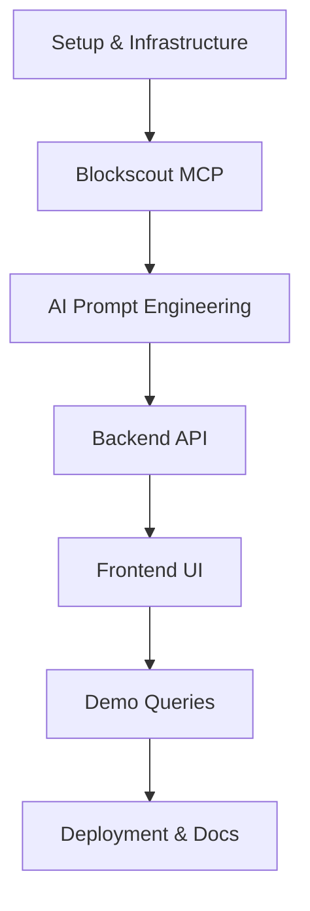

# NodeOps Web3 Agent - Detailed Project Plan

## Overview

Transform the existing Vercel AI SDK example into a **Web3 Intelligence Agent** that combines:
- **Vercel AI SDK** for conversational AI reasoning
- **Blockscout MCP Server** (`https://mcp.blockscout.com`) for blockchain data
- **Docker** for containerization
- **NodeOps Template** for one-click deployment

---

## Project Structure

```
nodeops-web3-agent-node/
├── app/
│   ├── web3-agent/               # NEW: Web3 Agent chat UI
│   │   ├── page.tsx              # Chat interface
│   │   └── components/           # UI components
│   │       ├── query-form.tsx    # Query input UI
│   │       └── result-view.tsx   # Result display
│   ├── api/
│   │   ├── web3-agent/           # NEW: Backend API
│   │   │   ├── route.ts          # Main agent endpoint
│   │   │   ├── blockscout.ts     # Blockscout MCP client
│   │   │   ├── prompt-builder.ts # AI prompt templates
│   │   │   └── cache.ts          # Query caching
│   │   └── query/                 # NEW: REST query endpoint
│   │       └── route.ts
├── agent/
│   └── web3-blockscout-agent.ts  # NEW: Agent configuration
├── lib/
│   ├── web3/                     # NEW: Web3 utilities
│   │   ├── blockscout-mcp.ts     # MCP client wrapper
│   │   ├── query-parser.ts       # Parse user queries
│   │   └── rate-limiter.ts      # Rate limiting
│   └── utils.ts
├── util/
│   └── mcp/
│       └── blockscout-handler.ts # NEW: Blockscout MCP handler
├── docs/
│   ├── PRD.md                    # Product Requirements
│   ├── REFERENCES.md              # Reference links
│   ├── PROJECT_PLAN.md           # This file
│   └── API.md                    # NEW: API documentation
├── docker/
│   ├── Dockerfile                 # NEW: Production Dockerfile
│   └── docker-compose.yml        # NEW: Local dev setup
├── nodeops/
│   └── template.yaml             # NEW: NodeOps deployment config
├── scripts/
│   ├── test-demo-queries.sh      # NEW: Test 5 demo queries
│   └── deploy-nodeops.sh        # NEW: Deployment script
├── .env.local.example             # Environment variables template
├── Dockerfile                     # Production build
└── README.md                      # Updated with Web3 Agent setup
```

---

## Milestones

### 📋 **Milestone 1: Project Setup & Infrastructure**
**Goal**: Establish project structure, Docker setup, and environment configuration

**Files to Create/Modify**:
- `.env.local.example` - Add Blockscout MCP and AI SDK env vars
- `docker/Dockerfile` - Multi-stage Docker build
- `docker/docker-compose.yml` - Local development environment
- `docker/.dockerignore` - Optimize build context
- `nodeops/template.yaml` - NodeOps deployment config
- `scripts/deploy-nodeops.sh` - Deployment automation
- Update `package.json` - Add Blockscout-specific dependencies

**Functions/Modules**:
```typescript
// .env.local.example
VERCEL_AI_KEY=your_vercel_ai_key
BLOCKSCOUT_MCP_URL=https://mcp.blockscout.com
DEFAULT_CHAIN=ethereum
NODE_ENV=production
```

**Testing**:
- [ ] Docker builds successfully
- [ ] Docker container starts without errors
- [ ] Environment variables load correctly
- [ ] Local dev server runs with docker-compose

**Dependencies**: None

---

### 📋 **Milestone 2: Blockscout MCP Integration**
**Goal**: Connect to Blockscout MCP Server and implement data fetching

**Files to Create/Modify**:
- `util/mcp/blockscout-handler.ts` - MCP server initialization with Blockscout
- `lib/web3/blockscout-mcp.ts` - MCP client wrapper with error handling
- `lib/web3/query-parser.ts` - Parse natural language queries into MCP calls
- `app/api/web3-agent/blockscout.ts` - Backend MCP client

**Functions/Modules**:
```typescript
// lib/web3/blockscout-mcp.ts
export class BlockscoutMcpClient {
  async fetchBlockchainData(query: string): Promise<any>
  async getLatestBlock(): Promise<any>
  async getTokenHolders(address: string): Promise<any>
  async getAccountSummary(address: string): Promise<any>
  async getContractEvents(contract: string): Promise<any>
  async getChainHealth(): Promise<any>
}

// lib/web3/query-parser.ts
export function parseWeb3Query(input: string): ParsedQuery {
  // Extract query type, addresses, contract addresses, etc.
}

// util/mcp/blockscout-handler.ts
export function initializeBlockscoutMcpServer(
  server: McpServer,
  blockscoutUrl: string
): void {
  // Register Blockscout MCP tools
  // get_latest_block
  // get_account_info
  // get_token_holders
  // get_contract_events
  // get_chain_status
}
```

**Testing**:
- [ ] MCP connection established to Blockscout
- [ ] Can fetch latest block successfully
- [ ] Can query account information
- [ ] Error handling for rate limits works
- [ ] Invalid queries return appropriate errors

**Dependencies**: Milestone 1

---

### 📋 **Milestone 3: AI Prompt Engineering & Reasoning**
**Goal**: Implement AI reasoning layer with blockchain-specific prompts

**Files to Create/Modify**:
- `lib/web3/prompt-builder.ts` - Super-prompt templates for Web3 analysis
- `agent/web3-blockscout-agent.ts` - Agent configuration
- `app/api/web3-agent/prompt-builder.ts` - Backend prompt logic

**Functions/Modules**:
```typescript
// lib/web3/prompt-builder.ts
export function buildWeb3Prompt(query: string, context: any): string {
  // Template:
  // "Analyze the following blockchain data:
  //  1. Token approvals & transfers
  //  2. Interacted contracts
  //  3. High-value transactions
  //  4. Smart contract calls
  //  5. Anomalies
  //  Context: {context}"
}

// agent/web3-blockscout-agent.ts
export const web3BlockscoutAgent = new ToolLoopAgent({
  model: anthropic('claude-sonnet-4-5'),
  providerOptions: {
    anthropic: {
      mcpServers: [{
        type: 'url',
        name: 'blockscout',
        url: process.env.BLOCKSCOUT_MCP_URL,
      }],
    },
  },
});
```

**Testing**:
- [ ] Prompt templates generate correctly
- [ ] AI receives blockchain context properly
- [ ] AI reasoning returns structured insights
- [ ] Handles missing/partial data gracefully

**Dependencies**: Milestone 2

---

### 📋 **Milestone 4: Backend API & Data Flow**
**Goal**: Create backend API that orchestrates MCP → AI → Response flow

**Files to Create/Modify**:
- `app/api/web3-agent/route.ts` - Main agent endpoint
- `app/api/query/route.ts` - REST query endpoint
- `app/api/web3-agent/cache.ts` - Query caching (Redis or in-memory)
- `lib/web3/rate-limiter.ts` - Rate limiting (10 req/sec)

**Functions/Modules**:
```typescript
// app/api/web3-agent/route.ts
export async function POST(req: Request) {
  // 1. Parse user query
  // 2. Check cache
  // 3. Fetch data from Blockscout MCP
  // 4. Build AI prompt with context
  // 5. Stream AI response
  // 6. Cache result
}

// app/api/query/route.ts
export async function POST(req: Request) {
  // REST endpoint for querying
  // Returns structured data
}
```

**Testing**:
- [ ] API endpoint responds to queries
- [ ] Data flows: User → Backend → MCP → AI → Response
- [ ] Caching reduces duplicate requests
- [ ] Rate limiting prevents abuse (10 req/sec)
- [ ] Error handling returns user-friendly messages

**Dependencies**: Milestone 3

---

### 📋 **Milestone 5: Frontend Chat UI**
**Goal**: Build conversational UI for Web3 queries

**Files to Create/Modify**:
- `app/web3-agent/page.tsx` - Chat interface
- `app/web3-agent/components/query-form.tsx` - Query input component
- `app/web3-agent/components/result-view.tsx` - Result display
- `components/web3/query-suggestions.tsx` - Predefined query suggestions

**Functions/Modules**:
```typescript
// app/web3-agent/page.tsx
export default function Web3Agent() {
  const { messages, sendMessage } = useChat({
    transport: new DefaultChatTransport({ api: '/api/web3-agent' }),
  });
  
  // Display chat messages with Web3-specific formatting
  // Show tool usage (MCP calls)
  // Display blockchain insights
}

// app/web3-agent/components/query-form.tsx
export function QueryForm() {
  // Input for natural language queries
  // Query suggestions (latest block, token holders, etc.)
  // Address input helpers
}
```

**Testing**:
- [ ] Chat UI renders correctly
- [ ] Can send messages and receive responses
- [ ] Streaming responses update in real-time
- [ ] Tool usage (MCP calls) are visible
- [ ] Error states display properly

**Dependencies**: Milestone 4

---

### 📋 **Milestone 6: Demo Queries & Polish**
**Goal**: Implement and test 5+ demo queries, add monitoring/logging

**Files to Create/Modify**:
- `app/web3-agent/components/demo-queries.tsx` - Predefined queries
- `lib/monitoring/logger.ts` - Logging utilities
- `lib/monitoring/metrics.ts` - Performance tracking
- `scripts/test-demo-queries.sh` - Automated test script

**Demo Queries**:
1. **Latest Block Info**: "What's the latest block on Ethereum?"
2. **Token Holders**: "Show me the top 10 holders of USDC"
3. **Smart Contract Events**: "List recent events for contract 0x..."
4. **Account Summary**: "Analyze account 0x... - show approvals and transfers"
5. **Chain Health**: "What's the current health status of the network?"

**Functions/Modules**:
```typescript
// lib/monitoring/logger.ts
export function logQuery(query: string, duration: number, success: boolean)
export function logError(error: Error, context: any)

// lib/monitoring/metrics.ts
export function trackLatency(endpoint: string, duration: number)
export function trackFailureRate(endpoint: string, failures: number)
```

**Testing**:
- [ ] All 5 demo queries work correctly
- [ ] Query results are accurate and formatted
- [ ] Logging captures queries, responses, errors
- [ ] Metrics track latency and failure rates
- [ ] Performance meets targets (< 5s response time)

**Dependencies**: Milestone 5

---

### 📋 **Milestone 7: Finalize Deployment & Documentation**
**Goal**: Complete Docker build, NodeOps template, and documentation

**Files to Create/Modify**:
- `Dockerfile` - Production-optimized Docker build
- `nodeops/template.yaml` - Complete NodeOps deployment config
- `README.md` - Comprehensive setup and usage guide
- `docs/API.md` - API documentation
- `.github/workflows/deploy.yml` - CI/CD pipeline (optional)

**NodeOps Template**:
```yaml
name: "web3-ai-agent"
category: "Tooling"
description: "AI-powered Web3 agent using Vercel AI SDK + Blockscout MCP"
containers:
  - name: web3-agent
    image: web3-ai-agent:latest
    ports:
      - 3000:3000
    resources:
      cpu: "1"
      memory: "2Gi"
    env:
      - VERCEL_AI_KEY=${VERCEL_AI_KEY}
      - BLOCKSCOUT_MCP_URL=https://mcp.blockscout.com
      - DEFAULT_CHAIN=ethereum
      - REDIS_URL=${REDIS_URL}
scaling:
  min_instances: 1
  max_instances: 5
  scale_metric: cpu_usage
```

**Functions/Modules**:
```bash
# scripts/deploy-nodeops.sh
#!/bin/bash
# Build Docker image
# Tag and push to registry
# Deploy via NodeOps CLI
```

**Testing**:
- [ ] Docker build succeeds in production mode
- [ ] NodeOps deployment works (one-click deploy)
- [ ] Autoscaling functions (min 1, max 5 instances)
- [ ] Production environment variables are set
- [ ] README provides clear setup instructions

**Dependencies**: Milestone 6

---

## Integration Dependencies



---

## Key Considerations

### Rate Limiting
- Blockscout MCP: 10 requests/second
- Implement client-side and server-side rate limiting
- Cache frequent queries (latest block, popular tokens)

### Error Handling
- MCP connection failures → fallback to direct Blockscout API
- AI timeouts → return partial results with context
- Invalid queries → helpful error messages

### Caching Strategy
- Cache latest block (30 seconds)
- Cache token holders (5 minutes)
- Cache account summaries (1 minute)
- Use Redis for production, in-memory for dev

### AI Prompt Optimization
- Limit context size to prevent token overflow
- Use structured data format (JSON) for blockchain data
- Include query type in prompt (e.g., "analyze account" vs "analyze token")

---

## Success Criteria

- ✅ Deploys via NodeOps in under 10 minutes
- ✅ All 5 demo queries work correctly
- ✅ REST endpoint `/api/query` is functional
- ✅ Rate limiting prevents abuse (10 req/sec)
- ✅ Autoscaling works (min 1, max 5 instances)
- ✅ AI reasoning provides meaningful blockchain insights
- ✅ Docker container is optimized (< 500MB)
- ✅ Documentation is complete and clear

---

## Timeline Estimate

- **Milestone 1**: 2-3 hours
- **Milestone 2**: 4-6 hours
- **Milestone 3**: 3-4 hours
- **Milestone 4**: 4-5 hours
- **Milestone 5**: 3-4 hours
- **Milestone 6**: 4-5 hours
- **Milestone 7**: 2-3 hours

**Total**: 22-30 hours

---

## Next Steps

1. Review this plan
2. Start with Milestone 1
3. Commit after each milestone completion
4. Test thoroughly before moving to next milestone
5. Keep PRD.md and REFERENCES.md in mind throughout

---

**Last Updated**: [Current Date]  
**Status**: Planning Phase

