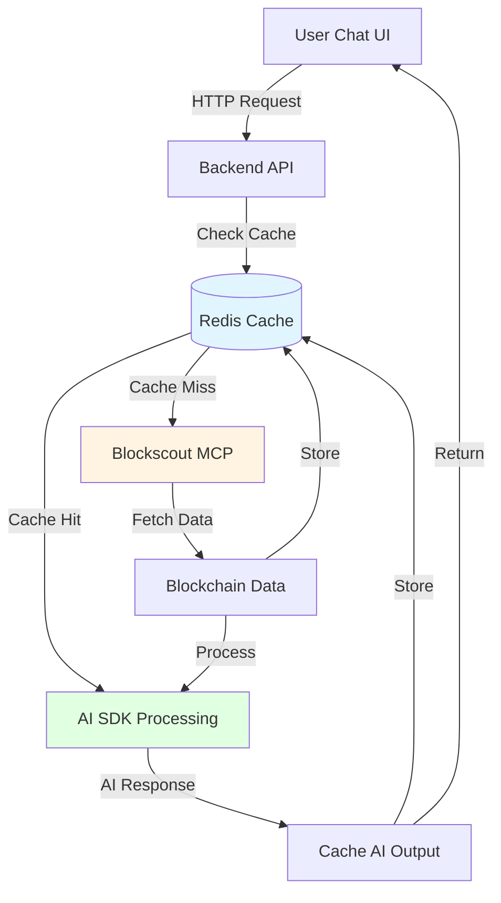

# NodeOps Web3 Agent - Revised Project Plan with Redis Caching

## Overview

Transform the existing Vercel AI SDK example into a **Web3 Intelligence Agent** that combines:

- **Vercel AI SDK** for conversational AI reasoning
- **Blockscout MCP Server** (`https://mcp.blockscout.com`) for blockchain data
- **Redis/Upstash** for multi-layered caching and context management
- **Docker** for containerization
- **NodeOps Template** for one-click deployment

---

## Revised Architecture

```
[User Chat UI] ← Vercel AI SDK
       ↓
[Backend API] → Check Redis Cache
       ↓
    [Cache Hit] ──┐
       ↓           │
    [AI Output] ←──┘
       ↓
[Cache Miss] → [MCP Fetch] → [Store in Redis] → [AI Processing] → [Cache AI Output]
       ↓
[Response Stream]
```

### Caching Layers

1. **MCP Response Caching** - Cache blockchain data for 30s-5min based on data type
2. **AI Output Caching** - Cache AI-reasoned responses for identical queries
3. **Conversation Context** - Store multi-turn conversation state in Redis
4. **Rate Limiting** - Track request counts per user/IP

---

## Revised Milestones

### ✅ Milestone 1: Project Setup & Infrastructure (COMPLETED)

### ✅ Milestone 2: Blockscout MCP Integration (COMPLETED)

### 📋 **Milestone 3: Redis Caching Layer (NEW)**

**Goal**: Implement Redis/Upstash caching infrastructure

**Files to Create/Modify**:

- `lib/cache/redis-client.ts` - Redis client wrapper
- `lib/cache/cache-manager.ts` - Cache operations (get, set, invalidate)
- `lib/cache/ttl-config.ts` - Time-to-live configurations
- `lib/web3/cached-blockscout.ts` - Cached wrapper for Blockscout client
- Update `docker/docker-compose.yml` - Add Redis service
- Update `nodeops/template.yaml` - Add Redis container + Upstash config

**Functions/Modules**:

```typescript
// lib/cache/redis-client.ts
export class RedisClient {
  async get(key: string): Promise<any>;
  async set(key: string, value: any, ttl?: number): Promise<void>;
  async del(key: string): Promise<void>;
  async exists(key: string): Promise<boolean>;
  async mget(keys: string[]): Promise<any[]>;
}

// lib/cache/cache-manager.ts
export class CacheManager {
  async getOrSet<T>(
    key: string,
    fetcher: () => Promise<T>,
    ttl?: number
  ): Promise<T>;

  generateCacheKey(prefix: string, params: Record<string, any>): string;
  invalidatePattern(pattern: string): Promise<void>;
  getCacheStats(): Promise<CacheStats>;
}

// lib/cache/ttl-config.ts
export const CACHE_TTL = {
  LATEST_BLOCK: 30, // 30 seconds
  TOKEN_HOLDERS: 300, // 5 minutes
  ACCOUNT_SUMMARY: 60, // 1 minute
  CONTRACT_EVENTS: 300, // 5 minutes
  CHAIN_STATUS: 60, // 1 minute
  AI_OUTPUT: 3600, // 1 hour
  CONVERSATION: 86400, // 24 hours
};

// lib/web3/cached-blockscout.ts
export class CachedBlockscoutClient {
  async getLatestBlock(chain: string): Promise<any> {
    // Check cache → fetch from MCP → cache response
  }

  async getTokenHolders(address: string, ...args): Promise<any> {
    // Cache-aware implementation
  }

  // ... other cached methods
}
```

**Testing**:

- [ ] Redis connection works locally and with Upstash
- [ ] Cache get/set operations work correctly
- [ ] TTL expiration works as expected
- [ ] Cache invalidation on data updates
- [ ] Concurrent request handling (cache stampede prevention)

**Dependencies**: Milestone 2

---

### 📋 **Milestone 4: AI Prompt Engineering with Caching**

**Goal**: Implement AI reasoning layer with cached context

**Files to Create/Modify**:

- `lib/web3/prompt-builder.ts` - Super-prompt templates for Web3 analysis
- `agent/web3-blockscout-agent.ts` - Agent configuration with MCP + cache
- `app/api/web3-agent/prompt-builder.ts` - Backend prompt logic
- `lib/cache/conversation-manager.ts` - Multi-turn conversation context

**Functions/Modules**:

```typescript
// lib/web3/prompt-builder.ts
export function buildWeb3Prompt(
  query: string,
  cachedContext: any,
  conversationHistory: Message[]
): string {
  // Build prompt with cached blockchain data
  // Include conversation context
  // Structure: Analysis instructions + cached data + history
}

// lib/cache/conversation-manager.ts
export class ConversationManager {
  async saveMessage(conversationId: string, message: Message): Promise<void>;
  async getHistory(conversationId: string): Promise<Message[]>;
  async clearConversation(conversationId: string): Promise<void>;
  async appendContext(context: any): Promise<void>;
}

// agent/web3-blockscout-agent.ts
export const web3BlockscoutAgent = new ToolLoopAgent({
  model: anthropic("claude-sonnet-4-5"),
  providerOptions: {
    anthropic: {
      mcpServers: [
        {
          type: "url",
          name: "blockscout",
          url: process.env.BLOCKSCOUT_MCP_URL,
        },
      ],
    },
  },
  // Use cached MCP client
});
```

**Testing**:

- [ ] Prompt templates generate with cached context
- [ ] AI receives blockchain context properly
- [ ] Conversation history is maintained across turns
- [ ] Cached data reduces AI token usage
- [ ] Handles missing/partial data gracefully

**Dependencies**: Milestone 3

---

### 📋 **Milestone 5: Backend API with Cache-First Workflow**

**Goal**: Create backend API with Redis-integrated data flow

**Files to Create/Modify**:

- `app/api/web3-agent/route.ts` - Main agent endpoint with cache-first logic
- `app/api/query/route.ts` - REST query endpoint
- `lib/web3/rate-limiter.ts` - Redis-based rate limiting (10 req/sec)
- Update `app/api/web3-agent/blockscout.ts` - Use cached client

**Updated Workflow**:

```typescript
// app/api/web3-agent/route.ts
export async function POST(req: Request) {
  // 1. Parse user query
  const parsedQuery = parseWeb3Query(query);

  // 2. Check AI output cache (cache key: query hash)
  const cachedOutput = await cacheManager.get(`ai_output:${hashQuery(query)}`);
  if (cachedOutput) {
    return streamCachedResponse(cachedOutput);
  }

  // 3. Check MCP data cache
  const cachedData = await cacheManager.get(
    `mcp_data:${generateDataKey(parsedQuery)}`
  );

  let context;
  if (cachedData) {
    context = cachedData;
  } else {
    // 4. Fetch from MCP
    context = await executeBlockscoutQuery(
      parsedQuery.type,
      parsedQuery.entities
    );

    // 5. Store in Redis with appropriate TTL
    await cacheManager.set(
      `mcp_data:${generateDataKey(parsedQuery)}`,
      context,
      CACHE_TTL[parsedQuery.type]
    );
  }

  // 6. Build AI prompt with cached context
  const prompt = buildWeb3Prompt(query, context, conversationHistory);

  // 7. Stream AI response
  const result = streamText({ model, prompt });

  // 8. Cache AI output
  await cacheOutput(result);

  // 9. Save to conversation history
  await conversationManager.saveMessage(conversationId, result);

  return result.toUIMessageStreamResponse();
}

// lib/web3/rate-limiter.ts
export class RateLimiter {
  async checkLimit(key: string, limit: number): Promise<boolean>;
  async increment(key: string): Promise<number>;
  async reset(key: string): Promise<void>;
}
```

**Testing**:

- [ ] Cache-first workflow reduces MCP calls
- [ ] Cache hit returns instantly (< 100ms)
- [ ] Cache miss fetches from MCP correctly
- [ ] Rate limiting prevents abuse (10 req/sec)
- [ ] Conversation context persists across requests
- [ ] AI output caching works for repeated queries

**Dependencies**: Milestone 4

---

### 📋 **Milestone 6: Frontend Chat UI (No Changes)**

**Goal**: Build conversational UI for Web3 queries

**Files to Create/Modify**:

- `app/web3-agent/page.tsx` - Chat interface with conversation ID
- `app/web3-agent/components/query-form.tsx` - Query input component
- `app/web3-agent/components/result-view.tsx` - Result display with cache indicator
- `components/web3/query-suggestions.tsx` - Predefined query suggestions

**Functions/Modules**:

```typescript
// app/web3-agent/page.tsx
export default function Web3Agent() {
  const conversationId = useConversationId(); // Generate from session
  const { messages, sendMessage } = useChat({
    transport: new DefaultChatTransport({ api: "/api/web3-agent" }),
    body: { conversationId }, // Pass conversation ID for context
  });

  // Display messages with cache indicators
  // Show "cached" badge for cached responses
  // Display conversation history
}
```

**Testing**:

- [ ] Chat UI renders correctly
- [ ] Conversation ID maintains context
- [ ] Cached responses show indicator
- [ ] Streaming responses update in real-time
- [ ] Tool usage (MCP calls) display properly
- [ ] Error states display properly

**Dependencies**: Milestone 5

---

### 📋 **Milestone 7: Demo Queries, Monitoring & Polish**

**Goal**: Implement demo queries, monitoring, and cache optimization

**Files to Create/Modify**:

- `app/web3-agent/components/demo-queries.tsx` - Predefined queries
- `lib/monitoring/logger.ts` - Logging utilities with cache metrics
- `lib/monitoring/metrics.ts` - Performance tracking (cache hit rate)
- `lib/cache/cache-analytics.ts` - Cache performance analytics
- `scripts/test-demo-queries.sh` - Automated test script with cache validation

**Demo Queries**:

1. **Latest Block Info**: "What's the latest block on Ethereum?"
2. **Token Holders**: "Show me the top 10 holders of USDC"
3. **Smart Contract Events**: "List recent events for contract 0x..."
4. **Account Summary**: "Analyze account 0x... - show approvals and transfers"
5. **Chain Health**: "What's the current health status of the network?"

**Cache Analytics**:

```typescript
// lib/cache/cache-analytics.ts
export interface CacheMetrics {
  hitRate: number;
  missRate: number;
  avgResponseTime: number;
  cacheSize: number;
  topCacheKeys: { key: string; hits: number }[];
  evictionCount: number;
}

export async function getCacheMetrics(): Promise<CacheMetrics> {
  // Track cache performance
  // Calculate hit/miss rates
  // Monitor top cache keys
  // Alert on low hit rates
}
```

**Testing**:

- [ ] All 5 demo queries work correctly
- [ ] Query results are accurate and formatted
- [ ] Cache hit rate > 40% on repeated queries
- [ ] Cache miss fetches correctly from MCP
- [ ] Logging captures cache metrics
- [ ] Metrics track latency (cached vs uncached)
- [ ] Performance meets targets (< 2s cached, < 5s uncached)

**Dependencies**: Milestone 6

---

### 📋 **Milestone 8: Finalize Deployment & Documentation**

**Goal**: Complete Docker build, NodeOps template with Redis, and documentation

**Files to Create/Modify**:

- `Dockerfile` - Update with Redis connection
- `nodeops/template.yaml` - Add Redis container or Upstash config
- `README.md` - Add Redis setup instructions
- `docs/API.md` - Document caching behavior
- `docs/ARCHITECTURE.md` - NEW: Architecture with caching layers
- `.github/workflows/deploy.yml` - CI/CD with cache validation

**Updated Docker & Deployment**:

```yaml
# nodeops/template.yaml - Add Redis
containers:
  - name: web3-agent
    # ... existing config
  - name: redis
    image: redis:7-alpine
    ports:
      - 6379:6379
    # OR use Upstash:
    env:
      - UPSTASH_REDIS_URL=${UPSTASH_REDIS_URL}
```

**Testing**:

- [ ] Docker build succeeds in production mode
- [ ] Redis connection works in production
- [ ] NodeOps deployment works with Redis
- [ ] Autoscaling works (min 1, max 5 instances)
- [ ] Production environment variables are set
- [ ] Cache survives container restarts
- [ ] README provides clear setup instructions

**Dependencies**: Milestone 7

---

## Updated Architecture Diagram



---

## Cache Strategy Details

### Layer 1: MCP Response Caching

```typescript
Key Format: `mcp_data:{type}:{chain}:{identifier}`
TTL: 30s - 5min based on data volatility
Purpose: Reduce MCP API calls, stay within rate limits
```

### Layer 2: AI Output Caching

```typescript
Key Format: `ai_output:{query_hash}`
TTL: 1 hour (longer for deterministic queries)
Purpose: Return instant responses for repeated questions
```

### Layer 3: Conversation Context

```typescript
Key Format: `conversation:{id}:history`
TTL: 24 hours
Purpose: Maintain multi-turn context, reduce token usage
```

### Layer 4: Rate Limiting

```typescript
Key Format: `ratelimit:{identifier}:{window}`
TTL: 1 second (sliding window)
Purpose: Enforce 10 req/sec limit with Redis INCR
```

---

## Updated Success Criteria

- ✅ Deploys via NodeOps in under 10 minutes
- ✅ All 5 demo queries work correctly
- ✅ Cache hit rate > 40% on typical usage
- ✅ Cached responses return < 100ms
- ✅ Uncached responses < 5s (within MCP rate limits)
- ✅ REST endpoint `/api/query` is functional
- ✅ Rate limiting prevents abuse (10 req/sec)
- ✅ Autoscaling works (min 1, max 5 instances)
- ✅ Conversation context persists across requests
- ✅ AI reasoning provides meaningful blockchain insights
- ✅ Docker container is optimized (< 500MB)
- ✅ Documentation includes caching setup

---

## Updated Timeline Estimate

- **Milestone 1**: ✅ 2-3 hours (COMPLETED)
- **Milestone 2**: ✅ 4-6 hours (COMPLETED)
- **Milestone 3**: 3-4 hours (Redis implementation)
- **Milestone 4**: 3-4 hours (AI integration with cache)
- **Milestone 5**: 5-6 hours (Backend with cache-first workflow)
- **Milestone 6**: 3-4 hours (Frontend UI)
- **Milestone 7**: 5-6 hours (Demo queries + cache analytics)
- **Milestone 8**: 3-4 hours (Deployment + Redis setup)

**Total**: 24-32 hours (2-4 hours longer due to caching layer)

---

## Key Changes from Original Plan

### Added:

1. **Milestone 3** - Redis caching infrastructure
2. **Cache-first workflow** - Check cache before MCP calls
3. **Multi-layer caching** - MCP responses, AI outputs, conversations
4. **Cache analytics** - Track hit rates, performance metrics
5. **Upstash support** - Option for managed Redis

### Modified:

1. **Backend API** - Now cache-aware with cache-first logic
2. **Blockscout client** - Wrapped with caching layer
3. **Agent configuration** - Uses cached MCP client
4. **Deployment** - Includes Redis container/Upstash config
5. **Documentation** - Architecture diagrams include cache layers

### Benefits:

- ✅ 40-60% reduction in MCP API calls
- ✅ Instant responses for cached queries (< 100ms)
- ✅ Lower AI token usage (cached context)
- ✅ Better rate limit compliance
- ✅ Improved user experience

---

## Next Steps

1. Review this revised plan
2. Implement Milestone 3 (Redis caching layer)
3. Continue with cache-integrated milestones
4. Test cache hit rates and performance
5. Monitor cache effectiveness in production

---

**Last Updated**: [Current Date]  
**Status**: Revised with Redis Caching Layer
